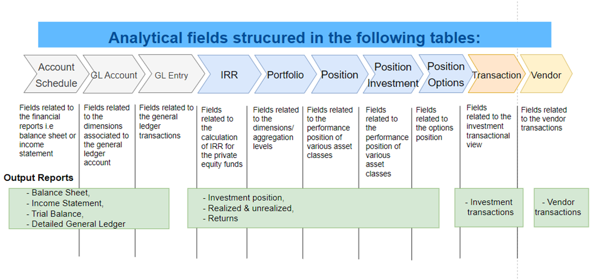

# INTRODUCTION

This document is accompanying the Elysys Analytics platform and has been
created for the purpose of providing users with brief guidance on how to
start with the use of this BI solution and getting familiar with the
existing fields. It will cover basics such as how the data is structured
and what reports can be built with each set of fields.

Having that in mind, please note that the standard package of reports
contains the minimum, so users can extend it according to their needs
and technical capacities.

## ANALYTICAL FIELDS ARE STRUCTURED IN THE FOLLOWING TABLES

## THERE ARE THREE DIFFERENT TYPES OF FIELDS:

-   Dimensions: specifies the aggregation level i.e Company, Portfolio,
    Investment,

-   Measures: specifies the calculated amount i.e Market Value,
    Quantity, Realised Gain Loss

-   DAX: this represents a measure that is created by the user or
    anybody with an access to the report. It's similar to any new cell
    in Excel.

## TABLES

### Account Schedule -- fields related to the financial reports i.e balance sheet and income statement

| Field | Meaning | Type |
|:--- | :--- | :---|
|**Schedule Name**| Specifies the name of the account schedule (financial report) | Dimension |
| **Line No_** | Specifies the line number from the report structure | Dimension |
| **Row No_** | Specifies the row number from the report structure | Dimension |
| **Description** | Specifies the Description from the report structure | Dimension |
| **Totaling** | Specifies the totaling formula from the report structure | Dimension |
| **Totaling Type** | Specifies the totaling type from the report structure | Dimension |
| **Bold** | Specifies if the bold option was toggled on | Dimension |
| **Underline** | Specifies if the underline function was toggled on | Dimension |
| **Indentation** | Specifies if the line is indented | Dimension |
| **GL Account No** | Specifies the GL account number | Dimension |
| **Document No** | Specifies the document number | Dimension |
| **Income_Balance** | Specifies the type of the GL account – balance sheet or income | Dimension |
| **ShowOppositeSign** | Specifies if the Show opposite sign option was toggled on  | Dimension |
| **Description Indented** | Specifies if the description is intended  | Dimension |
| **PriorYearEntry** | Specifies if the entry was involved in a year end closing activity  | Dimension |
| **Account Schedule Amount** | Specifies the income statement amount  | Measure |
| **Account Schedule Amount LTD** | Specifies the balance sheet amount  | Measure |

### GL Account – fields related to the dimensions related to the general ledger

| Field | Meaning | Type |
|:--- | :--- | :---|
|**No**| Specifies the number of the GL account | Dimension |
| **Name** | Specifies the line number from the report structure | Dimension |
| **Account Type** | Specifies the number of the GL account | Dimension |
| **IncomeBalance** | Specifies the type of the GL account – balance sheet or income | Dimension |
| **Company** | Specifies the company | Dimension |
| **Account Category** | Specifies the account category | Dimension |
| **Account Category Sort** | Specifies the sorting for the account category | Dimension |

### GL Entry – fields related to general ledger

| Field | Meaning | Type |
|:--- | :--- | :---|
|**Posting Date**| Specifies the posting date | Dimension |
| **GlobalDimension1Code** | Specifies the code for the global dimension 1 | Dimension |
| **GlobalDimension2Code** | Specifies the code for the global dimension 2 | Dimension |
| **SourceCode** | Specifies the source code | Dimension |
| **Description** | Specifies the description | Dimension |
| **DocumentNo** | Specifies the document number | Dimension |
| **DocumentDate** | Specifies if the document date | Dimension |
| **CurrencyCodeTcy** | Specifies if the currency code TCY | Dimension |
| **Company** | Specifies if the company | Dimension |
| **Dimension1Code** | Specifies the code for dimension 1 | Dimension |
| **Dimension2Code** | Specifies the code for dimension 2 | Dimension |
| **Dimension3Code** | Specifies the code for dimension 3 | Dimension |
| **Dimension4Code** | Specifies the code for dimension 4 | Dimension |
| **Dimension5Code** | Specifies the code for dimension 5 | Dimension |
| **Dimension6Code** | Specifies the code for dimension 6 | Dimension |
| **Dimension7Code** | Specifies the code for dimension 7 | Dimension |
| **Dimension8Code** | Specifies the code for dimension 8 | Dimension |
| **Dimension1Name** | Specifies the name for dimension 1 | Dimension |
| **Dimension2Name** | Specifies the name for dimension 2 | Dimension |
| **Dimension3Name** | Specifies the name for dimension 3 | Dimension |
| **Dimension4Name** | Specifies the name for dimension 4 | Dimension |
| **Dimension5Name** | Specifies the name for dimension 5 | Dimension |
| **Dimension6Name** | Specifies the name for dimension 6 | Dimension |
| **Dimension7Name** | Specifies the name for dimension 7 | Dimension |
| **Dimension8Name** | Specifies the name for dimension 8 | Dimension |
| **Dimension8Name** | Specifies the name for dimension 8 | Dimension |
| **Dimension1ValueCode** | Specifies the value code for dimension 1 | Dimension |
| **Dimension2ValueCode** | Specifies the value code for dimension 2 | Dimension |
| **Dimension3ValueCode** | Specifies the value code for dimension 3 | Dimension |
| **Dimension4ValueCode** | Specifies the value code for dimension 4 |Dimension |
| **Dimension5ValueCode** | Specifies the value code for dimension 5 | Dimension |
| **Dimension6ValueCode** | Specifies the value code for dimension 6 | Dimension |
| **Dimension7ValueCode** | Specifies the value code for dimension 7 | Dimension |
| **Dimension8ValueCode** | Specifies the value code for dimension 8 | Dimension |
| **Dimension1ValueName** | Specifies the value name for dimension 1 | Dimension |
| **Dimension2ValueName** | Specifies the value name for dimension 2 | Dimension |
| **Dimension3ValueName** | Specifies the value name for dimension 3 | Dimension |
| **Dimension4ValueName** | Specifies the value name for dimension 4 | Dimension |
| **Dimension5ValueName** | Specifies the value name for dimension 5 | Dimension |
| **Dimension6ValueName** | Specifies the value name for dimension 6 | Dimension |
| **Dimension7ValueName** | Specifies the value name for dimension 7 | Dimension |
| **Dimension8ValueName** | Specifies the value name for dimension 8 | Dimension |
| **BudgetAmount** | Specifies the budget amount | Dimension |
| **BalAccountNo** | Specifies the balancing account number | Dimension |
| **UserId** | Specifies the user id | Dimension |
| **Prior-YearEntry** | Specifies if the entry was involved in a closing year activity | Dimension |
| **JournalBatchName** | Specifies the journal batch name | Dimension |
| **BalAccountType** | Specifies the balancing account type | Dimension |
| **BalAccountType** | Specifies the balancing account type | Dimension |
| **ExternalDocumentNo** | Specifies the external document number | Dimension |
| **NoSeries** | Specifies the number series | Dimension |
| **Reversed** | Specifies if the entry was reversed | Dimension |
| **FAEntryType** | Specifies the fixed asset entry type | Dimension |
| **FAEntryNo** | Specifies the fixed asset entry no | Dimension |
| **InvestmentEntryType** | Specifies the investment entry type | Dimension |
| **SystemModifiedAt** | Specifies the modification date | Dimension |
| **HashkeyForVendor** | Specifies the hash key for vendor | Dimension |
| **InterCompanyDimCode** | Specifies the intercompany dimension code | Dimension |
| **InterCompanyDimName** | Specifies the intercompany dimension name | Dimension |
| **GenPostingType** | Specifies the posting type | Dimension |
| **GL Amount** | Specifies the GL amount | Measure |
| **GL Currency Amount** | Specifies the GL amount in currency | Measure |
| **GL Credit Amount** | Specifies the GL credit amount | Measure |
| **GL Debit Amount** | Specifies the GL debit amount | Measure |
| **GL Underlying Amount** | Specifies the GL underlying amount | Measure |

### IRR – fields related to the calculation of IRR for the private equity funds
| Field | Meaning | Type |
|:--- | :--- | :---|
| **Cashflow Amount** | Specifies the cashflow amount | Measure |
| **IRR** | Specifies the IRR | Measure |
| **IRR ex MV** | Specifies the IRR excluding the market value | Measure |

### Portfolio – fields related to the dimensions/ aggregation levels
| Field | Meaning | Type |
|:--- | :--- | :---|
| **Company** | Specifies the company code | Dimension |
| **Portfolio Code** | Specifies the portfolio code | Dimension |
| **Investment code** | Specifies the investment code | Dimension |
| **Asset Class** | Specifies the asset class | Dimension |
| **Custom Asset Class** | Specifies the custom asset class | Dimension |
| **Custom Sub Class** | Specifies the custom sub class | Dimension |
| **Instrument Type** | Specifies the instrument type | Dimension |
| **RiskClass** | Specifies the risk class | Dimension |
| **Bank Exposure** | Specifies the bank exposure | Dimension |
| **Market Place Code** | Specifies the market place code | Dimension |
| **Country Region** | Specifies the country region | Dimension |
| **EU Country Region** |  | Dimension |
| **VAT Scheme** | Specifies the VAT scheme | Dimension |
| **Intrastat Code** | Specifies the intrastat code | Dimension |
| **Industry Sector** | Specifes the industry sector | Dimension |
| **Analytic 1** | Specifies the analytic 1 | Dimension |
| **Analytic 2** | Specifies the analytic 2 | Dimension |
| **Analytic 3** | Specifies the analytic 3 | Dimension |
| **Analytic 4** | Specifies the analytic 4 | Dimension |
| **Analytic 5** | Specifies the analytic 5 | Dimension |
| **Analytic 6** | Specifies the analytic 6 | Dimension |
| **Benchmark1** | Specifies the benchmark 1 | Dimension |
| **Benchmark2** | Specifies the benchmark 2 | Dimension |
| **Benchmark3** | Specifies the benchmark 3 | Dimension |
| **Benchmark4** | Specifies the benchmark 4 | Dimension |
| **Investment Type** | Specifies the investment type | Dimension |
| **Description** | Specifies the description of the investment | Dimension |
| **Maturity Date** | Specifies the maturity date | Dimension |
| **Vintage** | Specifies the vintage for the private equity funds | Dimension |
| **Company Name** | Specifies the company name | Dimension |
| **Custodian Code** | Specifies the custodian code | Dimension |
| **Custodian Name** | Specifies the custodian name | Dimension |
| **ISIN Code** | Specifies the ISIN code | Dimension |
| **Bonds Rate** | Specifies the bond rate | Dimension |
| **Coupon Barrier** | Specifies the coupon barrier | Dimension |
| **Coupon Guarantee** | Specifies if a coupon is guarantee | Dimension |
| **Underlying Product** | Specifies the underlying product | Dimension |
| **Underlying Spot** | Specifies the underlying spot | Dimension |
| **Underlying Type** | Specifies the underlying spot | Dimension |
| **Date of Issue** | Specifies the date of issue | Dimension |
| **First Coupon Date** | Specifies the first coupon date | Dimension |
| **Coupon Frequency** | Specifies the coupon frequency | Dimension |
| **Day Count** | Specifies the day count | Dimension |
| **Contract Type** | Specifies the contract type | Dimension |
| **Strike Price** | Specifes the strike price | Dimension |
| **Option Type** | Specifies the option type | Dimension |
| **Portfolio Name** | Specifies the portfolio name | Dimension |
| **FixedAssetClassCode** | Specifies the fixed asset class code | Dimension |
| **FixedAssetSubClass** | Specifes the fixed asset sub class | Dimension |
| **Entity** | Specfies the entity – aggregation of multiple companies | Dimension |
| **EntityDescription** | Specifes the entity description | Dimension |
| **Ownership** | Specifies the percentage ownership | Dimension |
| **First Trade Date** | Specifies the first trade date | Dimension |
| **Loan Deposit Rate** | Specifies the loan deposit rate | Dimension |
| **Loan Deposit Rate Base** | Specifies the loan deposit rate base | Dimension |

### Position – fields related to the position of various asset classes
| Field | Meaning | Type |
|:--- | :--- | :---|
| **Closed** | Specifies if the position is closed/ matured | Dimension |
| **First Trade Date** | Specifies the first posting date |  |
| **Currency Code ICY** | Specifies the currency in which the investment is denominated in | Dimension |
| **Market Price Desc** | Specifies the market price nature, cost or market | Dimension |
| **Last Trade Date** | Specifies the last posting date | Dimension |
| **Model Refresh Date** | Specifies the refresh date of the model | Dimension |
| **LCY Code** | Specifies the local currency code in which the company is denominated in | Dimension |
| **Initial Trade Year** | Specifies the year of the first posted entry | Dimension |
| **Market Price Date** | Specifies the last date of the market price | Dimension |
| **MV0 GCY** | Specifies the beginning market value in global currency | Measure |
| **MV0 ICY** | Specifies the beginning market value in investment currency | Measure |
| **MV0 LCY** | Specifies the beginning market value in local currency | Measure |
| **MV1 GCY** | Specifies the ending market value in global currency | Measure |
| **MV1 ICY** | Specifies the ending market value in local currency | Measure |
| **MV1 LCY** | Specifies the ending market value in investment currency | Measure |
| **Amount ICY** | Specifies the cost amount in investment currency | Measure |
| **Amount GCY** | Specifies the cost amount in global currency | Measure |
| **Exchange Rate GCY** | Specifies the exchange rate between the investment currency and the global currency | Measure |
| **Last Tarding Price ICY** | Specifies the last trading price in the investment currency | Dimension |
| **Dietz Return YTD** | Specifies the Dietz Return | Measure |
| **TWR Intraday ICY** | Specifies the daily returns in investment currency | Measure |
| **TWR MTD ICY** | Specifies the month to date returns in investment currency | Measure |
| **TWR YTD ICY** | Specifies the year to date returns in investment currency | Measure |
| **TWR ITD ICY** | Specifies the inception to date returns in investment currency | Measure |
| **TWR 1Y ICY**| Specifies the one year returns in investment currency | Measure |
| **Market Value ICY** | Specifies the market value in investment currency | Measure |
| **Last Trading Price GCY** | Specifies the last trading price in the global currency | Measure |
| **Market Value GCY** | Specifies the market value in global currency | Measure |
| **Market Value Provisional ICY** | Specifies the market value for the pending contracts in investment currency | Measure |
| **Market Value Provisional GCY** | Specifies the market value for the pending contracts in global currency | Measure |
| **Price ICY** | Specifies the trade price in investment currency | Measure |
| **Quantity** | Specifies the posted number of shares or nominal amount | Measure |
| **Total Market Value ICY** | Specifies the market value for all contracts (pending and posted) in investment currency | Measure |
| **Total Market Value GCY** | Specifies the market value for all contracts (pending and posted) in global currency | Measure |
| **Total Quantity** | Specifies the number of shares and nominal for all contracts, pending and posted | Measure |
| **WAC Price ICY** | Specifies the average price in investment currency | Measure |
| **Cash GCY** | Specifies the posted cash amount in global currency | Measure |
| **Cash ICY** | Specifies the posted cash amount in investment currency | Measure |
| **Cash Total ICY** | Specifies the posted and pending cash amount in global currency | Measure |
| **Fees Close ICY** | Specifies the posted and pending cash amount in investment currency | Measure |
| **Fees Close GCY** | Specifies the fees for the closing contracts in global currency | Measure |
| **Fees Open ICY** | Specifies the fees for the opening contracts in investment currency | Measure |
| **Fees Open GCY** | Specifies the fees for the opening contracts in global currency | Measure |
| **Total Fees ICY** | Specifies the fees for the opening and closing contracts in investment currency | Measure |
| **Total Fees GCY** | Specifies the fees for the opening and closing contracts in global currency | Measure |
| **Unsettled Cash ICY** | Specifies the cash to be settled in investment currency | Measure |
| **Unsettled Cash GCY** | Specifies the cash to be settled in global currency | Measure |
| **Amount Provisional ICY** | Specifies the cost amount for the pending contracts in investment currency | Measure |
| **Amount Provisional GCY** | Specifies the cost amount for the pending contracts in global currency | Measure |
| **Cash Provisional GCY** | Specifies the pending cash amount in global currency | Measure |
| **Cash Provisional ICY** | Specifies the pending cash amount in investment currency | Measure |
| **Price Provisional ICY** | Specifies the trade price in investment currency for the pending contracts | Measure |
| **Quantity Provisional** | Specifies the pending number of shares or nominal amount | Measure |
| **Wac Price GCY** | Specifies the average price in global currency for the pending contracts | Measure |
| **Price GCY** | Specifies the trade price in global currency for the posted contracts | Measure |
| **TWR Intraday GCY** | Specifies the daily returns in global currency | Measure |
| **TWR ITD GCY** | Specifies the returns since inception to date in global currency | Measure |
| **TWR MTD GCY** | Specifies the monthly returns in global currency | Measure |
| **Cash in ICY** | Specifies the cash amount generated from purchases in investment currency | Measure |
| **Cash Out ICY** | Specifies the cash amount generated from purchases in investment currency | Measure |
| **Cash in GCY** | Specifies the cash amount generated from purchases in global currency | Measure |
| **Cash Out GCY** | Specifies the cash amount generated from purchases in global currency | Measure |
| **Interest Accrued ICY** | Specifies the posted accrued interest amount in investment currency | Measure |
| **Interest Accrued GCY** | Specifies the posted accrued interest amount in global currency | Measure |
| **Depreciation ICY** | Specifies the depreciation amount in global currency | Measure |
| **Depreciation GCY** | Specifies the depreciation amount in global currency | Measure |
| **Net Book Value ICY** | Specifies the net book value amount in investment currency | Measure |
| **Net Book Value GCY** | Specifies the net book value amount in global currency | Measure |
| **Interest Paid GCY** | Specifies the posted interest repayment amount in global currency | Measure |
| **Interest Paid ICY** | Specifies the posted interest repayment amount in investment currency | Measure |
| **Rate Floating** | Specifies the spread or the fix part of the floating rate | Measure |

### Position Investment – fields related to the position of various asset classes
| Date of Issue | Specifies the issue date | Dimension |
|:--- | :--- | :---|
| **First Coupon Date** | Specifies the date of the first coupon | Measure |
| **Capital Return NonRecallable ICY** | Specifies the nonrecallable capital returns for the private equity funds in investment currency  | Measure |
| **Capital Return NonRecallable GCY** | Specifies the nonrecallable capital returns for the private equity funds in global currency | Measure |
| **Capital Return NonRecallable Provisional ICY** | Specifies the pending nonrecallable capital returns for the private equity funds in investment currency | Measure |
| **Capital Return NonRecallable Provisional GCY** | Specifies the pending nonrecallable capital returns for the private equity funds in global currency | Measure |
| **Capital Returns ICY** | Specifies the posted capital returns for the private equity funds in investment currency | Measure |
| **Capital Returns GCY** | Specifies the posted capital returns for the private equity funds in global currency | Measure |
| **Balance Commitment GCY** | Specifies the posted balance commitment for the private equity in global currency | Measure |
| **Balance Commitment ICY** | Specifies the posted balance commitment for the private equity in investment currency | Measure |
| **Balance Commitment NonRecallable ICY** | Specifies the posted nonrecallable balance commitment for the private equity in investment currency | Measure |
| **Balance Commitment NonRecallable GCY** | Specifies the posted nonrecallable balance commitment for the private equity in global currency | Measure |
| **Commitment GCY** | Specifies the posted commitment for the private equity funds in global currency | Measure |
| **Commitment ICY** | Specifies the posted commitment for the private equity funds in investment currency | Measure |
| **Total Balance Commitment GCY** | Specifies the posted and pending balance commitment for the private equity in global currency | Measure |
| **Total Balance Commitment ICY** | Specifies the posted and pending balance commitment for the private equity in investment currency | Measure |
| **Total Balance Commitment NonRecallable GCY** | Specifies the posted and pending nonrecallable balance commitment for the private equity in global currency | Measure |
| **Total Balance Commitment NonRecallable ICY** | Specifies the posted and pending nonrecallable balance commitment for the private equity in investment currency | Measure |
| **Total Commitment GCY** | Specifies the posted and pending commitment for the private equity in global currency | Measure |
| **Total Commitment ICY** | Specifies the posted and pending commitment for the private equity in investment currency | Measure |
| **Expenses GCY** | Specifies the expenses amount for the private equity funds in global currency | Measure |
| **Expenses ICY** | Specifies the expenses amount for the private equity funds in investment currency | Measure |
| **Fees GCY** | Specifies the fees amount for the private equity funds in global currency | Measure |
| **Fees ICY** | Specifies the fees amount for the private equity funds in investment currency | Measure |
| **Inv Fees GCY** | Specifies the private equity fees in global currency | Measure |
| **Inv Fees ICY** | Specifies the private equity fees in investment currency | Measure |
| **Gain Loss GCY** | Specifies the posted realised gain or loss amount in global currency | Measure |
| **Gain Loss ICY** | Specifies the posted realised gain or loss amount in investment currency | Measure |
| **Gain Loss Provisional GCY** | Specifies the pending realised gain or loss amount in global currency | Measure |
| **Gain Loss Provisional ICY** | Specifies the pending realised gain or loss amount in investment currency | Measure |
| **Total Gain Loss GCY** | Specifies the posted and pending realised gain or loss amount in global currency | Measure |
| **Total Gain Loss ICY** | Specifies the posted and pending realised gain or loss amount in investment currency | Measure |
| **Maturity Banding** |  |  |
| **MOIC GCY** | Specifies the Multiple on Invested Capital for the private equity funds in global currency | Measure |
| **MOIC ICY** | Specifies the Multiple on Invested Capital for the private equity funds in investment currency | Measure |
| **Purchase Capital GCY** | Specifies the purchase amount in global currency | Measure |
| **Purchase Capital ICY** | Specifies the purchase amount in investement currency | Measure |
| **Purchase GCY** |  |  |
| **Purchases GCY** | Specifies the purchase amount in global currency | Measure |
| **Purchases ICY** | Specifies the purchase amount in investment currency | Measure |
| **Sales GCY** | Specifies the sales amount in global currency | Measure |
| **Sales ICY** | Specifies the sales amount in investment currency | Measure |
| **Tax GCY** | Specifies the tax amount for the private equity funds in global currency | Measure |
| **Tax ICY** | Specifies the tax amount for the private equity funds in investment currency | Measure |
| **Total Unrealised Gain Loss GCY** | Specifies the unrealised gain loss amount for posted and pending trades in global currency | Measure |
| **Total Unrealised Gain Loss ICY** | Specifies the unrealised gain loss amount for posted and pending trades in investment currency | Measure |
| **Unrealised Gain Loss GCY** | Specifies the unrealised gain loss amount for posted trades in global currency | Measure |
| **Unrealised Gain Loss ICY** | Specifies the unrealised gain loss amount for posted trades in investment currency | Measure |
| **Unrealised Gain Loss PE GCY** | Specifies the unrealised gain loss amount for posted trades for the private equity funds in global currency | Measure |
| **Unrealised Gain Loss PE ICY** | Specifies the unrealised gain loss amount for posted trades for the private equity funds in investment currency | Measure |
| **Unrealised Gain Loss Perc** |  |  |
| **Unrealised Gain Loss Provisional GCY** | Specifies the unrealised gain loss amount for posted and pending trades in global currency | Measure |
| **Unrealised Gain Loss Provisional ICY** | Specifies the unrealised gain loss amount for posted and pending trades in investment currency | Measure |

### Position Options – fields related to the options position
| Contract Type | Specifies the contract type, call or put | Dimension |
|:--- | :--- | :---|
| **Opt. Delta** | Specifies the Delta Greek of an open option contract | Measure |
| **Opt. Delta Composite** | Specifies the Delta Composite of an open option contract | Measure |
| **Opt. Gamma** | Specifies the Gamma Greek of an open option contract | Measure |
| **Opt. Implied Volatility** | Specifies the implied volatility computed by the BS/CRR model | Measure |
| **Opt. Rho** | Specifies the Rho Greek of an open option contract | Measure |
| **Opt. Theta** | Specifies the Theta Greek of an open option contract | Measure |
| **Opt. Vega** | Specifies the Vega Greek of an open option contract | Measure |
| **Option Type** | Specifies the option type, American or European | Dimension |
| **Risk-free Rate** | Specifies the Risk-free rate used for Greeks calculations | Measure |
| **Strike Price** | Specifies the strike price | Measure |
| **Underlying Price ICY** | Specifies the price of the underlying in investment currency | Measure |

### Transaction – fields related to the transactional view
| AssetClass | Specifies the asset class of the investment linked to the transaction | Dimension |
|:--- | :--- | :---|
| **Closed** | Specifies if the position was closed or not | Dimension |
| **Company** | Specifies the company in which the transaction was posted | Dimension |
| **CurrencyCodeICY** | Specifies the currency code associated to the transaction | Dimension |
| **DocumentNo** | Specifies the document number associated to the transaction in the ledgers | Dimension |
| **DocumentType** | Specifies the document type or the transaction type | Dimension |
| **InvestmentCode** | Specifies the investment code associated to the transaction | Dimension |
| **LedgerName** | Specifies the name of the ledger | Dimension |
| **PortfolioCode** | Specifies the portfolio code associated to the transaction | Dimension |
| **Posting Date** | Specifies the posting date associated to the transaction | Dimension |
| **Quantity** | Specifies the quantity associated to the transaction | Measure |
| **Transaction Amount GCY** | Specifies the cost amount in global currency | Measure |
| **Transaction Amount ICY** | Specifies the cost amount in investment currency | Measure |
| **Transaction Amount LTD GCY** |  |  |
| **Transaction Amount LTD ICY** |  |  |
| **Transaction Price ICY** | Specifies the trade price in the investment currency | Measure |
| **Transaction Quantity** | Specifies the traded quantity | Measure |

### Vendor – fields related to the vendor transactions
| AssetClass | Specifies the vendor posting group | Dimension |
|:--- | :--- | :---|
| **Company** | Specifies the company code in which the transaction was posted | Dimension |
| **CompanyDisplayName** | Specifies the company name in which the transaction was posted | Dimension |
| **CurrencyCode** | Specifies the vendor currency code | Dimension |
| **Description** | Specifies the description added to the transaction | Dimension |
| **DocumentNo** | Specifies the document number associated to the transaction in the ledgers | Dimension |
| **DocumentType** | Specifies the document type or the transaction type | Dimension |
| **InvestmentCode** | Specifies the vendor code associated to the transaction | Dimension |
| **Investment Type** | Specifies the vendor posting group | Dimension |
| **PaymentMethodCode** | Specifies the payment method code | Dimension |
| **PortfolioCode** | Specifies the portfolio code associated to the transaction | Dimension |
| **PostingDate** | Specifies the posting date associated to the transaction | Dimension |
| **VendorAmount** | Specifies the amount posted in the ledger in currency | Measure |
| **VendorAmountGCY** | Specifies the amount posted in the ledger in global currency | Measure |
| **VendorPostingGroup** | Specifies the vendor posting group | Dimension |