# Elysys Analytics Standard Reports

## About this guide

This document serves as a **reference guide and data dictionary** for the suite of analytics reports developed across **the Investment, Financials, and Accounts Payable** domains.

It is designed to help users understand the data structures behind each report, clarify field definitions, and ensure consistent usage across teams.

The intended audience includes Product Managers, Business Analysts, Finance stakeholders, and anyone interacting with Power BI dashboards or leveraging insights from the data model.

Each section corresponds to a report type and outlines:

*   Report purpose and business context
*   Fields, Metrics and Visuals Used
*   Visual components and underlying logic
*   Relevant filters, slicers, and calculation notes

This guide is based on existing reports in the production environment and is meant to evolve as new reporting features are added or updated. For questions, feedback, or suggestions, please reach out to the analytics product team.

    

        <strong>Global Investment Dashboard</strong> 
        Shows the position, historical trades and price movement
    

    

        <strong>Trial Balance & General Ledger</strong> 
        Shows the balance and transactions by dimensions
    

    

        <strong>Balance Sheet and Income Statement</strong> 
        Shows the balance (not by dimensions)
    

    

        <strong>Accounts Payable & Vendor Ledger</strong> 
        Shows the balance and transactions by dimensions
    

  

    Global Investment Dashboard

 

This report provides a snapshot of a client's current investment positions, historical transactions and price movement, including:

*   **Number of shares** held
*   **Total acquisition cost** (average cost, inception to date)
*   **Market value** as of the selected date
*   **Realised and Unrealised profit or loss (PnL)** (average cost, inception to date)
*   Etc.

**Report’s structure:**

| | |
| ---        |           --- |
| First Page of the report – **Overview** | 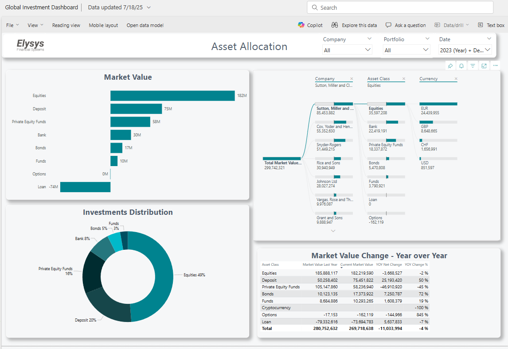 | 
| _Available filters on the first page_ | 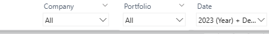 |
| The page can be   extended to get  more details **about the  position** via  **Drill through** on each  asset class | 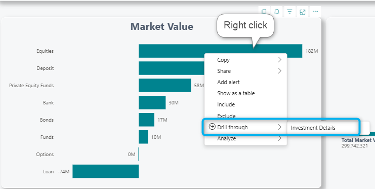 |
| From the new page with the  investment details,  **another Drill through** can  be done to access the  **historical transactions** or  **price movement** | 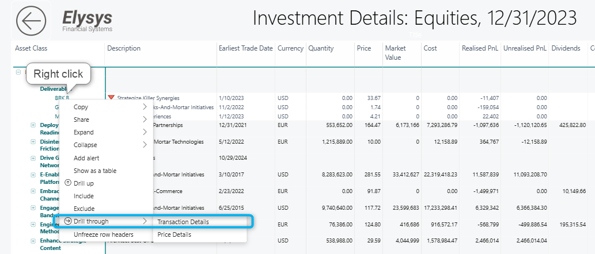 |
| Second page of the report - **Quarterly** | 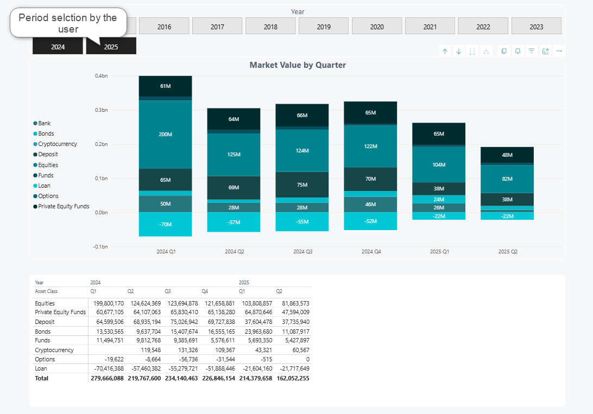 |

**Fields, Metrics and Visuals Used**

When switching to **_Edit_** mode, the user can see the fields available from Elysys Analytics on the **right side of the screen**. These fields are displayed in various tables that are relevant for a specific type of report.

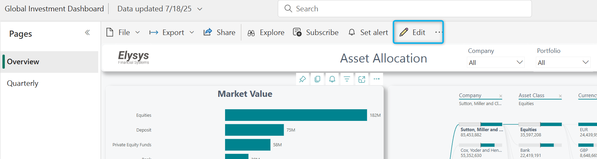
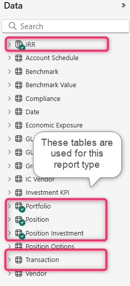

These are the most used fields for the Global Investment Dashboard.

| Table | Field Name | Definition | Usage in Report |
| --- | --- | --- | --- |
| Portfolio | Asset Class | Category of the security (e.g., Equity, PE Funds) | Used for grouping and exposure analysis |
| Portfolio | Company | The legal entity (holding/ trust, etc) | Used for grouping and exposure analysis |
| Portfolio | Currency | Reporting currency of the position | Used for grouping and exposure analysis |
| Portfolio | Portfolio Code | Identifier for the client's portfolio | Used for grouping and exposure analysis |
| Portfolio | Investment Code | Unique code for the investment instrument | Enables position-level drill-down |
| Portfolio | Description | Description for the investment instrument | Enables position-level drill-down |
| Portfolio | First Trade Date | Date of the earliest transaction for a position | Useful for aging, lifecycle, and classification |
| Position | Market Value GCY | Market value in group currency (e.g., EUR) * | Standardized for portfolio-wide aggregation |
| Position | Quantity | Number of shares or units held | Used in holdings table |
| Position | Last Trading Price | Most recent price per unit/share | Used for valuation and pricing visuals |
| Position | Amount | Average cost amount since inception | Shown in trades and investment summary |
| Position Investment | Unrealised Gain Loss | Change in market value of holdings not yet sold since inception | Included in performance metrics |
| Position Investment | Realised Gain Loss | Profit or loss recognized from sold investments since inception | Included in performance metrics |
| Position Investment | Total Gain Loss | Sum of realised and unrealised gains/losses since inception | Included in performance metrics |
| Position Investment | Dividends | Income earned from equity/ funds and private equity funds holdings since inception | Included in performance metrics |
| Position Investment | Coupons | Received periodic interest from fixed income securities since inception | Included in performance metrics |
| Position | Total Fees | All fees attributed to the position (buys and sells) since inception | Included in performance metrics |
| Position Investment | Fees | Fees related to private equity funds income since inception | Included in performance metrics |
| Position Investment | Tax | Tax related to private equity funds income since inception | Included in performance metrics |
| Position Investment | Expenses | Expenses related to private equity funds income since inception | Included in performance metrics |
| IRR | IRR | Internal Rate of Return based on cash flow | Included in performance metrics |
| Position | TWR YTD Div | Year-to-date Time-Weighted Return including dividends | Included in performance metrics |
| Position | Interest Paid | Interest disbursed from the portfolio since inception | Included in performance metrics |
| Position | Interest Accrued | Interest earned but not yet received | Included in performance metrics |
| Transaction | Ledger | Accounting ledger used for recording the transaction |  |
| Transaction | AssetClass | Category of asset involved in the transaction |  |
| Transaction | Cmpany | Entity associated with the transaction |  |
| Transaction | PortfolioCode | Portfolio identifier for transaction ownership |  |
| Transaction | InvestmentCode | Security code involved in the transaction |  |
| Transaction | Description | Description of the security involved in the transaction |  |
| Transaction | CurrencyCodeICY | Currency code in which transaction was reported |  |
| Transaction | DocumentType | Type of supporting document (e.g., Purchase, Sale, Dividend, etc) |  |
| Transaction | DocumentNo | Reference number for the transaction |  |
| Transaction | Posting Date | Date when the transaction was recorded |  |
| Transaction | Transaction Amount | Value exchanged in the transaction (average cost) |  |
| Transaction | Transaction price | Price per unit/share at which transaction occurred |  |

_\*For Bonds, it includes the accrued interest_

**Glossary of Common Terms**

Each calculated amount is available in two different currency translations: ICY and GCY.

Depending on the amount, the translation happens automatically **at the report date** (i.e Market Value) or at the **date it was posted** in the system (i.e posting date from BC/ Elysys Wealth).

| ICY | Investment currency |
| --- | --- |
| GCY | Global currency (i.e EUR, USD) |

    Trial Balance & General Ledger Report with Dimensions

### Trial Balance

This report provides a complete financial view by combining the **Trial Balance** and the **Detailed General Ledger (GL),** both enhanced with organizational dimensions.

**Purpose:** Summarizes the balances of all accounts, showing the opening balance, debits and credits for the selected period and closing balance. It includes the following:

*   Account Category,
*   Account No,
*   Account Name,
*   Dimension Name.

**Fields, Metrics and Visuals Used**

When switching to **_Edit_** mode, the user can see the fields available from Elysys Analytics on the **right side of the screen**. These fields are displayed in various tables that are relevant for a specific type of report.

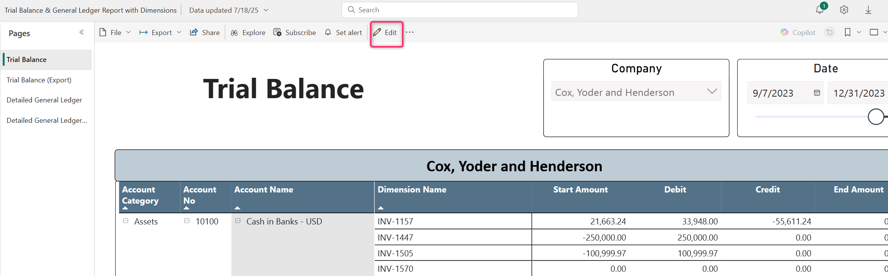
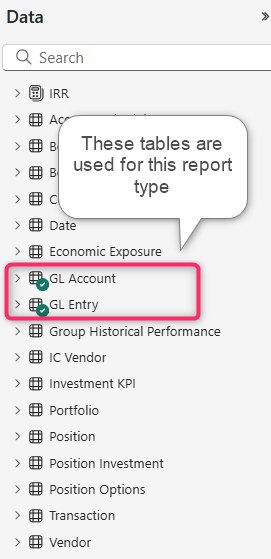

**Report’s structure:**
|  |  |
| --- | --- |
| First Page of the report – Trial Balance |  |
| _Available filters on the first page_ | 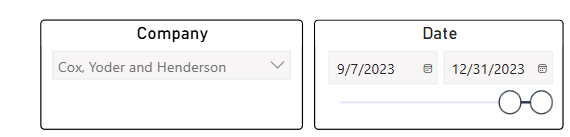 |
| Second page of the report – Detailed General Ledger | 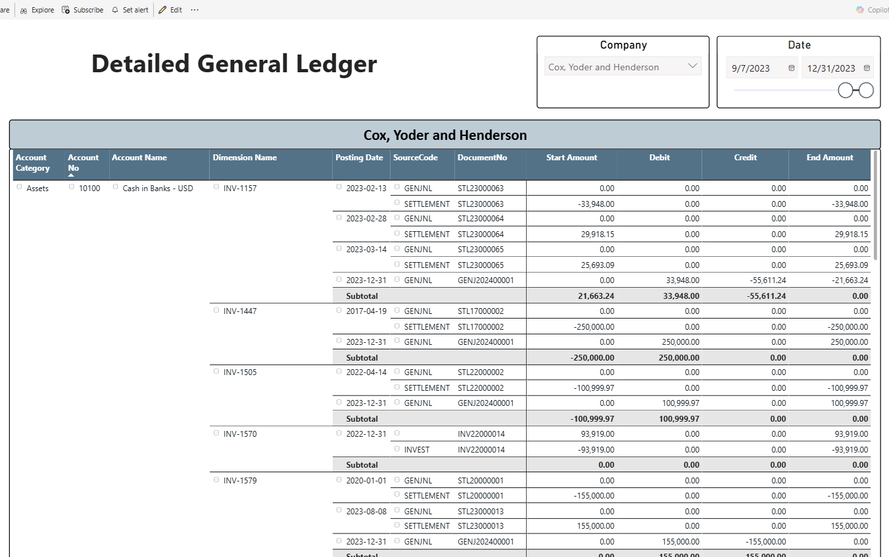 |

These are the most used fields for the Global Investment Dashboard.

| Table | Field Name | Definition | Usage in Report |
| --- | --- | --- | --- |
| GL Account | Account Category | Category of the account (i.e Assets, Equity, Income, etc) | Used for grouping and exposure analysis |
| GL Account | Account No | Unique code for the GL account | Used for grouping and exposure analysis |
| GL Account | Account Name | Description of the GL account | Used for grouping and exposure analysis |
| GL Account | Dimension Name | Unique code for the investment instrument | Used for grouping and exposure analysis |
| GL Entry | Posting Date | The date of the trade from the general ledger | Used for grouping and exposure analysis |
| GL Account | Source Code | The nature of the trade (i.e general, settlement, investment, etc) | Used for grouping and exposure analysis |
| GL Account | Document No | Unique identifier that tracks the trade | Used for grouping and exposure analysis |
| GL Entry | Start Amount | Opening balance in local currency |  |
| GL Entry | Debit | Debit amount in local currency during the period |  |
| GL Entry | Credit | Ending balance in local currency |  |
| GL Entry | End Amount | Closing balance in local currency |  |

### Detailed General Ledger

The **Detailed General Ledger** provides complete visibility into all financial transactions recorded in the general ledger, enriched with organizational dimensions. It shows the opening balance, debits and credits for the selected period and closing balance

**Purpose:**

*   Review every journal entry line that contributes to account balances.
*   Analyze transactions not only by account but also by dimensions for deeper insight into financial performance.

It includes the following:

*   Account Category,
*   Account No
*   Account Name
*   Dimension Name,
*   Posting Date,
*   Document Number

    Key Financial Indicators Dashboard

### Balance Sheet & Income Statement

This **Key Financial Indicators** report is structured to provide a clear financial snapshot through two dedicated pages and custom fields created on top of these two:

*   **Balance Sheet Page**
*   **Income Statement Page**

**Purpose:** Summarizes the balances of all lines from balance sheet/ income statement, showing the balance for the selected period and company(s). It includes the following:

*   Line No,
*   Description of the line,
*   Balance,
*   Net Change.

**_Important Notes_**

*   _To view this report in Power BI, a prerequisite setup must be completed in_ **_Business Central_** _using the_ **_Financial Report module_**_, specifically through the_ **_Account Schedules_**_. The data displayed in the report is based on these schedules and their configurations._
*   _This report is not compatible with_ **_dimension-based reporting_**_. It relies solely on the structure and data defined within the Account Schedule setup._

**Fields, Metrics and Visuals Used**

When switching to **_Edit_** mode, the user can see the fields available from Elysys Analytics on the **right side of the screen**. These fields are displayed in various tables that are relevant for a specific type of report.

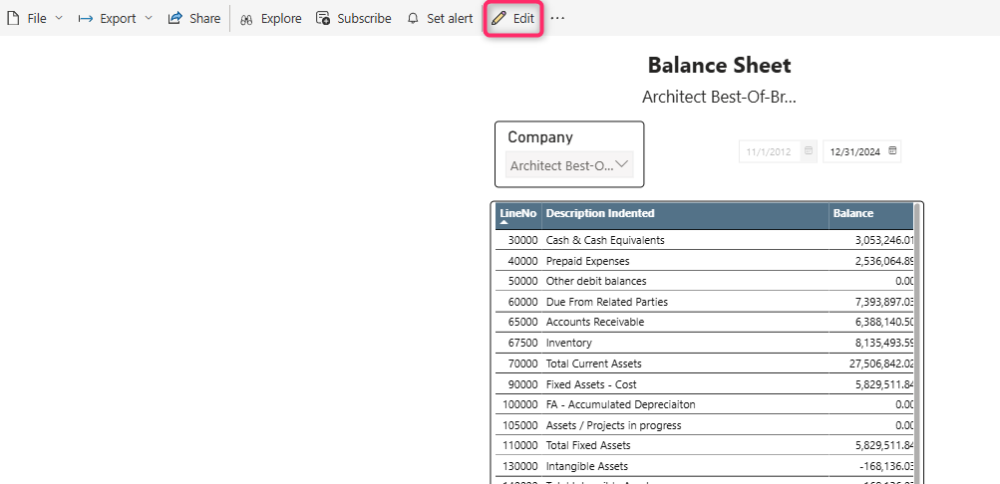
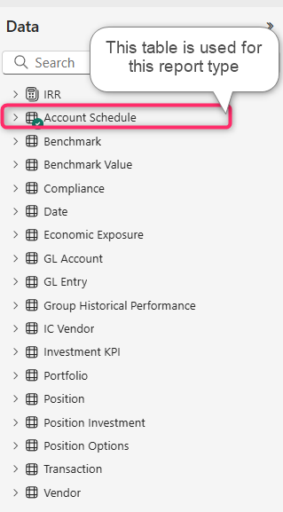

**Report’s structure:**

|  |  |
| --- | --- |
| First Page of the report – **Balance Sheet** | 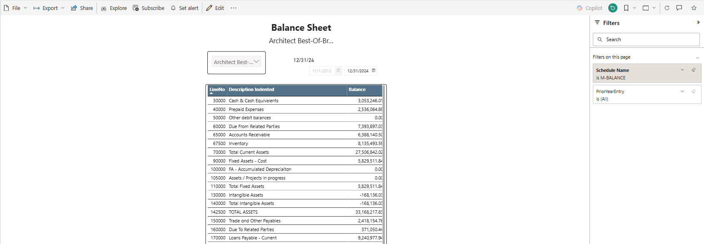 |
| _Available filters on the first page_ | 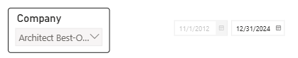 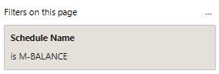 |
| Second page of the report – Income Statement | 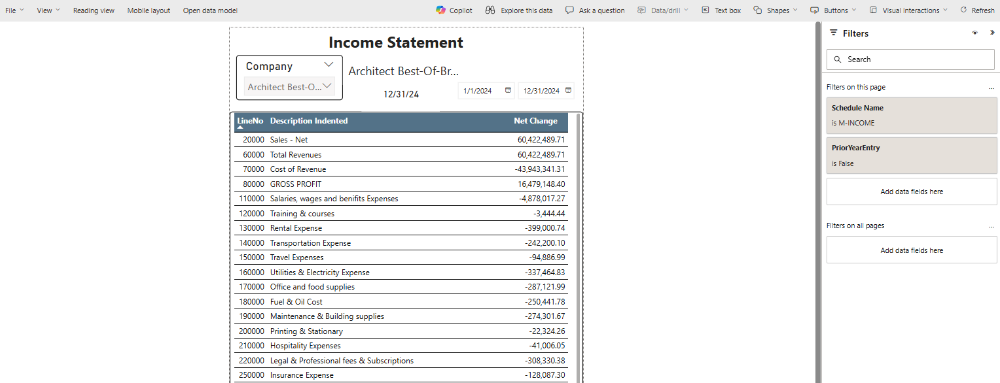 |
| _Available filters on the first page_ | 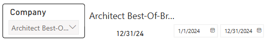 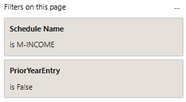 |

These are the most used fields for the Key Financial Indicators Dashboard.

| Table | Field Name | Definition | Usage in Report |
| --- | --- | --- | --- |
| Date | Date | Report period | Used for filtering |
| Account Schedule | Company | The legal entity (holding/ trust, etc) | Used for grouping and exposure analysis |
| Account Schedule | Line No | Reporting currency of the position | Used for grouping |
| Account Schedule | Description | Line description from the balance sheet/ income statement | Used for grouping and exposure analysis |
| Account Schedule | Account Schedule Amount LTD | The balance inception to date |  |
| Account Schedule | Account Schedule Amount | The balance at the posting date |  |

    Accounts Payable & Vendor Ledger Dashboard with Dimensions

This Power BI report provides a detailed view of vendor-related transactions, enabling users to monitor and analyze accounts payable balances at the transaction level. Each entry includes:

*   Document Type,
*   Posting Date,
*   Document Number,
*   Associated Dimensions,
*   Outstanding Balance,
*   Dimensions.

**Fields, Metrics and Visuals Used**

When switching to **_Edit_** mode, the user can see the fields available from Elysys Analytics on the **right side of the screen**. These fields are displayed in various tables that are relevant for a specific type of report.

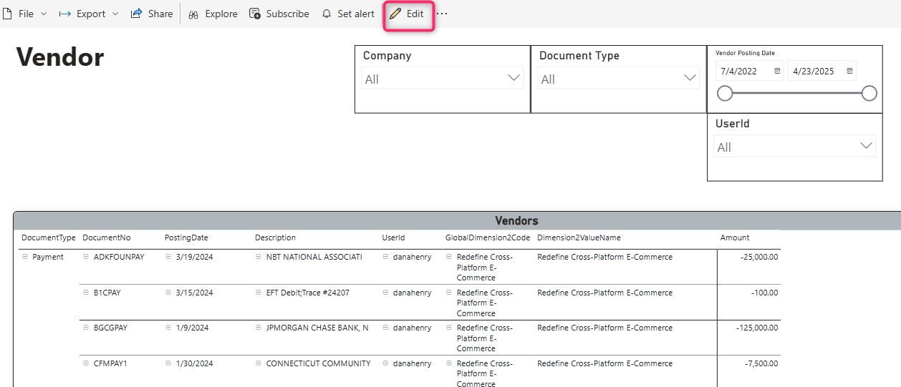
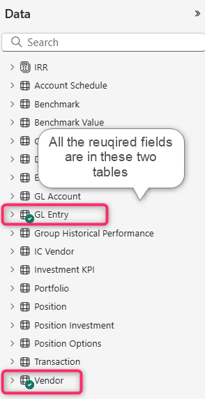

**Report’s structure:**

|  |  |
| --- | --- |
| First Page of the report – **Vendor Matrix** | 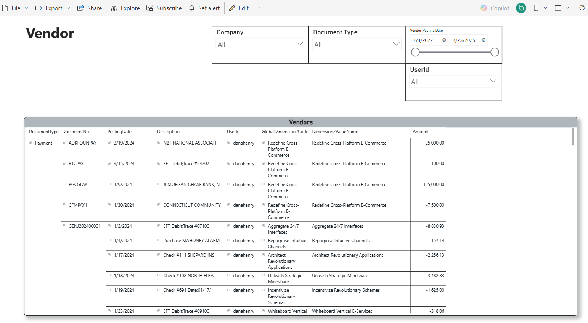 |
| _Available filters on the first page_ | 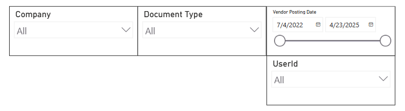 |
| Second page of the report – **Vendor Table** (same content, but the visual format is different) | 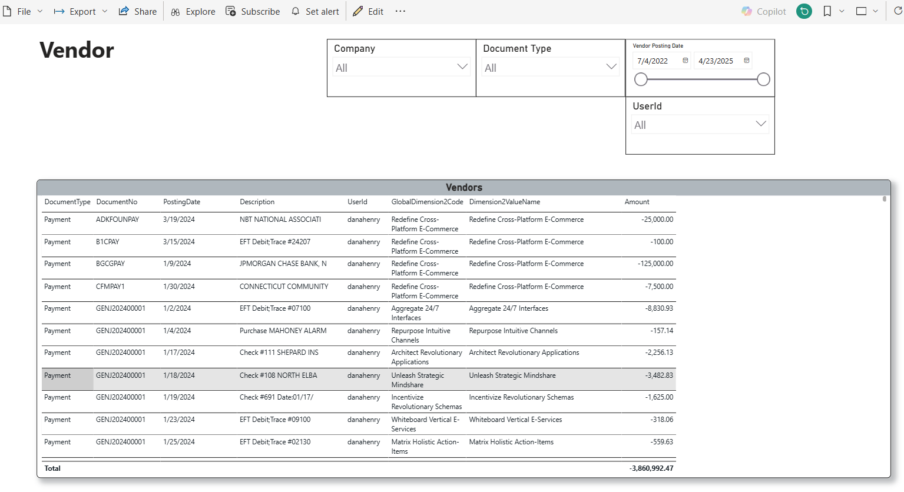 |

These are the most used fields for the Accounts Payable & Vendor Ledger Dashboard with Dimensions.

| Table | Field Name | Definition | Usage in Report |
| --- | --- | --- | --- |
| Date | Date | Report period | Used for filtering |
| Vendor | Company | The legal entity (holding/ trust, etc) | Used for grouping and exposure analysis |
| Vendor | Document Type | The transaction type (payment, invoice, refund, etc) | Used for grouping |
| Vendor | Document No | Unique identifier that tracks the trade | Used for grouping |
| Vendor | Description | The trade description | Used for grouping |
| Vendor | User Id | The user id who posted the trade | Used for grouping |
| GL Entry | Dimension Code or Dimension Value | Dimension code or dimension value assigned to the trade | Used for grouping |
| GL Entry | Amount | The trade amount in local currency |  |