# Semantic Model Extension Creation

## About this guide

This guide provides clear instructions on how to **create a semantic model extension based on the Position View model.**

**Business Scenario:** the client has custom/ specific calculations that are needed to be built into the model.

| **In Power BI Desktop create a blank report** |  |
| --- | --- |
| In **Get data** menu, select Power BI semantic model | 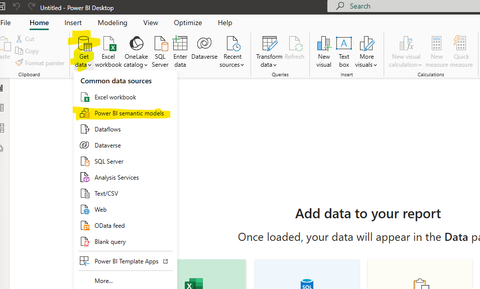 |
| Select the semantic model you want to use and click **connect**. In this example we will use **Position View** semantic model | 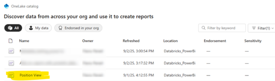 |
| In the **model view**, click on **Make changes to this model**. | 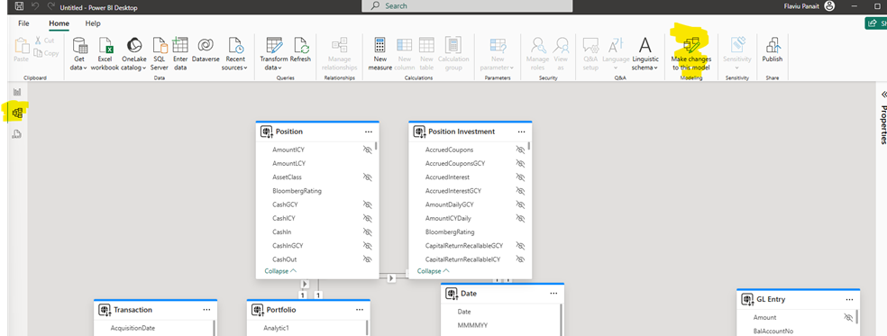 |
| A message will appear -> click on Add local model | 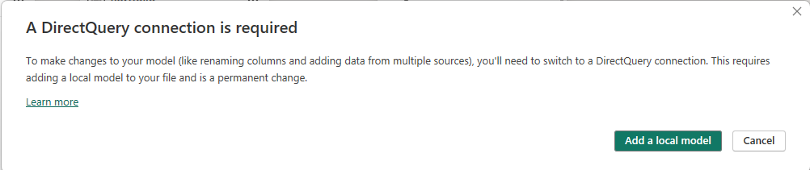 |
| Press **Submit** | 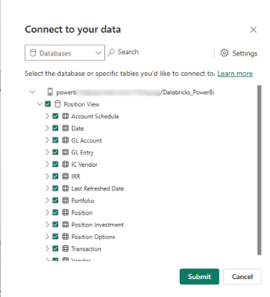 |
| Now you can edit the model. You can add new measures, new tables, rename columns, etc. |  |
| In this example we will add a new table and create a new measure. Click on New table | 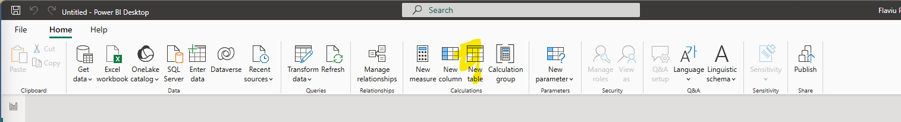 |
| A table will appear. We rename the table to Demo Table | |
| Right click on the Demo Table and add a new measure – Demo Measure | 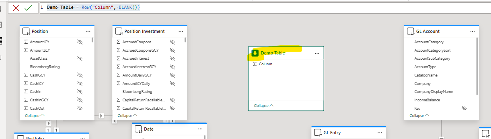 |
| In report view, you can see the new table and the new measure | 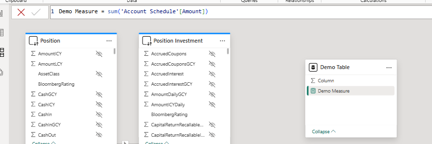  |
| Save and publish the new semantic model | 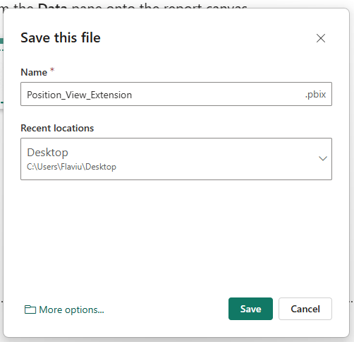 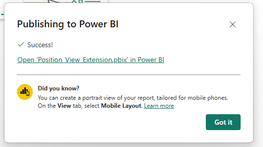 |
| In the workspace you can see now 2 semantic models: Position View and Position View Extension | 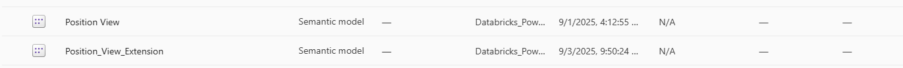 |
| You can start using the new semantic model to create reports. | 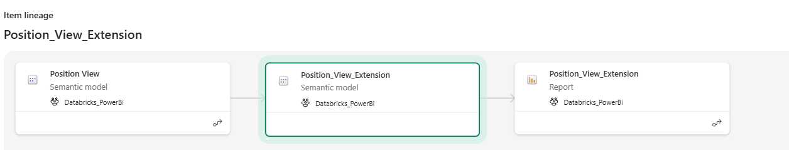 |