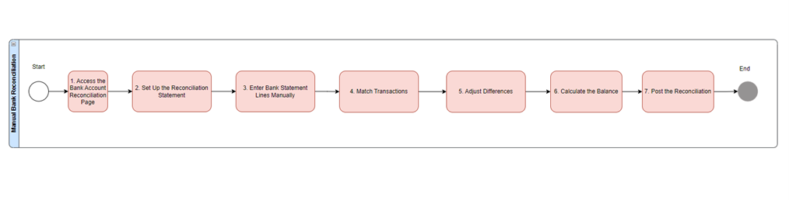
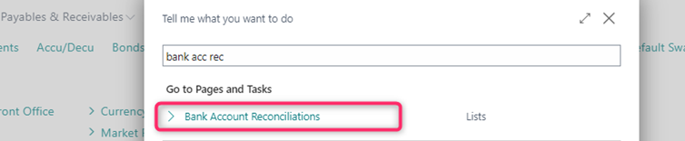
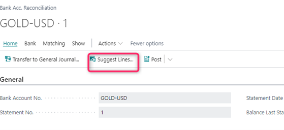
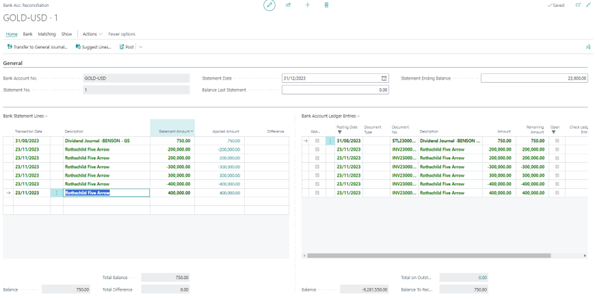
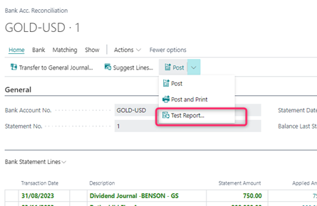
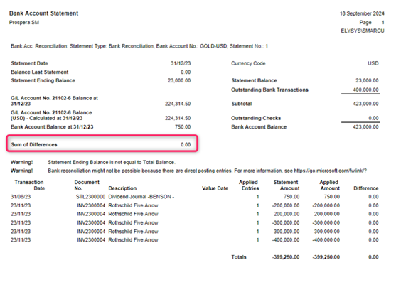

***Elysys Wealth -- Manual Bank Account Reconciliation***

Manual bank account reconciliation in Microsoft Dynamics 365 Business
Central involves matching the transactions recorded in the company\'s
bank account with those in the bank statement provided by the financial
institution.

The purpose is to ensure that the transactions recorded in Business
Central accurately reflect those processed by the bank, identifying any
discrepancies such as missing entries, errors, or fraudulent activity.

**Summary**

**Steps to performing manual bank account reconciliation in Business
Central:**

| | |
| ---        |           --- |
| Access the Bank Account Reconciliation Page |  |
| Choose "New" to create a new reconciliation or open an existing one if you are continuing a reconciliation process. | |
| Set Up the Reconciliation Statement | Bank Account: Select the bank account you want to reconcile.   Statement No.: Enter a unique identifier for the reconciliation statement.   Statement Date: Enter the date of the bank statement you are reconciling against.   Statement Ending Balance: Enter the ending balance from the bank statement. |
| Enter Bank Statement Lines Manually or via the Suggest Lines function |  |
| Match Transactions |    Move to the "Bank Account Ledger Entries" pane, which displays all the transactions recorded in Business Central for the selected bank account.   Manually match the transactions from the bank statement (in the "Bank Statement Lines") with the corresponding transactions in the ledger entries.   To mark transactions as matched, select the checkboxes next to the entries in both panes. |
| Adjust Differences | If there are discrepancies, such as missing or incorrect entries, you need to investigate and resolve them.   Possible actions include:   -	Adding missing transactions to Business Central (e.g., bank fees, interest).   -	Correcting errors in recorded transactions.   -	Identifying transactions that need to be adjusted or are pending.   Use the "Transfer to General Journal" action to create journal entries for any necessary adjustments. |
| Review and Correct (if necessary) | If discrepancies persist, review the bank statement and ledger entries to identify the issues.   You can save the reconciliation without posting it if you need more time to resolve discrepancies.       |
| Post the Reconciliation | Once all transactions are matched and the difference is zero, select "Post" to finalize the reconciliation.   This action locks the reconciliation, preventing further changes, and updates the bank account's reconciled balance. |

**Tips for Effective Manual Reconciliation**

-   You can also import bank statement files in comma or semicolon
    delimited format (.CSV). Use the Set up a bank statement file format
    assisted setup to define bank statement import formats and attach
    the format to a bank account. You can then use these formats when
    you import bank statements in the Bank Account Reconciliation page.
-   You can use a mix of manual and automatic matching. If you have
    manually matched entries, automatic matching will not overwrite your
    selections.
-   When matching lines and entries manually, the Show All, Show
    Reversed Entries, Hide Reversed Entries, and Show Nonmatched actions
    can make it easier to get an overview. By default, the bank account
    ledger entries don\'t include unmatched reversed entries. To include
    these entries in the list and match them manually, choose the Show
    Reversed Entries action. If you choose to hide reversed entries
    after you\'ve made one or more matches, the matched entries are
    still shown.
-   You can also manually match multiple bank statement lines with one
    bank account ledger entry. For example, this might be useful if your
    bank deposit contained several payment methods, such as credit cards
    from different issuers, and your bank lists those as separate lines.
-   To remove a match, select the bank statement line, and then choose
    the Remove Match action. If you have matched multiple bank statement
    lines to a ledger entry, and need to remove one or more of the
    matched lines, all of the manual matches are removed for the ledger
    entry when you choose Remove Match.
-   If you run the Test Report from the Payment Reconciliation Journal
    page, Business Central calculates the value in the Statement Ending
    Balance as follows:
-   balance last statement + sum of all lines in the payment
    reconciliation journal
> You can use the value to compare to your bank statement.
-   Remember to set the appropriate Statement ending date (in this
    example, that is March 31), and edit the Balance Last Statement
    field.
Microsoft documentation :
*https://learn.microsoft.com/en-us/dynamics365/business-central/bank-how-reconcile-bank-accounts-separately*
