# Chart of Accounts

*Note: the below documentation is provided by Microsoft. To make sure
you are reading the most up to date documentation, please use the
official [Microsoft Dynamics 365 Business Central
documentation](https://learn.microsoft.com/en-us/training/dynamics365/business-central)
link.*

# **Setting up G/L accounts**

The income statement and balance sheet are two important company
financial reports. In Business Central, an account in the income
statement and the balance sheet is called a G/L account, and all the G/L
accounts make up the **Chart of Accounts** list.

In the **Chart of Accounts** list, all G/L accounts are available and
can be viewed at one time. However, there is also a **G/L Account Card**
for each account, and this can be accessed from the **Chart of
Accounts** list.

You can use G/L account cards to create and edit G/L accounts. The G/L
account card has the following five FastTabs:

-   **General**

-   **Posting**

-   **Consolidation**

-   **Reporting**

-   **Cost Accounting**

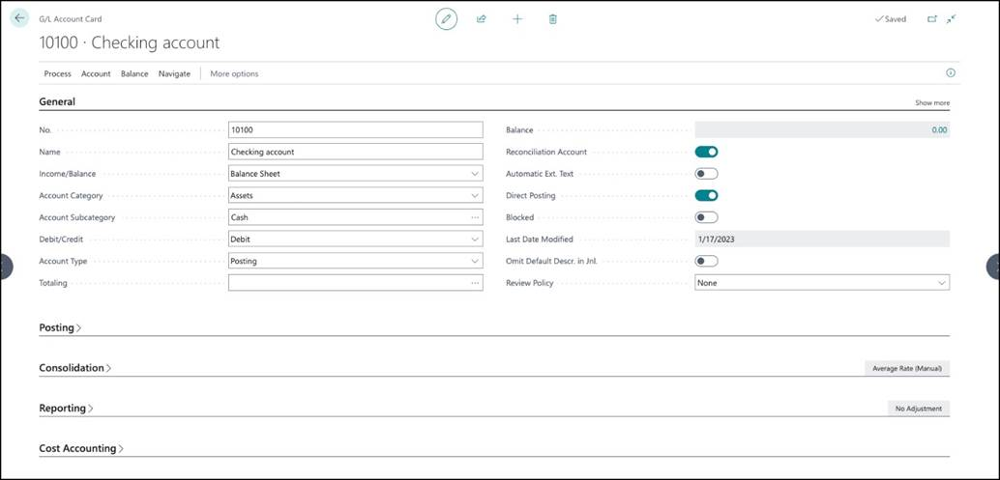

In this scenario, let\'s say that you need to create a new G/L account
for telephone expenses. To create the account, follow these steps:

1.  Select the **Search for Page** icon in the top-right corner of the
    page, enter **chart of accounts**, and then select the related link.

2.  Select **New**.

3.  Expand the **General** FastTab. The following table provides
    descriptions of the fields on the **General** FastTab and the data
    to enter for this demonstration.

| **Field** |  **Description** | **Demonstration data** |
| :---        |    :----:   |          ---: |
|  No.       | The number of the G/L account.       | 613500   |  
|  Name       |      The name or description.            |       Telephone expenses|
| Income/Balance |  Indicates whether the account is  classified as an income statement of a balance sheet account. This field is important to determine whether an account must be closed in the fiscal year-end. | Income Statement |
| Account Category| Specifies the category of the G/L account, like assets, equity, and so on. This field is used for creating financial statements.|Expense|
|Account Subcategory|Specifies the subcategory of the account category of the G/L account. This field is used for creating financial statements.|Utilities Expense|   
|Debit/Credit | Indicates the type of entries that will be posted to this account. The selection that  is made does not restrict the type of transaction that is posted to the account. |Both|   
|Account Type|Indicates the purpose for the account in the different lists, journals, and reports. The available options are: Posting - The only account type where entries can be posted. Heading - Used for description and reporting purposes only. Total - Used to total the accounts that are nominated in the Totaling field. Begin-Total - Marks the beginning of an account range in the Totaling field. End-Total - Marks the end of an account range in the Totaling field.|Posting|   
|Totaling|Specifies an account interval or a list of account numbers. The program will total the entries of the accounts that are displayed in this field. Totaling formulas are possible for G/L accounts of the Total and End-Total account types.|\<blank>|   
|Balance|Displays the current balance of the account. Select the balance amount to access the General Ledger Entries list.||   
|Reconciliation Account|Determines whether the G/L account is included in the Reconciliation list in the general journals. Use the Reconciliation list before posting to review the effect of posting the accounts in the journal.|No|   
|Automatic Ext. Texts|If this field is selected, extended text that is set up on the accounts is automatically added to the sales and purchase documentation in the Description field. If this field isn't selected, extended text can still be set up on the account and added to documents manually. To create the extended text, select Extended Text on the Navigate tab.|No|   
|Direct Posting|Indicates whether posting can move directly into this account from a journal line. This field is automatically selected when new accounts are created. G/L accounts, such as the receivables (trade debtors) account, that are posted based on posting groups are usually only set up for indirect posting.|Yes|   
|Blocked|If you select this field, it prevents entries from posting to this account. Accounts can be blocked and reopened as needed.||   
|Last Date Modified|System-generated field that displays the date that the G/L account was last changed.|System generated|   
|Omit Default Descr. in Jnl|Specifies if the default description is automatically inserted in the Description field on journal lines that are created for this general ledger account.||   
|Review Policy|Specifies how to allow reviews of G/L entries in the Review Policy field.||                      

 
4.  Expand the **Posting** FastTab. The following table provides
    descriptions of the fields on the **Posting** FastTab and the data
    to enter for this demonstration.
    

| **Field** |  **Description**    | **Demonstration data**|
| :---        |    :----:   |          ---: |
|Gen. Posting Type|Defines whether the account is used only for a Sale or Purchase transaction or with both types of transactions. This field is used with the VAT Bus. Posting Group and VAT Prod. Posting Group fields to determine where the system will post VAT. The following options are available: \<Blank>, Purchase, and Sale.|Purchase|
|Gen. Bus. Posting Group|Identifies the default general business posting group for the account. This field is used together with the Gen. Prod. Posting Group and Gen. Posting Type fields to find the G/L accounts to post to for sales, purchases, discount amounts, Cost of Goods Sold (COGS), and inventory adjustments. Because the general business posting group indicates whom you sell to or buy from, the customer’s or vendor’s general business posting group takes priority over the G/L account’s general business posting group. When no customer or vendor is involved in a transaction, the program will use the G/L account’s general business posting group.|DOMESTIC|
|Gen Prod. Posting Group|Identifies the default general product posting group for the account. This field is used with the Gen. Bus. Posting Group and Gen. Posting Type fields to find the G/L accounts to post to for sales, purchases, discount amounts, COGS, and inventory adjustments. The general product posting group of an item takes priority over the G/L account’s general product posting group.|SERVICES|
|VAT Bus. Posting Group|Identifies the default VAT Business Posting Group for the account. This field is used with the VAT Prod. Posting Group and Gen. Posting Type fields to determine the VAT percentage and the VAT calculation type and to find the G/L accounts where the program posts VAT. Because the VAT business posting group indicates whom you sell to or buy from, the customer’s or vendor’s VAT business posting group takes priority over the G/L account’s VAT business posting group. When no customer or vendor is involved in a transaction, the program will use the G/L account’s VAT business posting group.|DOMESTIC|
|VAT Prod. Posting Group|Identifies the default VAT Product Posting Group for the account. This field is used with the VAT Bus. Posting Group and Gen. Posting Type fields to determine the VAT percent and the VAT calculation type and to find the G/L accounts where the program posts VAT. The VAT product posting group of an item takes priority over the G/L account’s VAT product posting group.|VAT25|
|Default IC Partner G/L Acc. No|Identifies the default Intercompany (IC) G/L account number for this G/L account. When you enter this G/L account in an intercompany general journal, the IC G/L account that is specified in this field is used as the default balancing account number.|\<blank>|
|Default Deferral Template|Specifies the default deferral template that governs how to defer revenues and expenses to the periods when they occurred.|\<blank>|

**Review Policy** on the **General** FastTab has a few options that
weren\'t discussed above. The following options are available:

-   **None:** You can\'t mark entries for the account as reviewed. For
    example, use this option for accounts such as payables, receivables,
    and bank accounts where there are other ways to review their
    amounts.

-   **Review allowed:** You don\'t have to include entries in a review,
    and the amounts of the debit and credit entries don\'t have to
    balance. You remove a review, for example, if you\'ve made a
    mistake.

-   **Review allowed and match balance:** The total amounts of the debit
    and credit entries in the review must match. The **Debit** and
    **Credit** fields show those amounts, and the **Balance** field
    shows the total. This setting also lets you remove a review. When
    you remove a review from one or more entries, the debit and credit
    entries must still balance.

Refer to the **Review general ledger entries** unit in this module for
information on reviewing journal entries.

On the **Consolidation** FastTab, you can enter the debit and credit
account of the consolidation company to map with. When running the
consolidation from the consolidation company, the program creates
general journal lines for each business unit, based on the mapping
entered here. When the company has a different local currency than the
consolidation company, you can select a consolidation translation method
for the G/L account. This specifies the currency translation rate to be
applied to the account.

On the **Reporting** FastTab, you can specify if you want to process
exchange rate adjustments between the local currency and the additional
reporting currency for this account.

The **Cost Accounting** FastTab shows the cost type the G/L account is
mapped to.

For this example, you don\'t need to enter the **Consolidation**,
**Reporting**, and **Cost Accounting** FastTabs.

If you completed the steps in the scenario, when you close the G/L
account card, you should see the new G/L account you set up for
telephone expenses appearing in the chart of accounts.

# **Use the chart of accounts**

The chart of accounts shows the ledger accounts that store your
financial data.

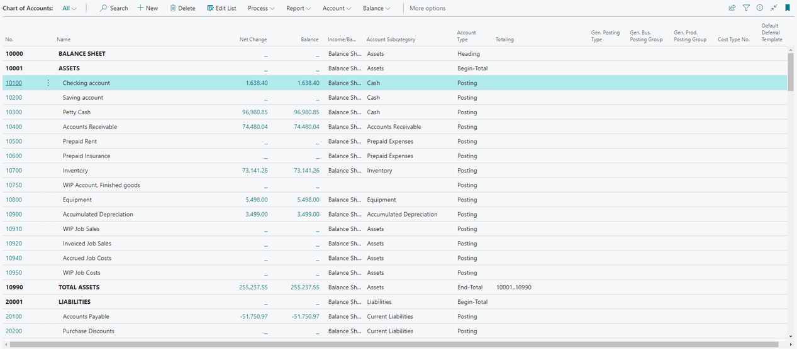

From the chart of accounts, you can open each G/L account. However, by
selecting **Edit List**, you can also update current or create new G/L
accounts. You can drill down on the **Net Change** and **Balance**
fields to display the ledger entries of a G/L account.

The **Chart of Accounts Overview** page is a simpler version of the
chart of accounts. If you just want a quick overview of the basics, such
as net changes and balances, the **Chart of Accounts Overview** page is
a useful alternative.

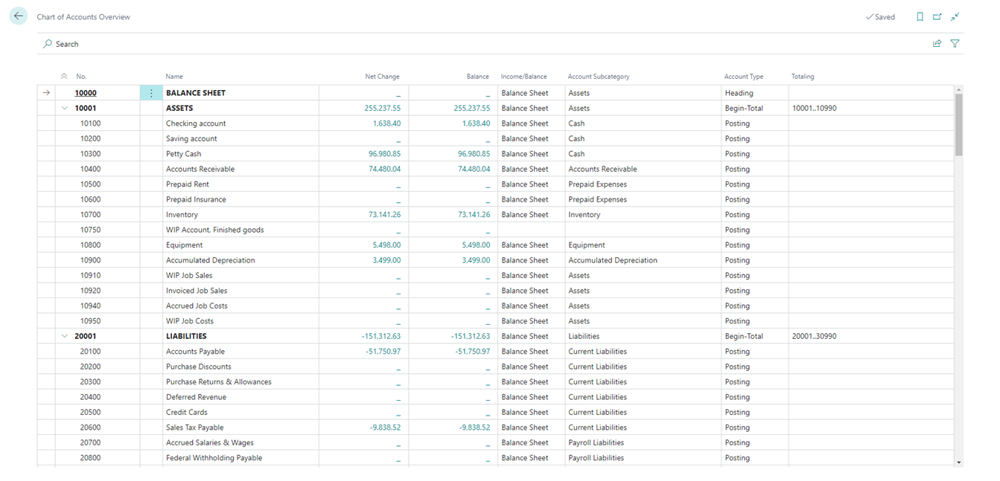

Just like the chart of accounts, it displays basic information like the
net change and balance of all G/L accounts. You can collapse rows of
account type **Begin-Total**. By bookmarking the **Chart of Accounts
Overview** page, you have direct access from your role center.

# Set up account categories and subcategories

The previous unit explained that you can assign G/L account categories
and subcategories. This unit examines these categories and subcategories
in more detail.

You can personalize the structure of your financial statements by
mapping general ledger accounts to G/L account categories.

Besides structuring the chart of accounts, you can use the account
categories and subcategories to create the following financial reports:

-   Balance sheet

-   Income statement

-   Cash flow statement

-   Retained earnings report

On a G/L account card, you can assign one of the following G/L account
categories:

-   \<blank\>

-   Assets

-   Liabilities

-   Equity

-   Income

-   Cost of Goods Sold

-   Expense

You can further divide these G/L account categories into subcategories.
Select the **Search for Page** icon in the top-right corner of the page
icon, enter **G/L account categories**, and then select the related
link.

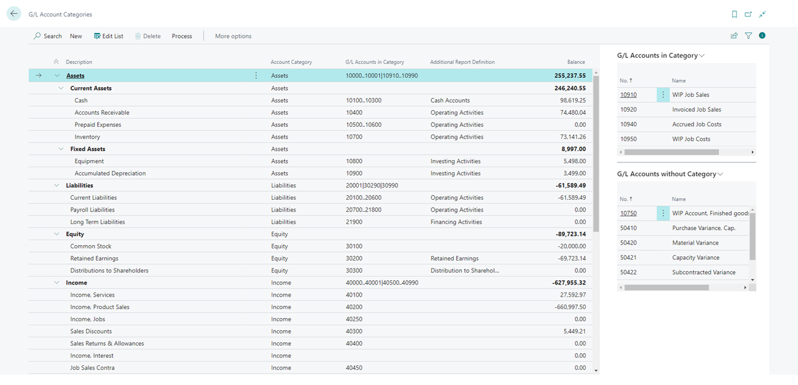

The **G/L Account Categories** window shows your categories and
subcategories and the G/L accounts that are assigned to them. You can
create new subcategories and assign those categories to existing
accounts.

You can create a category group by indenting other subcategories under a
line in the **G/L Account Categories** window. This approach simplifies
your task of getting an overview because each grouping shows a total
balance. For example, you can create subcategories for different types
of assets and then create category groups for fixed assets versus
current assets.

You can specify whether the accounts in each subcategory must be
included in specific types of reports be selecting one of the following
values in the **Additional Report Definition** field:

-   \<blank\>

-   Operating Activities

-   Investing Activities

-   Financing Activities

-   Cash Accounts

-   Retained Earnings

-   Distribution to Shareholders

## Set up financial reports with account categories

Based on account categories and subcategories, you can generate account
schedules for the following reports:

-   Balance sheet

-   Income statement

-   Cash flow statement

-   Retained earnings report

To create financial reports with account categories, follow these steps:

1.  Select the **Search for Page** icon in the top-right corner of the
    page, enter **G/L account categories**, and then select the related
    link.

2.  On the **G/L Account Categories** page, select **Process** and then
    **Generate Account Schedules**.

3.  Specify if you want to create new account schedules or replace the
    existing ones and select **OK**. This only applies to the account
    schedules that are generated from the **G/L Account Categories**
    page and has no impact on the account schedules that are created
    manually.

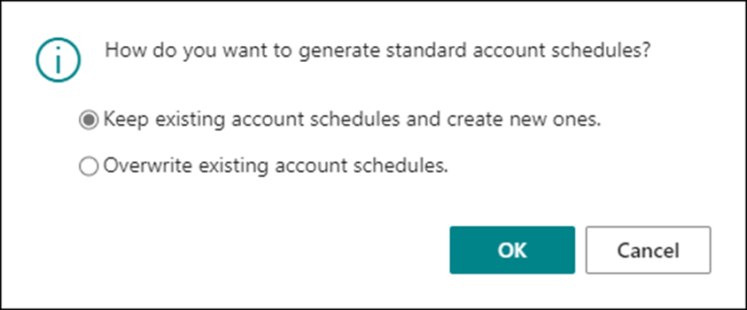

Business Central will create four account schedules. The following
fields on the **G/L Account Categories** page are used to generate the
account schedules:

-   Account Category

-   Additional Report Definition

On the **General Ledger Setup** page, the four account schedules are
specified on the **Reporting** FastTab.

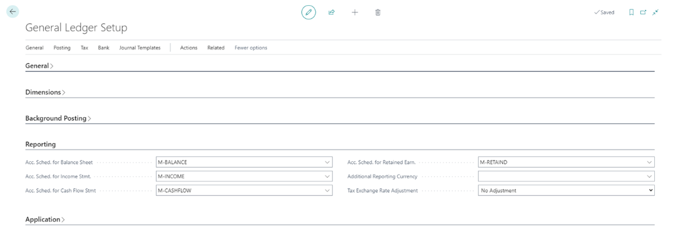

You can run the report in several ways:

-   From the **Account Schedules** page

-   From the role center

To run the reports from the **Account Schedules** page, follow these
steps:

1.  Select the **Search for Page** icon in the top-right corner of the
    page, enter **account schedules**, and then choose the related link.

2.  On the **Account Schedules** page, select one of the account
    schedules, and select **Process**, and then **Overview**.

> 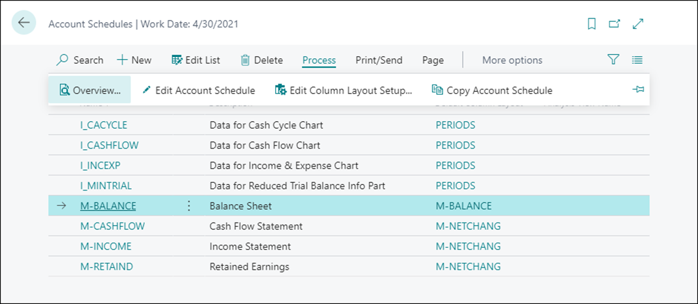

To run the reports from your role center, select **Reports**, and then
**Financial Statements**.

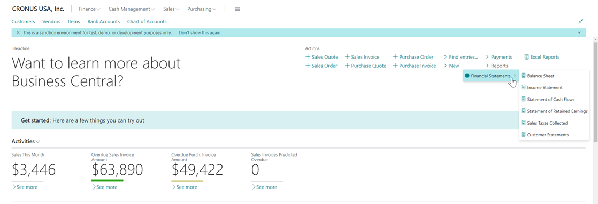

Keep in mind that these financial statements are not included in every
role center. Only the roles that should have access to financial
information (such as Business Manager and Accountant).

# Maintain the chart of accounts

To maintain the chart of accounts, you might need to perform the
following tasks:

-   Add or modify existing accounts

-   Delete accounts

-   Consult the **Where-Used List**

## Add or modify G/L accounts

Typically, you can add new G/L accounts or modify existing ones from the
G/L account card. However, you can also add or modify accounts from the
**Chart of Accounts** list by following these steps:

1.  Select the **Search for Page** icon in the top-right corner of the
    page, enter **chart of accounts**, and then select the related link.

2.  Select **Manage** and then select **Edit List**.

3.  You can now perform one of the following tasks:

    -   **Create a new G/L account** - Select **New** and enter the
        fields as required.

    -   **Modify an existing account** - Locate the account that you
        want to modify and make the required modifications.

## Delete a G/L account

If you want to delete a G/L account, you must consider the following
rules:

-   The account that you want to delete must have a balance that is
    equal to zero (0).

> 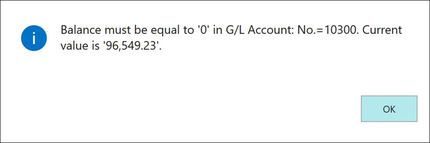

-   The account that you want to delete can\'t have ledger entries in a
    fiscal year that hasn\'t been closed yet.

> 

Furthermore, you can set up two more conditions to prevent users from
deleting G/L accounts. To do so, select the **Search for Page** icon in
the top-right corner of the page, enter **general ledger setup**, and
then select the related link.

On the **General Ledger Setup** card, expand the **General** FastTab and
select **Show more** to display all fields. To add conditions to prevent
the deletion of G/L accounts, consider the following fields:

-   **Check G/L Account Usage** - Specifies that you want the program to
    protect G/L accounts that are used in setup tables from being
    deleted. For example, if this field is enabled, you cannot delete
    accounts that are used in posting group setup tables, even if
    nothing is posted to the account.

-   **Check G/L Acc. Deletion After** - Specifies if and when general
    ledger accounts can be deleted. If you enter a date, G/L accounts
    with entries on or after this date can\'t be deleted.

If you want to prevent users from deleting a G/L account, even when all
the above conditions are met, you can turn on the **Block Deletion of
G/L Accounts** toggle on the General Ledger Setup page.

To block the deletion of G/L accounts, follow these steps:

1.  Select the **Search for Page** icon in the top-right corner of the
    page, enter **general ledger setup**, and then select the related
    link.

2.  Expand the **General** FastTab and click **Show more** to display
    all the fields.

3.  Enable the **Block Deletion of G/L Accounts** field.

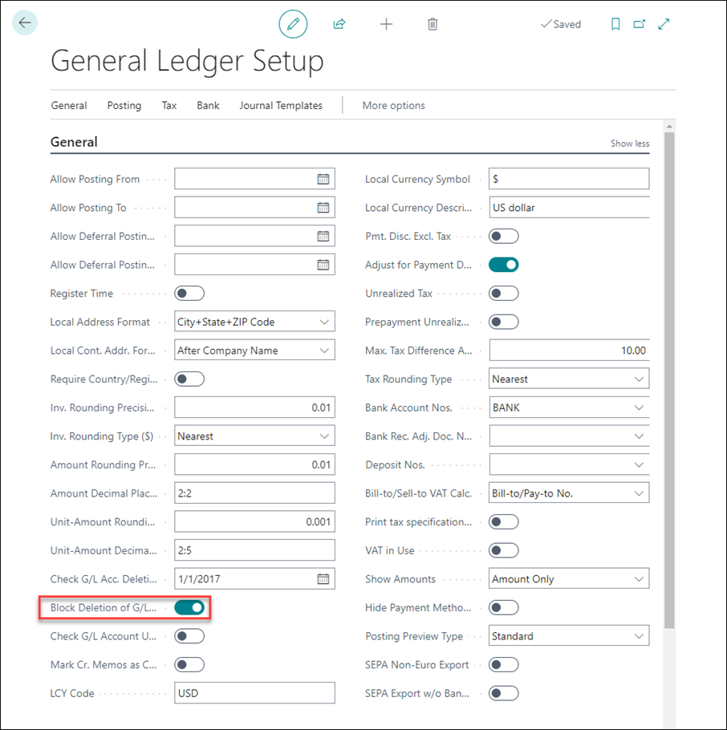

If you turn on the toggle, Business Central will prevent users from
deleting accounts that have entries after the date that is specified in
the **Check G/L Acc. Deletion After** field. If you must delete such
accounts, a user who can access the General Ledger Setup page can turn
off the **Block Deletion of G/L Accounts** toggle.

Note that deletion of G/L accounts with no entries or entries before the
date in the **Check G/L Acc. Deletion After** field is still possible,
even when the **Block Deletion of G/L Accounts** is turned on.

## Consult the Where-Used List

You can use the **Where-Used List** to verify in which setup tables that
a specific G/L account is used. This approach could be useful if you
want to modify the setup or if you want to delete a G/L account.

To access the **Where-Used List**, follow these steps:

1.  Select the **Search for Page** icon in the top-right corner of the
    page, enter **chart of accounts**, and then select the related link.

2.  Select a G/L account, for example 404100 (Income, Services).

3.  On the action menu, select **Edit \> Account \> Where-Used List**.

> 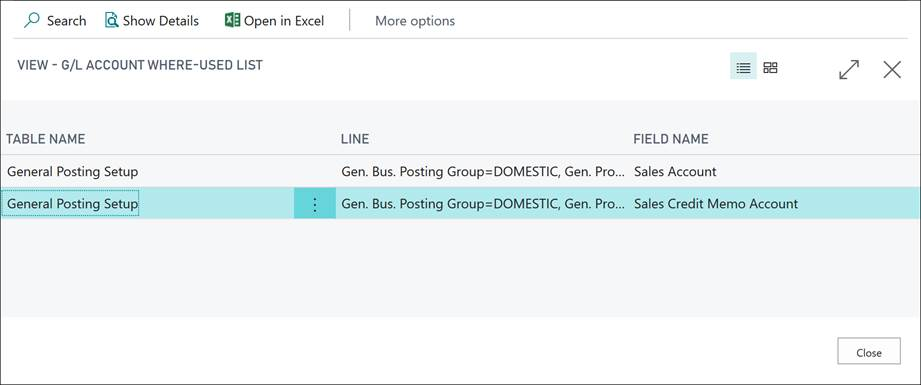

# **Review general ledger entries**

To accelerate the period-end process of reviewing and reconciling G/L
accounts, you can review the G/L entries for G/L accounts and mark the
entries as **Reviewed**. Whether you can review the general ledger
entries for a G/L account, is specified in the **Review Policy** field
on the **General** FastTab of the G/L account card.

For G/L accounts where reviewing is enabled, you can review general
ledger entries as follows:

1.  Select the **Search for Page** icon in the upper-right corner of the
    page, enter **General Ledger Entries**, and then select the related
    link.

2.  Select **Review Entries**.

3.  Select the entries on the page that you have reviewed, and then
    select the **Set selected as reviewed** option.

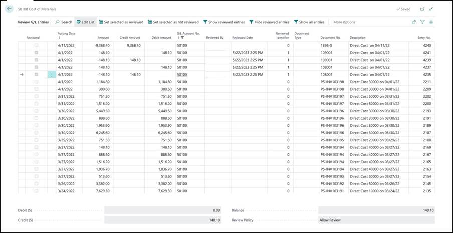

By marking entries as reviewed, the **Reviewed By** field displays the
username and the **Reviewed Date** field the date and time the review
was completed.

You can use the **Set selected as not reviewed** option to clear the
**Reviewed** field for the selected entries.
