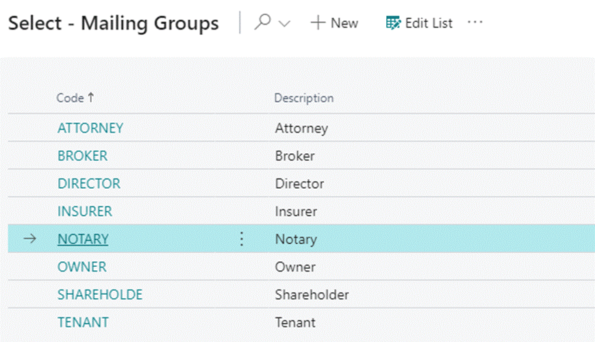
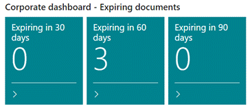

# Elysys Corporate

Elysys Corporate is a management tool that helps companies manage their
organizational structure, shareholders, owners, directors, properties,
and other third-party individuals and/or organizations associated with
the organization e.g., brokers, attorneys and/or tenants.

It includes features such as tracking shareholders' holding percentage,
capital structure, tax reporting, and agreements and contracts
management.

## Setup 

a)  **Corporate Setup**

    Path: Corporate Setup -> Setup -> COP Corporate Setup

1. Define No. Series for the following:

    -   Property

    -   Contact

    -   Company

2. Define professional roles used within the organization, e.g.

    -   Director

    -   Shareholder

    -   Owner

    -   Notary

    

    Specify roles under the Mailing Groups.

    

b)  **Role Setup**

    Path: Corporate Setup -> Role Setup -> COP Role Setup

Specify roles to which professionals are assigned to.

c)  **Incorporation Document Type**

Path: Corporate Setup -> Incorporation Document Type -> Document Type

Specify document types that will be uploaded into the module. The user can define an indefinite number of document types.

## Workflow 
### I. Creating Contacts Automatically 
The system allows automatic integration of Business Central contacts
by defining Bus. Relation Code in the Marketing Setup screen for
Customers, Vendors, Bank Accounts and Employees. Once defined, the
system automatically imports all contacts from Business Central into
Corporate Module.

    Path: Marketing Setup -> Interactions -> Bus. Relation Code for

### II. Creating Contacts Manually 

    Path: Corporate Activities -> Contact

 All contacts need to be created under the Corporate Activities before
 being assigned to corresponding Administration Activities.

 Contacts can be created as a Person or a Company

**Contact Card**

1.   **General**

2. **Communication**

3. **Foreign Trade**

4.  **Notes:**
    -   Aggregated list for all contacts appears under the Contact view.
    -   Contacts created as companies are in **bold**.

    

### III. Administration Activities 

Before a Corporate Contact is created, any related contacts previously
created need to be assigned to a corresponding role or roles under the
Administration Activities.

One contact can be assigned to one or multiple roles.

### IV. Corporate Contact 

Corporate Contact stores detailed information regarding a company or a
person, its contact details, tax information, shareholders and share
distribution, ultimate owners, and directors.

**GENERAL INFORMATION**

**Corporate Contact Information**

**Warning Dates**

Warning 1-3 -- Specifies the important deadlines regarding the Corporate
Contact.

Warning Date 1 -- Specifies the important dates to be tracked by the
company.

Define Warning Events/Dates if you wish to be notified of any upcoming
deadline up to three months before its due date.

#### i. Corporate Contacts -\> Functions 

Under Functions of the Corporate Contact the user can specify Capital
Structures, upload documents, record tax information and assign bank
accounts.

-   **Capital Structures**

-   **Various Corporate** -- supporting information.

-   **Documents History** -- a file can be attached by clicking Upload
    Document then choosing the files to be uploaded.

-   **Tax Filling** -- in order to define Tax Information, go to Tax
    Filling Card then Function where you can define Tax Information of
    the Corporate Contact.

-   **Banks Assigned** -- in order to define Bank Accounts related to
    the Contact go to Banks card.

#### ii. Corporate Contacts -\> Property 

Used to link associated contacts with the corporate contact, e.g., its
Shareholders and Partners and Corporate Owners, their holding
percentage, date of appointments, Directors and other.

    Path: Corporate Contact -> Property
                               Shareholders or Partners
                               Notary
                               Board and Authority
                               Power of Attorney
                               Corporate Property
                               Director or Officer
                               Corporate Owner
                               Insurer

**Shareholders or Partners**

In order to define a Shareholder's holding percentage, select **Type =
Shareholder**.

To link another Corporate Contact and its holding percentage, a company,
or a person, select **Type = Corporate Contact.**

View the chart displaying Organizational Structure and its Shares
Distribution under the main screen of the module.

### V. Property 

###  i. COP Property Card 

Property Card specifies the details of the property, its owners, shares
distribution, tenants, and other third party\'s companies and
individuals, such as a Broker and/or an Insurer assigned to the
property.

-   **Ultimate Owner**

        Path: COP Property Card -\> Property -\> Ultimate Owner

    Specifies Ultimate Owners of the property and the shares distribution.

    

-   **Tenant**

        Path: COP Property Card -> Property -> Tenant

    Specifies details about the tenants occupying the property, the rent
amount and payment method.

    

-   **Corporate Property**

    Specifies the company which has full or partial ownership of the
    property.

    

-   **Notary, Insurer and Broker**

    Specifies the Notary, Insurer and Broker associated with the property.

-   **Power of Attorney Action**

    Specifies the details of the Attorney and the type of authority it
holds.

    
