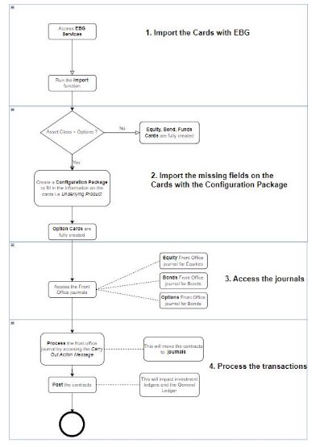
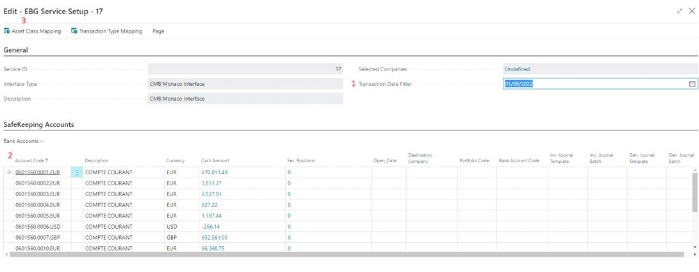
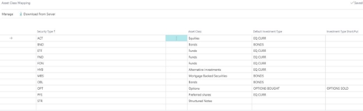
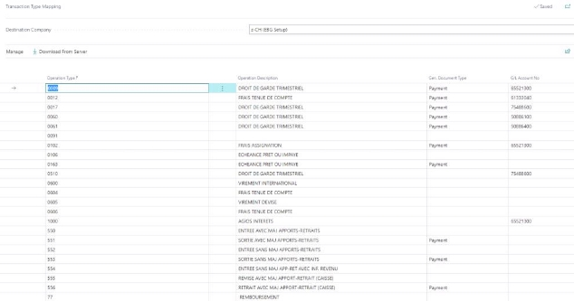

# **EBG User Guide**

Flow Diagram

**Components:**

## 1. Connection Setup

To connect business central with the service please search for the page “EBG Connection Setup”.

Elysys will provide you a Login and password to connect to the service. 

Once filled in you could use the “Test Connection” button to control the network status and authentication.

## 2. Services List

Once the connection is set, you will be able to see the list of available services the provider have setup for you, using the page “EBG Services”.

Opening this page can took few seconds as the system is downloading the services from the server through web service.

## 3. Setup a service

In order to be able to run a service, it is needed to specify the company you want it to run the service on. Click on the column “Selected Company” to open company list.

## 4. Setup Bank Interface 

Bank Interface need additional setup once the company have been selected. Open the configuration page using “Setup” button from the Service list 

1. **Transaction Date Filter** : Specify a starting date to begin the transaction import, or blank for no filter. When the interface is executed, only transaction date >= this value will be proceed.
1. **Safekeeping account mapping:** Specify Business Central mapping with the accounts provided by the bank. Those are not mandatory but highly recommended to reduce manual input.

1) “Destination Company” is the company used to import transaction related to the account
2) “Portfolio Code” is the Elysys Wealth Portfolio to affect investment transaction on Front Office
3) “Bank Account” is the Business Central Bank Account to be affected on cash movement in General journal
4) “Inv. Journal Template/Batch” is used to specify in what journal the investment transaction will be imported. Front Office Only
5) “Gen. Journal Template/Batch” is used to specify in what general journal cash operations will be imported

## 5. Asset Class & Transaction Type Mapping

Specify the relation between specific codes used by Banks and asset class or transaction type in Business Central and Elysys Wealth.

Asset Class Mapping: 

It is used to import investment card from the “security information” provided by the bank

During the import, the process look at each “Security Information”, verify if the investment card already exists in Business Central, then create it if it does not exists yet using Asset Class define in this table. 

**!! If “Asset Class” is set to blank here, related securities will not be imported.** 

**Transaction Type Mapping**

It is used to import the “Cash operations” in **General Journal**

During the import, the process look at “Cash Operation” which have not been imported yet. Then according the Operation Type, will write in General Journal a line using Document Type and G/L Account No. define here.

Document Type and Account No. can be left blank, the operation will be imported. You can remove a line to stop related operations imports.

Gen. Journal Line are imported as following :

- Account Type = Bank Account
- Account No. = Bank Account set on “Safekeeping Account” related to the operation
- Document Type = Gen. Document Type set on “Transaction Type Mapping” related to the operation
- Bal. Account Type = “G/L Account”
- Bal. Account No. = “G/L Account No.” set on “Transaction Type Mapping” related to the operation
- Amount, Date and Description = as provided on the “Cash Operation” from the bank

## 6. Execute & Schedule

On the “EBG Services” list page, you can execute a service manually. The system will then try to integrate data from the service in Business Central. You can use “Execute” button to try a service manually.

While execute a service, the system may create a “Message” : this is the set of data that is imported in business central.

When you’re happy with a service, the integration can be automated, you would then use the “Schedule” button which simply generate a Job Queue to run the service on a daily basis.

You can still verify the history of what data were integrated using the message button :

The columns “Modified Record” and “Inserted Record” are clickable and show the very detail of what data have been integrated in business central.
