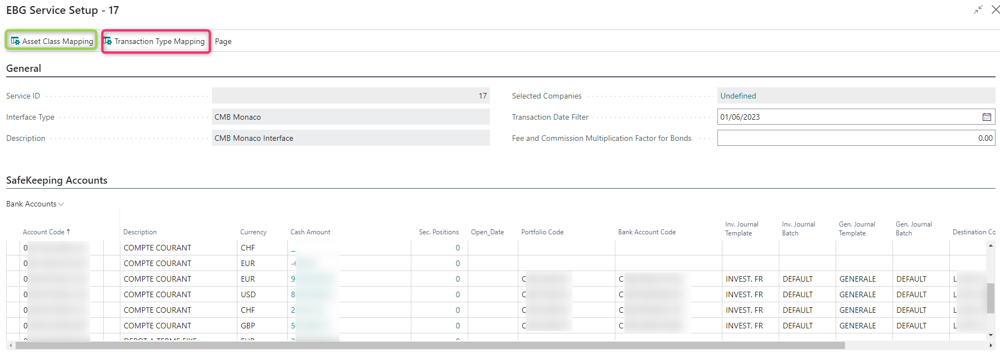
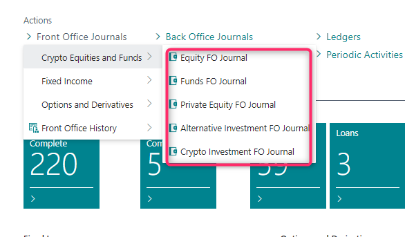

# Introduction

This document is accompanying the Elysys **Electronic Bank Gateway** --
**EBG** and it has been created for the purpose of providing users with
brief guidance on how to set up and start with the use of the EBG
solution and getting familiar with the existing interfaces. It will
cover basics such as how the data is structured and what reports can be
built with each set of fields.

 

Having that in mind, please note that the standard package of interfaces
contains the following data:

-   Currency Exchange rates (i.e ECB),

-   Market prices (i.e EDI),

-   Bank interfaces (i.e Goldman Sachs, JP Morgan, etc).

## Visual Representation of the Setup Process

## Recommendations

**We highly recommend that all the following steps are taken in *one
entity* dedicated to EBG processes.**

## How to Access the Ebg Interfaces on the Client Side

Once the interface is enabled from Elysys side, it will appear in
Business Central on the client side. To access them, you must search for
**\"EBG Services\".**

| | |
| ---        |           --- |
| 1. From BC, access the list of available services. |  |
| 2. Depending on what services are enabled from Elysys side, you will find theme listed here, in the **“EBG Services”** | |

## How to setup each interface on the client side ?

Please note that the standard package of interfaces contains three
different types of interfaces and further, you will find the set-up
guide for each one of them.

### Currency Exchange Rate

| | |
| ---        |           --- |
| 1.	**Currency Exchange Rate:** this interface will import the exchange rates for the selected companies. |  Next, you have the following functionalities available for you:   1.	`Selected Companies`: you can drill down on the number and select in what company the interface will update the exchange rates. This step is a pre-requisite before running the import or scheduling the interface.  2.	`Schedule`: you can schedule the job queue to be executed daily, weekly, etc. After you add the desired parameters, you run the "Restart" function to schedule it.    3.	`Import`: you can manually run an import, being able to specify the time interval in between you want to update the exchange rates.   |

### Market Prices

| | |
| ---        |           --- |
| 2. **Market prices:** this interface will import the daily prices for the selected companies. |   Next, you have the following functionalities available for you:   4.	`Selected Companies`: you can drill down on the number and select in what company the interface will update the market prices. This step is a pre-requisite before running the import or scheduling the interface.  5.	`Schedule`: you can schedule the job queue to be executed daily, weekly, etc. After you add the desired parameters, you run the **"Restart"** function to exceute it.    6.	`Execute`: you can manually run an import, being able to specify the time interval in between you want to update the exchange rates. 
 |

### Bank Interfaces

A bank interface is more complex than the previous ones and therefore,
the set up requires more details.

#### *How to set it up ?*

In Business Central, search for **\"EBG Services\"** to access the
interface. Depending on the client, you might see one interface or
multiple interfaces. For this document, we focus on only one bank
interface.

Next, you have the following functionalities available for you:

1.  **`Selected Companies`**: you can drill down on the number and select
    in what company the interface will import the data. This step is a
    pre-requisite before running the import or scheduling the interface.

2.  `Schedule`: you can schedule the job queue to be executed daily,
    weekly, etc. After you add the required parameters, you run the
    \"Restart\" function to schedule it.

3.  `Import`: you can manually run an import.

4.  `Setup`: in this section you must set up and configure the bank
    accounts, the asset classed and the transaction types. Here are two
    categories to be configured:

    1.  **General**
         
        1. Asset Class Mapping: specifies the mapping from the bank side with the mapping done in Elysys for each asset class and investment type. Usually it\'s prepopulated, but the user can manually edit the list. If the list is blank, the user can use the function **\"Download From Server\"** to automatically populate the list.  `This is a pre-requisite for the securities to be imported.`
        
        2. Transaction Type Mapping: specifies the mapping for the cash operations. According to the Operation Type, will write in General Journal a line using Document Type and G/L Account No. defined here. Document Type and Account No. can be left blank, and the operation will still be imported. You can remove a line to stop related operations imports.
        

    2.  **SafeKeeping Accounts:** specifies the mapping in between the
    accounts coming from the bank and the **bank accounts/ portfolio/
    company/ front-office journals** from Elysys.  

#### There are other useful sections on the interface dashboard.

-   **Securities info:** specifies the details related to the security,

-   **Sec. Positions:** specifies the details related to the positions,

-   **Sec. Transactions:** specifies the details for each transaction
    that will be imported in the front-office journals. Furthermore, the
    imported transactions will be marked as **\"Imported\".** This way
    the system will not import twice the same transaction, only if the
    user is manually executing the function **\"Unmark Imported\".**

-   **Cash Positions:** specifies the cash position for each bank
    account,

-   **Cash Operations:** specifies the cash transactions that will be
    imported in the general journal.

Once the interface is executed, the transactions **will be populated in
the front-office journals**, categorised by asset class. The user must
manually **post the journal afterwards**.

 

