# Cash Transfer Journal

## Scope  {#scope .unnumbered}

**Intercompany Cash Transfer** allows transferring funds between two
different entities.

**Intracompany Cash Transfer** allows transferring funds between two
different bank accounts of the same entity.

## Notes {#notes .unnumbered}

-   **Cash Transfer Journal** can be processed from any company,
    regardless of the companies involved.

-   For Intercompany transfers Interim Bank Accounts are created in
    source and target companies and linked to corresponding accounts in
    the **Bank Account Posting Groups**.

-   Intercompany transfers and their reversals trigger the creation of
    ledger entries and reversals in both companies simultaneously.

-   **Cashflow Classification** specifies the cashflow category the
    transaction belongs to.

-   **Intercompany Dimension** allows locating the source of transaction
    in the ledger entries of both entities.

-   **Transfer Instruction** specifies details of the transfer of funds
    and its signatories in a pdf or a word document.

-   **Posted Transfer** is a historical aggregated view for all cash
    transfers made across all entities.

## Workflow  {#workflow .unnumbered}

IC A -- Source Company

IC B -- Target Company

### Intercompany Cash Transfer 

a)  **Intercompany Cash Transfer Journal**

> Path: Elysys Wealth -\> Toolkit -\> Transfer -\> Cash Transfer Journal

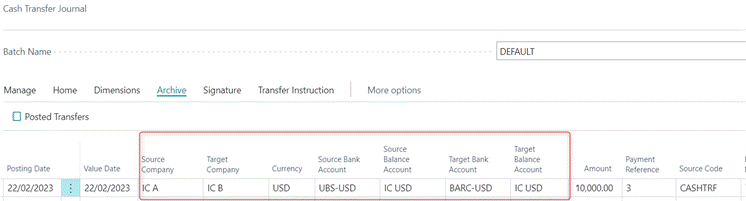

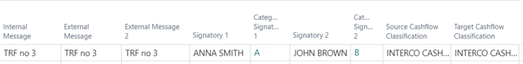

Notes:

-   Source Company must be different from Target Company.

    -   **Source Company** -- the company we are transferring the funds
        from.

    -   **Target Company** -- the company to which we are transferring
        the funds to.

-   **Currency** - filters Source and Target Bank Accounts in the
    selected currency.

-   **Source/Target Bank Account** -- specifies main bank accounts the
    funds are transferred between.

-   **Source/Target Balance Account** -- specifies interim accounts the
    entries will be booked against in the ledger entries for both source
    and target companies.

-   **Amount** -- specifies the amount we are transferring. In case of
    an overdraft, the user will be notified before the transfer is
    validated.

-   **Payment Reference** -- specifies the reference of the payment.

-   **Source Code** -- specifies where the entry was created. It auto
    populates based on the Source Code selected in the Intercompany Cash
    Journal Batch. If the Source Code in the batch is blank, then the
    user needs to select the Source Code in the journal manually.

-   **Signatory 1 & 2** -- used for generating Payment Instructions.
    Signatories are predefined in the following pages:

    -   **INV Signatory List**

-   **INV Signatory Card  **

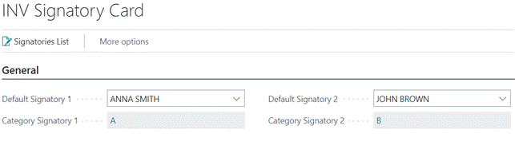

-   **Cashflow Classification -** specifies the cashflow category the
    transaction belongs to. The categories are user definable and are
    predefined in the Cashflow Classification Setup screen.

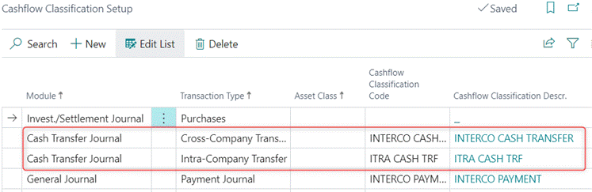

-   **Inter-Company Dimension** -- allows tracing the source of
    transaction in the ledger entries of both entities.

    -   **Source Dimension** - specifies the dimension value displayed
        in the ledger entries in the source company; e.g., name of the
        target company.

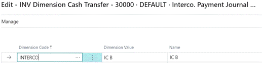
 

-   **Target Dimension -** specifies dimension value displayed in the
    ledger entries in the target company; e.g., name of the source
    company.

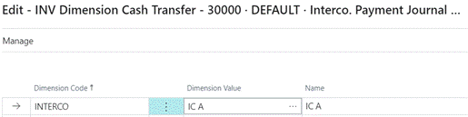

b)  **Cash Transfer Details** **FactBox**

FactBox displays available funds in source and target bank accounts. It
is a useful point of reference before a journal is posted.

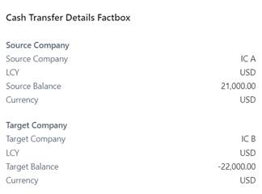

c)  **Processing Journal**

Path: Cash Transfer Journal -\> Home -\> Post

Posting the journal validates the transfer in both companies
simultaneously.

d)  **Posted Transfers**

Path: Cash Transfer Journal -\> Archive -\> Posted Transfers

**Posted Transfers** take us to the aggregated/historical view for all
cash transfers posted across all entities.

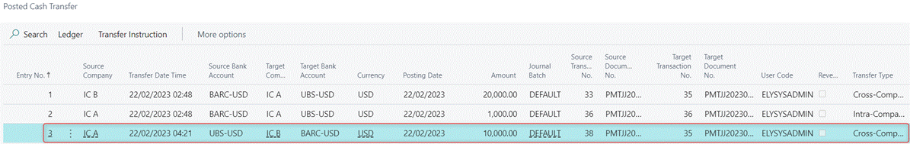

## Ledger Entries  {#ledger-entries .unnumbered}

a)  Source Company -- IC A

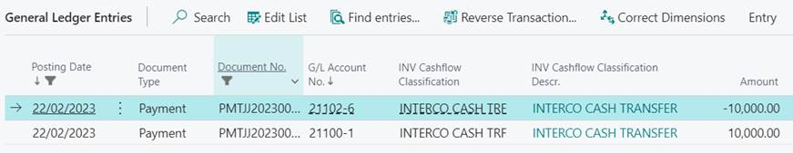

> DB Interim Bank Account 1,000.00   
>
> CR Main Bank Account 1,000.00 

Cashflow Classification -\> Interco Cash Transfer

Intercompany Dimension -\> IC B (Target Company) 

b)  Target Company -- IC B

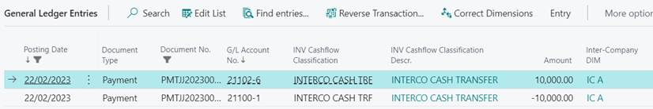

> DB Main Bank Account 1,000.00   
>
> CR Interim Bank Account 1,000.00 

Cashflow Classification -\> Interco Cash Transfer

Intercompany Dimension -\> IC A (Source Company) 

### Intracompany Cash Transfer 

**Intracompany Cash Transfer** within the Cash Transfer Journal allows
transferring funds between two different Bank Accounts of the same
company.

a)  **Intracompany Cash Transfer Journal**

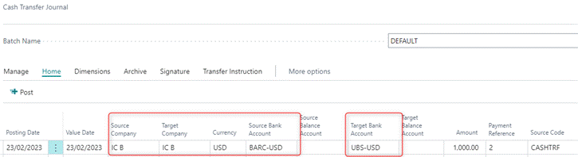

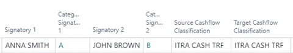

Notes:

-   Source and Target companies are the same.

-   Source/Target balance Bank Accounts are disabled.

-   **Cashflow Classification -** specifies the cashflow category the
    transaction belongs to which. The categories are user definable and
    are predefined in the Cashflow Classification Setup screen.  

## Ledger Entries  {#ledger-entries-1 .unnumbered}

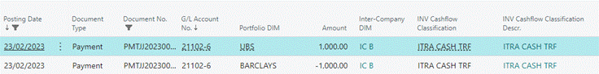
> DB Target Bank Account 1,000.00   
>
> CR Source Bank Account 1,000.00 

Cashflow Classification -\> Intra Cash Transfer

Intercompany Dimension -\> IC B

## Reversal  {#reversal .unnumbered}

Reversal can be processed from any company involved and reversal in one
entity triggers the creation of ledger entries and reversals in both
companies simultaneously.
