# Scope 

**Intercompany Investment Transfer** allows transferring an asset
between two different entities at market price.

**Intracompany Investment Transfer** allows transferring an asset from
one portfolio to another within the same company at average cost.

# Notes

-   Asset Classes included: Bonds, Preferred Shares, Structured Notes,
    Equities, Funds, and Alternative Investments.

-   **Investment Transfer** can be processed from any company,
    regardless of the companies involved.

-   **Posted Transfers** is a historical aggregated view for all
    investment transfers made across all entities.

-   For Intercompany transfers Interim Accounts are created in source
    and target companies and linked to corresponding accounts in the
    **Bank Account Posting Groups**.

-   Intercompany transfers and their reversals trigger the creation of
    ledger entries and reversals in both companies simultaneously.

-   Intracompany transfers and their reversals trigger the creation of
    ledger entries and reversals in both portfolios simultaneously.

-   **Cashflow Classification** specifies the cashflow category the
    transaction belongs to.

-   **Inter-Company Dimension** allows tracing the source of transaction
    in the ledger entries of both entities.

-   **Transfer Instruction** specifies details of the transfer of an
    asset and its signatories in a pdf or a word document.

# Workflow 

IC A -- Source Company

IC B -- Target Company

## Intercompany Investment Transfer 

> Path: Elysys Wealth -\> Toolkit -\> Transfer -\> INV Transfer Journal

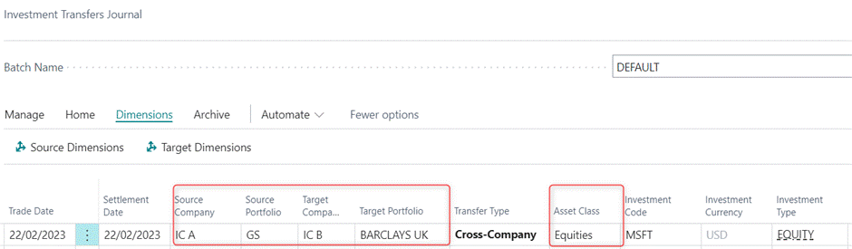

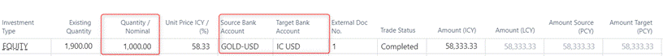
Notes:

-   Source Company must be different from Target Company.

    -   **Source Company/Portfolio** -- the company/portfolio we are
        transferring the asset from.

    -   **Target Company** -- the company/portfolio to which we are
        transferring the asset to.

-   Transfer Type -- specifies if the transfer is Cross-Company or
    Inter-Company transfer. The type auto populates by the system once
    the user selects the source and target companies.

-   **Currency** -- the currency of the investment selected.

-   **Existing Quantity** -- specifies the existing quantity of the
    selected asset.

-   **Quantity** -- specifies the quantity/nominal to be transferred.

-   **Unit Price ICY / (%)** -- for cross company transfers it is
    calculated at Market Price and it is user definable. For
    intracompany transfers it is calculated at an average price and
    cannot be amended.

-   **Source/Target Bank Account** -- specifies main bank accounts the
    funds are transferred between.

-   **Source/Target Balance Account** -- specifies interim accounts the
    entries will be booked against in the ledger entries in both source
    and target companies.

-   **Payment Reference** -- specifies the reference of the payment.

-   **Source Code** -- specifies where the entry was created. It auto
    populates based on the Source Code selected in the Intercompany Cash
    Journal Batch. If the Source Code in the batch is blank, then the
    user needs to select the Source Code in the journal manually.

-   **Inter-Company Dimension** -- allows tracing the source of
    transaction in the ledger entries of both entities.

    -   **Source Dimension** - specifies the dimension value displayed
        in the ledger entries in the source company; e.g., name of the
        target company.

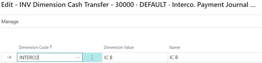
 

-   **Target Dimension -** specifies dimension value displayed in the
    ledger entries in the target company; e.g., name of the source
    company.

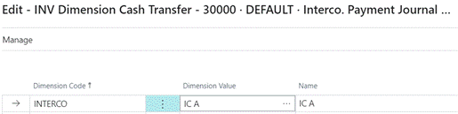
a)  **Investment Transfer Details FactBox**

FactBox displays the available quantity of the investment in source and
target portfolios of the selected companies.

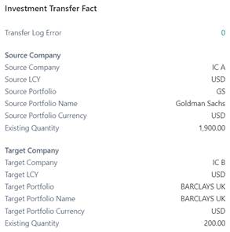

b)  **Processing Journal**

Path: INV Transfer Journal -\> Home -\> Post

Posting the journal validates the transfer in both companies
simultaneously.

c)  **Posted Transfers**

Path: INV Transfer Journal -\> Archive -\> Posted Transfers

**Posted Transfers** take us to the aggregated/historical view for all
investment transfers posted across all entities.

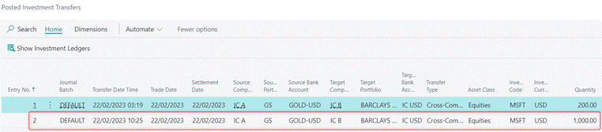
# Ledger Entries 

a)  Source Company -- IC A

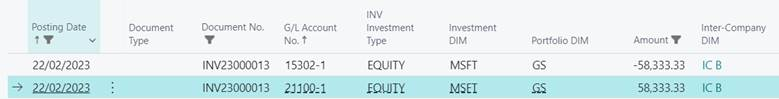

> DB Interim Account 58,333.33.00   
>
> CR Equity 58,333.33.00

Dimension -\> IC B (Target Company) 

b)  Target Company -- IC B

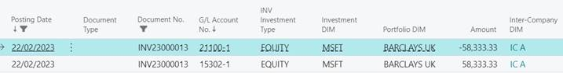

> DB Equity 58,333.33.00   
>
> CR Interim Bank Account 58,333.33.00

Dimension -\> IC A (Source Company) 

## Intracompany Investment Transfer

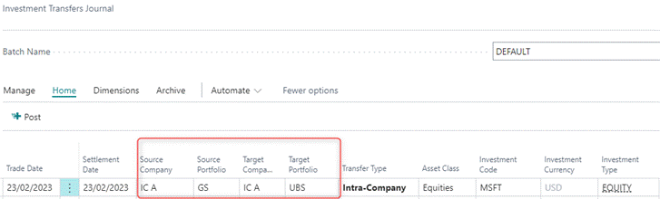

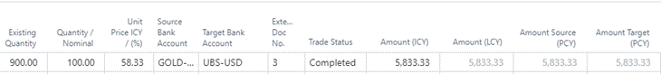

# Ledger Entries

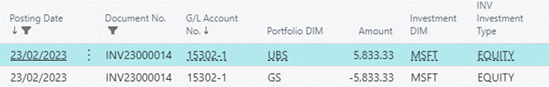

> DB Target Portfolio 5,833.33.00   
>
> CR Source Portfolio 5,833.33.00 

# Reversal 

Reversal can be processed from any company involved and reversal in one
entity triggers the creation of ledger entries and reversals in both
companies simultaneously.
