# Scope  {#scope .unnumbered}

**The Intercompany Payment Journal** allows processing payments from
another entity than the invoice was booked.

# Notes {#notes .unnumbered}

-   **Intercompany Payment Journal** can be processed from any company,
    regardless of the companies involved.

-   Intercompany Payment Journal triggers the creation of ledger entries
    and its reversals in both companies simultaneously.

-   **Posted Transfer Journal** is a historical aggregated view for all
    payments made across all entities.

-   For Intercompany transfers Interim Bank Accounts are created in
    source and target companies and linked to corresponding accounts in
    the **Bank Account Posting Groups**.

-   **Intercompany Dimension** allows tracking the source of transaction
    in the ledger entries in both entities.

-   **Cashflow Classification** specifies the cashflow category the
    transaction belongs to.

-   **Transfer Instruction** specifies details of the transfer of funds
    and its signatories in a pdf or a word document.

# Workflow & Expected Results  {#workflow-expected-results .unnumbered}

IC A -- Target Company

IC B -- Paying Company

## Intercompany Payments 

a)  **Purchase Invoice**

> Purchase Invoice in amount of USD 1,000.00 is posted in Company **IC
> A**

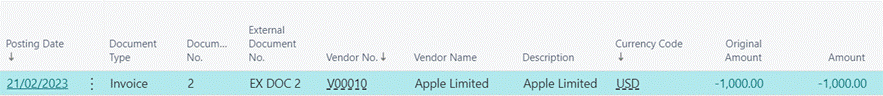

b)  **Intracompany Payment Journal**

> Path: Elysys Wealth -\> Toolkit -\> Transfer -\> Interco. Payment
> Journal

c)  **Suggest Payments**

Intercompany Payment Journal -\> Home -\> Suggest

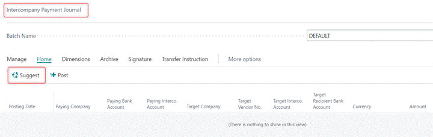

**Suggest** function allows filtering any outstanding payments across
all companies and can be accessed from any company.

d)  **Intercompany Payment Suggest Screen**

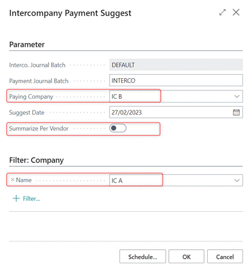

**Interco. Journal Batch** -- multiple Journal Batches can be created
for different users.

**Payment Journal Batch** -- local journal batch linked to both paying
and receiving company.

**Paying Company** -- the company which will pay the invoice. If left
blank, then the user can select Paying Company manually in the journal.

**Suggest Date** -- date at which the system filters outstanding
invoices to be paid. The system calculates it according to the payment
terms defined for the vendor.

**Summarize Per Vendor** -- if enabled the system suggests one line for
all invoices belonging to the same vendor per company. If the vendor has
invoices booked in multiple currencies, then the system suggests lines
per currency.

**Filter: Company** -- specifies the company we are suggesting the
outstanding payments for. If the filter is disabled, then the system
suggests outstanding invoices for all companies.

**OK** -- validates the search

e)  **Suggested Payment**

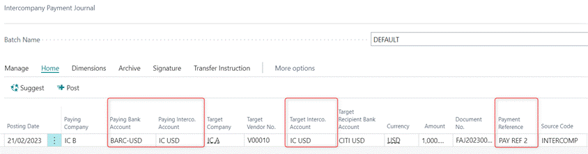

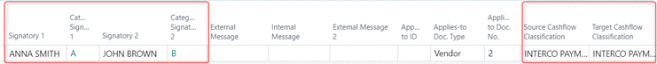

After the journal is suggested, the user needs to fill out the following
fields:

-   **Paying Bank Account** -- the main bank account the payment will be
    made from.

-   **Paying Interco. Bank Account** -- Interim Bank Account of the
    Paying Company.

-   **Target Interco. Account** -- Interim Account of the Target
    Company.

-   **Cashflow Classification** - specifies the cashflow category the
    transaction belongs to. The categories are user definable and are
    predefined in the Cashflow Classification Setup screen.

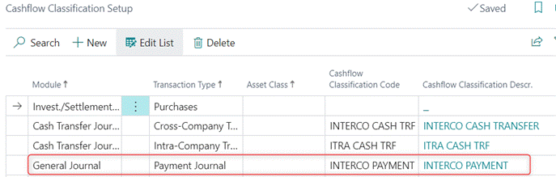

-   **Signatory 1 & 2** -- used for generating Payment Instructions.
    Signatory is the person that is approving the payment. Signatories
    are predefined in the following pages:

    -   **INV Signatory List**

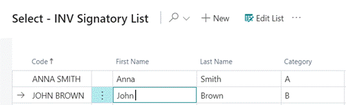

-   **INV Signatory Card**

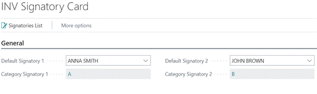

-   **Inter-Company Dimension** -- allows tracing the source of
    transaction in the ledger entries of both entities.

    -   **Source Dimension** -\> specifies dimension value displayed in
        the ledger entries of the paying company; e.g., name of the
        target company.

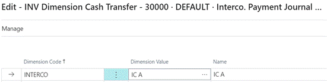

-   **Target Dimension -\>** specifies dimension value displayed in the
    ledger entries of the target company; e.g., name of the paying
    company.

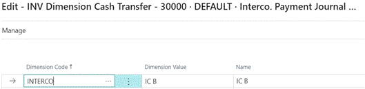
f)  Transfer Instruction

Transfer Instruction can be accessed via the journal before posting. It
is user definable and describes the details of the transfer.

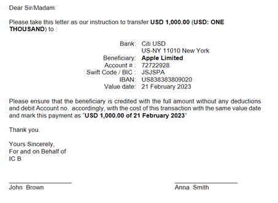

g)  **Posting the Payment**

Path: Intercompany Payment Journal -\> Home -\> Post

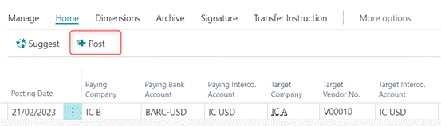

Posting the intercompany payment validates the payment in both entities
simultaneously.

h)  **Posted Interco. Payments**

**Posted Interco. Payments** take us to the aggregated/historical view
for all intercompany payments posted across all entities.

Path: Intercompany Payment Journal -\> Archive -\> Posted Interco.
Payments

![Timeline Description automatically generated with medium
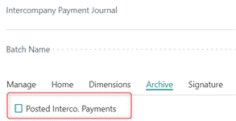

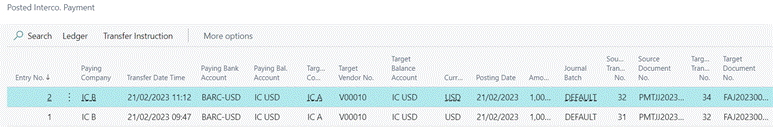

Notes:

-   If the user selects **Summarize Per Vendor** in the **Intercompany
    Payment Suggest** screen, then **Applies-to ID** will generate a
    unique ID for this payment.

-   If the **Summarize Per Vendor** is disabled, then **Applies-to Doc.
    Type and Applies-to Doc. No.** are generated.

## Ledger Entries

-   **Paying Company - IC B**

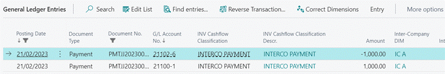

DB Interim Bank Account 1,000.00

CR Main Bank Account 1,000.00

Cashflow Classification -\> Interco Payment

Dimension -\> IC A (Target Company)

-   **Target Company - IC A**

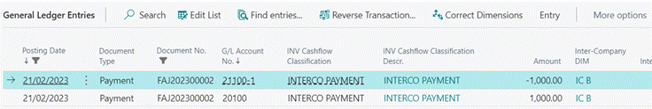
DB Accounts Payable 1,000.00

CR Interim Bank Account 1,000.00

Cashflow Classification -\> Interco Payment

Dimension -\> IC B (Paying Company)

# Reversal  {#reversal .unnumbered}

Reversal can be processed from any company involved and reversal in one
entity triggers the creation of ledger entries and reversals in both
companies simultaneously.
