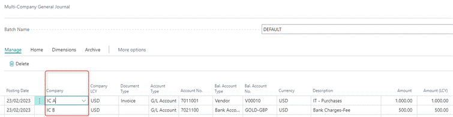
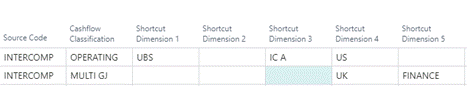
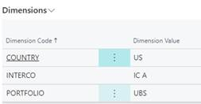
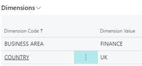
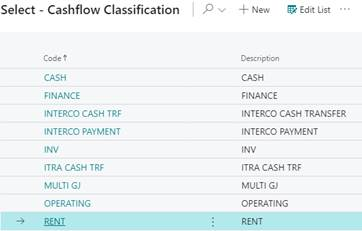
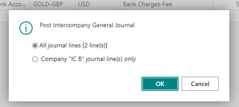
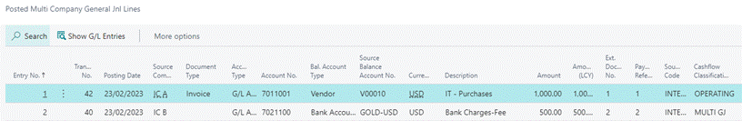

# Multi-Company General Journal

## Scope 

Multi Company General Journal allows posting financial transactions
across all entities within one screen.

Path: Elysys Wealth -\> Toolkit -\> Multicompany General Journal

## Notes

-   **Transactions** can be posted from any company, regardless of the
    companies involved.

-   **Posted Lines** screen takes us to historical aggregated view for
    all journals posted across all entities.

-   **Cashflow Classification** specifies the cashflow category the
    transaction belongs to.

-   **Shortcut Dimensions** are used for analytical purposes and allow
    tracking the source of transactions in the ledger entries. **T**he
    system populates dimension fields in the journal based on the
    shortcut dimensions defined on the General Ledger Setup page.

## Workflow 

Two journals for two different companies are inserted via the
Multicompany General Journal.

Dimensions -- IC A

Dimensions -- IC B

**Cashflow Classification -** specifies the cashflow category the
transaction belongs to. The categories are user definable and are
predefined in the Cashflow Classification Setup screen. 

**Posting**

To post Multi Company General Journal the following conditions must be
met:

-   Total Balance for all lines must be equal to zero.

-   The general journal lines are balanced by date, based on the Posting
    Date.

The user has an option to either post all or selected lines only.

**Posted Lines** take us to the aggregated/historical view for all
transactions posted across all entities.

