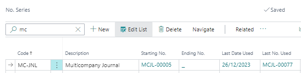
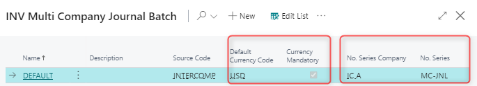
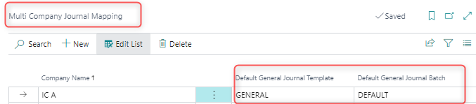
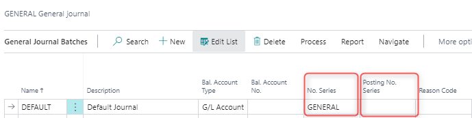
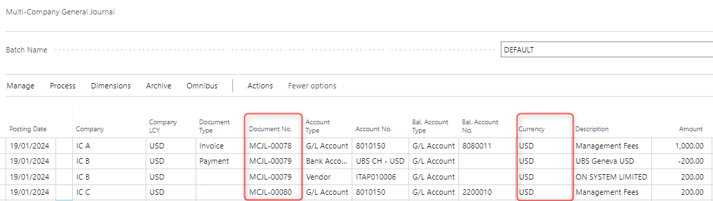
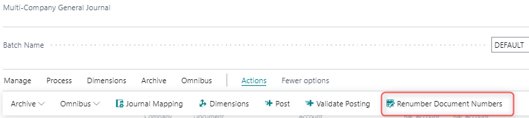

# Multi-Company General Journal

## Scope 

Multi Company General Journal allows posting financial transactions
across all entities within one screen.

Path: Elysys Wealth -\> Toolkit -\> Multicompany General Journal

## Notes

-   **Transactions** can be posted from any company, regardless of the
    companies involved.

-   **Posted Lines** screen takes us to historical aggregated view for
    all journals posted across all entities.

-   **Cashflow Classification** specifies the cashflow category the
    transaction belongs to.

-   **Shortcut Dimensions** are used for analytical purposes and allow
    tracking the source of transactions in the ledger entries. **T**he
    system populates dimension fields in the journal based on the
    shortcut dimensions defined on the General Ledger Setup page.

## Setup & Workflow

1. Two journals for two different companies are inserted via the
Multicompany General Journal.

Dimensions -- IC A

Dimensions -- IC B

**Cashflow Classification -** specifies the cashflow category the
transaction belongs to. The categories are user definable and are
predefined in the Cashflow Classification Setup screen. 

**Posting**

To post Multi Company General Journal the following conditions must be
met:

-   Total Balance for all lines must be equal to zero.

-   The general journal lines are balanced by date, based on the Posting
    Date.

The user has an option to either post all or selected lines only.

**Posted Lines** take us to the aggregated/historical view for all
transactions posted across all entities.

2.  **Document Number Management and Default Currency**

To populate Document No. in the Multi-Company General Journal and
synchronize the same Number Series code across all entities, it is
necessary to create a unique Number Series line that will be linked to a
specific batch in the journal.

It is created within one company, which will serve as the reference
point for calculating Document No. in the Multi-Company General Journal.

To activate it, the No. Series line should be linked to the batch with
which it will be used.

The unique No. Series is created in a dedicated company that will be
linked to the batch in the Multi-Company General Journal. It is
recommended to create the No. Series in the Master Company.

i.  No. Series Set-up

interinter

The No. Series Company and No. Series are linked to the batch. The
set-up serves as the reference point for Document No. calculation in the
journal.

ii. Batch Set-up

-   No. Series should be used by one batch and one journal only.

-   Default Currency Code: the user can specify the Default Currency to
    be populated in the journal.

-   Currency Mandatory: if flagged, the entry will be blocked if the
    Currency field in the journal is blank.

-   No. Series Company: the company from which the No. Series is used to
    calculate Document Nos.

iii. Multi Company Journal Mapping

iv. General Journal Template

The batch used in the Multi-Company General Journal must have the **No.
Series** defined under the General Journal Batches page.

If No. Series should be used, then the **Posting No. Series** must be
left blank.

If the **Posted No. Series** is defined, the No. Series will be
overwritten by the Posted No. Series.

v.  Multi-Company General Journal

Based on the above set-up, the Multi-Company General Journal populated
the following Document Numbers and Currencies.

The user can manually edit the Document No. if the Manual No. is flagged
in the No. Series set-up page.

vi. Renumber Documents

Renumber Document Number is used to manage document numbers in the
system across all companies. assign document numbers and prevent posting
errors in the journal.

The system automatically assigns document numbers based on the No.
Series Company, the reference company, and the No. Series defined within
the batch used.