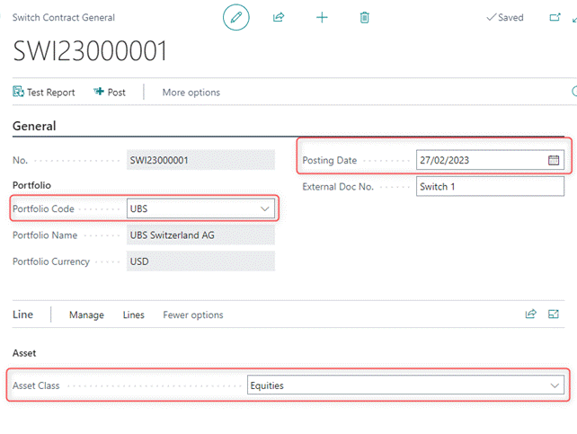
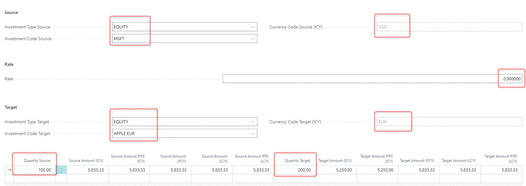
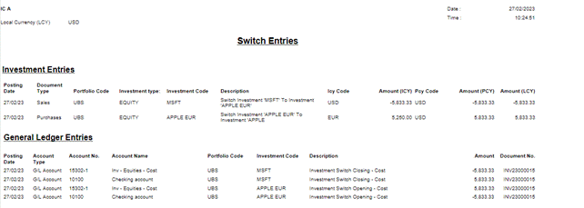
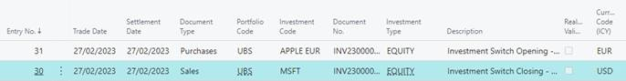
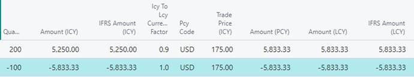
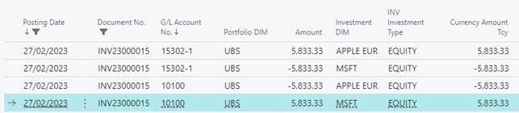

# Switch

## Scope

Switch allows changing investment's name to another one in case a sale
of one investment occurs in exchange for another one.

## Notes

-   Asset Classes Included -\> **Equities, Funds, Alternative
    Investments**

-   Switch can be processed within the same portfolio only.

-   It is the users' responsibility to insert an exchange rate in case a
    multicurrency switch is recorded.

-   The system will block the switch if more quantity than available in
    the source investment is being sold.

-   Source Investment is recorded as sale.

-   Target Investment is recorded as purchase.

## Workflow 

> Path: Elysys Wealth -\> Toolkit -\> Switch

Notes:

-   **Investment Code Source** must be different than **Investment Code
    Target**

    -   **Investment Code Source** -- specifies the original name of the
        investment.

    -   **Investment Code Target** -- specifies the new name of the
        investment.

-   **Rate**

    -   Specifies the exchange rate in case of multicurrency switch.

    -   It is up to the user to update the exchange rate based on the
        rate indicated in the documentation provided by the bank.

    -   Target Amount (ICY) and Target Amount IFRS (ICY) are
        automatically calculated based on the exchange rate specified.

-   The system blocks the switch in case more **Quantity Source** is
    inserted into the journal than it is available for the Source
    Investment.

-   Quantity Source can differ from the Quantity Target.

Test Report allows final check of the investment and ledger entries
before the switch is posted.

Investment Ledger Entries

General Ledger Entries

