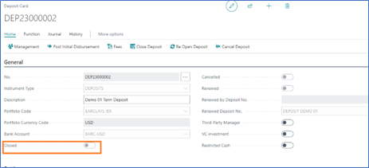

# Elysys Deposits Module
This document describes the standard functionalities of the Deposits
module in Elysys for Microsoft Dynamics Business Central, as well as the
required setup. Two types of deposits can be managed within the system:

-   Term Deposit,

-   Call Deposit.

## **Deposit Setup**

The user must make sure the following settings had been set up: *Home
Page ➔ Application Setup ➔ Setup ➔ Loans and Deposits Setup ➔ Button:
New.*

<b>General FastTab:</b>  

    - select the Portfolio and the Instrument dimensions to be used. These 2 dimensions will be used to track all entries generated by the system when posting a deposit’s capital and interest payments. If the Dimensions do not exist, you will need to create them. 

    - When posting entries in a foreign currency, adjusting entries might be generated and will be posted to the account filled in “Rounding Adj. Account”. Then select a number series to number the accrued.    

<b> Deposits FastTab:</b>    

    - Deposit Nos.: Select a number series for this field to number all new deposits. This will be used to create the instrument code which will be used to track the deposit throughout the system.  

    - Renew Deposit Template and Renew Deposit Batch fields need to be filled in if renewed deposits are used.
  

      

        
    

 

### **At least one portfolio needs exist to create a deposit**

    

    The Portfolio Currency (PCY) is compulsory as the financial system will calculate all amounts against PCY and LCY. Portfolios created from Elysys Wealth setup will appear in this list. 

      

    Exchange rates to be used specially with the Loans & Deposits module can be imported using the PCY Exchange Rate page. If this is not necessary, make sure to tick the box “Financial base rates for PCY” on the Portfolio Card to use standard BC’s currency exchange rates (BC stands for Business Central).

  

      

        
    

 

  The bank account used on the Deposit card must be linked to the
Portfolio Dimension. This can be done from the *Bank Account card Bank
Account Button: Dimensions*

### **Each deposit is linked to an instrument type**

The user must make sure the following settings had been set up: *Home
Page ➔ Application Setup ➔ Instrument Type.*

    

    The instrument type will define the accounting rules to be used during the deposit’s lifetime. Create one or more instrument types based on how many accounting rules you require.

  

      

        
    

 

### **For each instrument type previously created, a set of accounts needs to be filled in**

The user must make sure the following settings had been set up: *Home
Page ➔ Application Setup ➔ Loan and Deposits Posting Group.*

These accounts will be used for the different functions performed on the
deposit such as the interest repayments (PNL Interest), revaluation
(PNL/BS UR), the accrued interest (PNL/BS Accrued Interest) and the
closing (PNL Realised).

## **Deposit Card**

All necessary information required by the system to manage a deposit are
to be filled in on the Deposit Card.

To create a new deposit, go to *Home ➔ Deposit tile ➔ Button: New*

**General FastTab:**

-   *No.:* type in a unique code, or skip to the next field to have this
    field automatically filled in;

-   *Instrument Type:* choose an instrument type from the list. This
    will define the accounting rules for the deposit (see the above
    setup for more information);

-   *Description:* enter a description for the deposit;

-   *Portfolio Code:* select a portfolio code from the dropdown list;

-   *Portfolio Currency Code:* will be automatically filled in based on
    portfolio's currency code;

-   *Bank Account:* select a bank account;

-   *Cancelled:* specifies if the deposit is has been cancelled; the
    field is automatically ticked once the user is using *Cancel*
    function;

-   *Renewed:* specifies if the deposit is has been renewed; the field
    is automatically ticked once the user is using *Renew* function; the
    next two fields are impacted by the same process i.e *Renewed by
    Deposit No.* and *Renewed Deposit No.*

-   *Third- Party Manager:* for analytical purpose only;

-   *VC investment:* for analytical purpose only;

-   *Restricted Cash:* for analytical purpose only;

**Settings FastTab:**

-   *Deposit Type:* select "Call Deposit" or "Term Deposit";

-   *Deposit Amount (ICY):* initial deposit amount in deposit currency;

-   *Deposit Currency Code:* the currency of the deposit; it defaults
    per bank's currency;

-   *Instrument Type:* choose an instrument type from the list. This
    will define the accounting rules for the deposit (see the above
    setup for more information);

-   *Trade Date:*

-   *Value Date:* deposit subscription date;

-   *Duration (Days):* the number of days in between the opening and
    closing date;

-   *Market Calendar Code:* uses standard Business Central calendar
    function. Set up several calendars from which to pick up from. It
    lets the user define non-working days. The deposit payments will
    then be processed the following next working day if it falls on a
    non-working day.

-   *Period:* choose the frequency of the deposit repayments; this field
    is available only for Term deposits;

-   *Rate Type:* fixed or floating;

-   *Rate (%):* fixed annual percentage rate;

-   *+ Base:* if floating, a variable base rate will be added to the
    fixed rate. Select from the list;

-   *Day Count:* calculation option for the interest amount;

**Analytics FastTab:**

These fields are used for the reporting purposes.

**Deposit Details Factbox:**

In the factbox, user can see and drill into the transaction history (the
amounts are clickable). The transactions are posted in the following
ledgers:

-   *Loan and Deposit Ledger:* capital movements i.e opening, closing,
    fees,

-   *Interest Ledger:* interest repayments

-   *Interest Accrued Ledger:* for accrued interest transactions.

## **Deposit Management**

Go to: *Home ➔ Deposits ➔ Home➔ Button: Management*

The **Management** page gives the user a detailed list of past and
future deposit repayments. For each line the user can check the interest
and capital amount, as well as the interest rate applied and other
useful information.

The *Modify* function is user for adjusting the Posting Date and the
Interest for **non-posted** repayments.

To cancel those changes, the functions "Reset Line" or "Reset All" can
be used.

To distinguish posted from non-posted entries, the system will show the
posted entries in a red colour.

## **Fees**

Go to: *Home ➔ Deposits ➔ Home➔ Button: Fees*

The system allows the booking of fees at any point during the life of
the deposit. Simply access the Fees page from the Deposit Card. For each
fee transaction, the system requires: the Fee Code, the Posting Date,
and the Fee Amount (ICY). Previously, the user will need to set up the
Fee Card for each type of fee.

**The Fee Card requires:**

-   The Fee Code,

-   The Fee Description,

-   The Commission Type which must be "Fees",

-   The G/L Account specifying to which account the fee will be booked
    against.

## **Journals & Posting procedures**

### **Loan & Deposit Journal**

Go to: *Home ➔ Deposits ➔ Journal➔ Button: Loan & Deposit Journal*

The Loan and Deposit Journal is used to generate and post deposit
disbursements and capital and interest repayments.

Click on the button **"Suggest Entries**" to generate posting entries.
The suggest function will populate the table with the outstanding
*Capital* and *Interest* payments at the desired date, for one or more
deposits depending on the filters. The system creates 2 distinct lines,
one for the capital repayment and one for the interest repayment, as
they are posted to different ledgers in the system.

The user can delete the entries which he doesn't want to post. However,
it is important to pay attention to not delete only part of a repayment
(i.e. delete the interest line and post the capital line), as the
repayment will be marked by the system as fully booked. The user can
look at the Document No. to know what lines are grouped together.

For deposits in a foreign currency, the system will manage the
difference in forex movement during the life of the deposit. When the
last repayment of the deposit is generated and posted, the system will
also post a forex realized amount. This amount is calculated based on
all the historical capital repayments and adjusted as at the Posting
Date of the deposit closure.

Once the entries have been carefully verified, use the various available
functions to:

-   Preview the lines to be posted (Button: Test Report)

-   Post the journal into the system (Button: Post)

-   Add Dimensions to a desired journal entry (Button: Dimensions)

-   Add Dimensions to several journal entries at once by selecting them
    (Button: Dimensions Multiple)

### **Accrued Interest Journal**

Go to: *Home ➔ Deposits ➔ Journal➔ Button: Accrued Interest Journal*

The Accrued Interest Journal is used to generate and post accrued
interest entries for one or more deposits.

Click on the button *"Suggest Entries"* to generate posting entries.

When Accrued Interest entries are posted, reversing entries are also
posted at "Posting Date +1", as the interest payment is booked at full
amount and the user doesn't have to take care of reversing manually the
accrued amount.

The option *"GL Integration"* allows the user to choose whether he wants
to post the entries to the General Ledger or not. If the entries do not
need to be posted to the General Ledger Entry, the box must be
unchecked; this way, the system will only post them to the sub-ledger
Accrued Interest Ledger Entry.

Once the entries have been carefully verified, use the various available
functions to:

-   Preview the lines to be posted (Button: Test Report)

-   Post the journal into the system (Button: Post)

-   Add Dimensions to a desired journal entry (Button: Dimensions)

-   Add Dimensions to several journal entries at once by selecting them
    (Button: DimensionsMultiple)

### **Loan & Deposit Revaluation**

*Go to: Home ➔ Loans ➔ Journal➔ Button: Loan & Deposit Revaluation*

The Revaluation Journal is used to generate and post forex revaluation
entries for one or more deposits.

The process will use the exchange rate as at the revaluation date and
adjust the Amount (LCY) accordingly.

Click on the button *"Suggest Revaluation"* to generate posting entries.
When Deposit Revaluation entries are posted, reversing entries are also
posted at "Posting Date +1" so the user doesn't have to take care of
manually reversing the forex unrealized amount.

Once the entries have been carefully verified, use the various available
functions to:

-   Preview the lines to be posted (Button: Print Preview)

-   Post the journal into the system (Button: Posting)

-   Add Dimensions to a desired journal entry (Button: Dimensions)

-   Add Dimensions to several journal entries at once by selecting them
    (Button: DimensionsMultiple)

### **Loan & Deposit IFRS Year End Closing**

 *Go to: Home ➔ Deposits ➔ Journal➔ Button: Loan & Deposit IFRS Year
 End Closing*

 For entities complying with the IFRS regulations, Elysys Deposits
 Module provides an IFRS accounting treatment.

 Within the Loan & Deposit IFRS Year End Closing, the user can generate
 the needed entries to mark to market the foreign currency deposits at
 the end of the fiscal year. Business Central standard currency
 exchange rates are used to adjust the outstanding deposit capital.

 **Pre-Requirement:** The Loan & Deposit Revaluation must be processed
 before running the IFRS Year End Closing process.

 Click on the button *"Suggest Revaluation"* to generate posting
 entries. You will be prompted to choose from the already configured
 beginning periods of the fiscal years.

 Once the entries have been carefully verified, use the various
 available functions to:

-   Preview the lines to be posted (Button: Print Preview)

-   Post the journal into the system (Button: Posting)

-   Add Dimensions to a desired journal entry (Button: Dimensions)

-   Add Dimensions to several journal entries at once by selecting them
    (Button: DimensionsMultiple)

## **Functions & Navigation**

### **Renew with or without Capitalisation of Interest**

*Go to: Home ➔ Deposits ➔ Function ➔ Button: Renew with Capitalisation
of Interest/ Renew without Capitalisation of Interest*

The *"Renew"* function is used when a new deposit is created based on an
existing deposit. Using this function, the user will be able to track
which deposit has been renewed with which other one.

Additionally, it helps "cloning" an existing deposit, only by changing
the value and maturity dates (maturity date of the old deposit becomes
the value date of the new deposit).

For the renewal *"with capitalisation of interest",* the amount of the
newly created deposit will comprise the subscribed amount of the old
deposit, plus the interest for the last repayment period.

For the renewal *"without capitalisation of interest",* the same deposit
amount as on the first deposit will be filled in on the new deposit card
created by the system.

### **Post Initial Disbursement** 

*Go to: Home ➔ Deposits ➔ Home ➔ Button: Post Initial Disbursement*

This function is used to automatically process the opening line for the
deposit, this way avoiding the extra step of Suggest Entries in the Loan
and Deposit Journal.

### **Close Deposit**

*Go to: Home ➔ Deposits ➔ Home ➔ Button: Close Deposit*

With this function, the closing line will be generated in the Management
Page. The Closing Date and the Interest can be modified or left a per
system's initial calculation. However, you still have to navigate to the
Loan & Deposit Journal and use "Suggest Entries" function, and process
the closing line. Only then the balance on the deposit will be impacted.

After using the "Close Deposit" function, the *Closed* flag from the
deposit card will change its status and the deposit will not be shown
anymore in the deposit list, unless you change the filters to include
the closed ones as well.

### **Cancel Deposit**

*Go to: Home ➔ Deposits ➔ Home ➔ Button: Cancel Deposit*

The *Cancel Loan* function can be used to "close" a deposit in Elysys
without having to delete the card, for audit purposes for example. If a
deposit remains *"open",* every time the user will generate the
accounting entries, the capital and interest payments for that deposit
will appear. This function prevents this to happen.

### **Dimensions**

*Go to: Home ➔ Deposits ➔ Function ➔ Button: Cancel Deposit*

User can link Dimensions to the Deposit. These Dimensions will be linked
to all ledger entries linked to the underlying Deposit No.

### **Calendar**

*Go to: Home ➔ Deposits ➔ Function ➔ Button: Calendar*

*Calendar* function uses standard Business Central calendar function.
Set up several calendars from which to pick up from. It lets the user
define non-working days. The deposit payments will then be processed the
following next working day if it falls on a non-working day.

