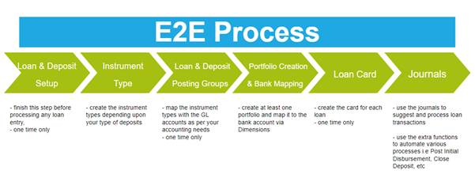
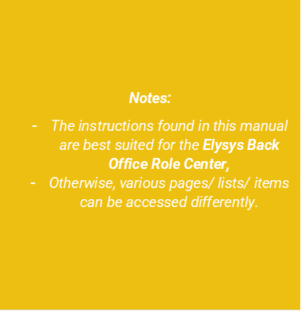
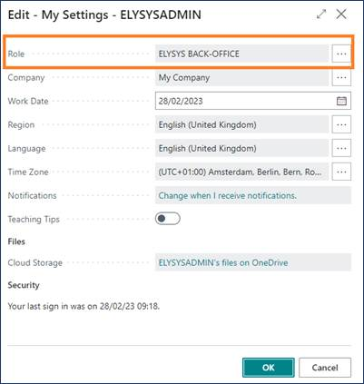

# Elysys Loans Module

This document describes the standard functionalities of the Loans module
of Elysys Loans for Microsoft Dynamics Business Central, as well as the
required setup. A loan can be either a lending or a borrowing. Three
types of loans can be managed within the system:

-   Interest only repayment

-   Fixed capital repayment

-   Fixed capital and interest repayment

## Loan & Deposit General Setup

The user must make sure the following settings had been set up:

**Home Page ➔ Application Setup ➔ Setup ➔ Loans and Deposits Setup ➔
Button: New**

*Figure 1 Loan & Deposit General Setup*

*General FastTab:* select the Portfolio and the Instrument dimensions to
be used. These 2 dimensions will be used to track all entries generated
by the system when posting a loan's capital and interest payments. If
the Dimensions do not exist, you will need to create them.

When posting entries in a foreign currency, adjusting entries might be
generated and will be posted to the account filled in "Rounding Adj.
Account". Then select a number series to number the accrued interest
entries.

*Loans FastTab:* Select a number series for "Loans Nos" field to number
all new loans. This will be used to create the instrument code which
will be used to track the loan throughout the system. The Renew Loan
Template and Batch fields need to be filled in if renewed loans are
used.

*Bundled Loans and Sales Invoice FastTab:* Select a number series for
"Bundled Loans Nos" field to number all new bundled loans. By default,
loans linked to a customer will generate a Sales Invoice but will let
the user review it before posting. If the "Post Loan Sales Invoices"
option is selected however, the Sales Invoice will be posted
automatically when processing the loan.

**Home Page ➔ Administration ➔ Portfolio**

At least one portfolio needs exist to create a loan. The Portfolio
Currency (PCY) is compulsory as the financial system will calculate all
amounts against PCY and LCY. Portfolios created from Elysys Wealth setup
will appear in this list.

If a new portfolio needs to be created, click the Button: New.

Exchange rates to be used specially with the Loans & Deposits module can
be imported using the PCY Cash Curr. Exchange Rate page. If this is not
necessary, make sure to tick the box "Financial base rates for PCY" on
the Portfolio Card to use standard BC's currency exchange rates (BC
stands for Business Central).

**Home Page ➔ Application Setup ➔ Instrument Type**

Each loan is linked to an instrument type. The instrument type will
define the accounting rules to be used during the loan's lifetime.
Create one or more instrument types based on how many accounting rules
you require.

**Home Page ➔ Application Setup ➔ Setup ➔ Loans & Deposits Posting
Group**

For each instrument type previously created, a set of accounts needs to
be filled in. They will be used for the different functions performed on
the loans such as the interest repayments (PNL Interest), revaluation
(PNL/BS UR), the accrued interest (PNL/BS Accrued Interest) and the
closing (PNL Realised).

## Counterparty Setup

The financial system can manage Customer Loans (lending) and Bank Loans
(lending and borrowing). Standard Business Central Customer & Bank
modules are used for this purpose.

The user must select on the Loan Card the Counterparty Type and
Counterparty Account to be used.

### 1\. Bank Counterparty

 **Go to: Home Page ➔ Banks ➔ Button: New**

 Fill in the following mandatory fields:

 *General FastTab*

-   No. : Unique code identifying the bank account;

-   Name: Bank account description;

 *Posting FastTab*

-   Currency Code: Mandatory. The currency of the loan will match the
    bank account's currency;

-   Bank Acc. Posting Group: Defines to which G/L Account the bank
    entries will be linked with;

From the Bank Account card, go to Bank Account ➔ Button Dimensions and
fill in:

-   Dimension Code: Select the Portfolio Dimension filled in the Loan &
    Deposit General Setup

-   Dimension Value Code: Select the Portfolio to which you want to link
    the bank account. The same portfolio must be selected on the Loan
    Card.

### 2\. Customer Counterparty

**Go to: Home Page ➔ Payables & Receivables ➔ Customers Button: New**

Fill in the following mandatory fields:

*General FastTab*

-   No. : Unique code identifying the Customer account;

-   Name: Customer account description;

*Invoicing FastTab*

-   Gen. Bus. Posting Group;

-   Customer Posting Group;

-   Currency Code: **Mandatory.** The currency of the loan will match
    the bank account's currency;

## 3. Loan Card 

All necessary information required by the system to manage a loan are to
be filled in on the Loan Card.

**To create a new loan, go to Home ➔ Loans tile ➔ Button: New**

*General FastTab*

-   No.: type in a unique code, or skip to the next field to have this
    field automatically filled in;

-   Instrument Type: choose an instrument type from the list. This will
    define the accounting rules for the loan (see the above setup for
    more information);

-   Description: enter a description for the loan;

-   Portfolio Code: select a portfolio code from the dropdown list;

-   Portfolio Currency Code: will be automatically filled in based on
    portfolio's currency code;

-   Lending: check this box if your loan is a lending. Unchecked, it
    will be a borrowing;

-   Counterparty Type: loans can be managed either using Bank Accounts
    or Customers. For the current documentation, the "Bank" counterparty
    type will be used;

-   Counterparty Account: choose a loan account to be used with this
    loan (see the above loans account setup for more information).

*Figure 2 Loan Card, General FastTab*

*Settings FastTab*

-   Loan Type: select the type of the loan (see loan types below)

-   Loan Amount (ICY): initial loan amount in loan currency. Increases
    or decreases can be done after the loan opening if needed;

-   Loan Limit Amount (ICY): field not mandatory. If set up, the user
    will get a warning if trying to increase the total loan amount
    higher than the limit amount;

-   Value Date: loan subscription date;

-   Maturity Date: loan maturity date;

-   Market Calendar Code: uses standard Business Central calendar
    function. Set up several calendars from which to pick up from. It
    lets the user define non-working days. The loan payments will then
    be processed the following next working day if it falls on a
    non-working day.

-   Rate Type: fixed or floating;

-   Rate (%): fixed annual percentage rate;

-   \+ Base: if floating, a variable base rate will be added to the
    fixed rate. Select from the list;

-   Period: choose the frequency of the loan repayments;

-   Payment Amount: total payment amount per period. This field is
    recalculated when using the "Simulation" function. It can be changed
    using the function "Change Payment Amount", which will also change
    the Maturity Date accordingly;

-   Day Count: calculation option for the interest amount;

-   Include Inception Day: if selected, the Value Date will be taken
    into account when calculating the interest amount for the first
    period of the loan. (Interest = First Payment Date -- Value Date +
    1)

-   Starting Date of Repayment: to be filled in if the loan needs to be
    postponed;

*Figure 3 Loan Card, Settings FastTab*

*Postpone FastTab*

-   Replace Date: Boolean field to select if the current start date of
    the repayments will be replaced

-   New First Payment Date: the new date at which the first repayment
    will start.

*Figure 4 Loan Card, Postpone FastTab*

*Facility Management FastTab*

-   Facility Loan:

-   Tranche:

-   Lender:

-   Merged into Loan No.:

-   Premium Day Count:

*Figure 5 Loan Card, Facility Management FastTab*

## 4. Loan Types

The loans module allows the management of the following types of loans:

-   Interest Only Repayment: loan in which, for a set term, the borrower
    pays only the interest on the principal balance;

-   Fixed Capital And Interest Repayment: loan in which, for a set term,
    the total due (capital + interest repayments) is constant. The total
    due can be changed by the user if needed and the Maturity Date will
    change accordingly.

-   Fixed Capital Repayment: loan in which, for a set term, the capital
    repaid is unchanged by period and the interest repayment is
    variable.

## 5. Postponement Types

Only loans type 2 can be postponed. There are 3 types of postponement:

-   Total -- with capitalised interest: the total due amount is zero
    until the Starting Date of Repayment. The total loan amount is
    increased with the interest amount accumulated from the value date
    to the starting date of repayment.

-   Total -- without capitalised interest: the interest amount
    accumulated from the value date to the starting date of repayment is
    added to the first loan repayment.

-   Partial -- payment interest only: only the interest amount will be
    paid for the periods preceding the Starting Date of Repayment

## 6. Disbursements  

The Loan Disbursements page give the user an overview of all the capital
increases and decreases occurred for the loan. The first line
corresponds to the initial loan disbursement. The user can add one or
more lines by specifying the Posting Date and the Amount, as long as no
other disbursement or payments have been done after the Posting Date. If
a decrease needs to be booked for the loan, the Amount needs to be
entered with a negative sign. A fee can be added to the disbursement
operation if needed.

*Figure 6 Loan Disbursement page*

## 7. Payment Schedule

The Payment Schedule page gives the user a detailed list of past and
future loan repayments. For each line the user can check the interest
and capital amount, as well as the interest rate applied and other
useful information.

*The Modify function* is user for adjusting the Posting Date and the
Interest for non-posted repayments.

To cancel those changes, the functions *"Reset Line"* or *"Reset All"*
can be used.

To distinguish posted from non-posted entries, the system will show the
posted entries in a red colour.

In case where a repayment needs to be skipped, the Total Due needs to be
= 0. To let the system know it needs to skip the line, the user needs to
use the "Mark/Unmark as Posted" function. When the line is red (marked
as posted), the user will be able to continue processing the following
payments.

*Figure 7 Payment Schedule page*

## 8. Fees 

The system allows the booking of fees at any point during the life of
the loan. Simply access the Fees page from the Loan Card. For each fee
transaction, the system requires: the Fee Code, the Posting Date, and
the Fee Amount (ICY). Previously, the user will need to set up the Fee
Card for each type of fee.

*The Fee Card requires:*

-   The Fee Code

-   The Fee Description

-   The Commission Type which must be "Fees"

-   The G/L Account specifying to which account the fee will be booked
    against.

*Figure 8 Creation of a new Fee Card*

## 9. Journals & Posting procedures 

### 1. Loan & Deposit Journal 

**Go to: Home ➔ Loans ➔ Journals ➔ Button: Loan & Deposit Journal**

*Figure 9 Loan & Deposit Journal window*

 The Loan & Deposit Journal is used to generate and post loan
 disbursements and capital and interest repayments.

 Click on the button *"Suggest Entries"* to generate posting entries.
 The journal will populate the table with the outstanding Capital and
 Interest payments at the desired date, for one or more loans depending
 on the filters. The system creates 2 distinct lines, one for the
 capital repayment and one for the interest repayment, as they are
 posted to different ledgers in the system.

 The user can delete the entries which he doesn't want to post.
 However, it is important to pay attention to not delete only part of a
 repayment (i.e. delete the interest line and post the capital line),
 as the repayment will be marked by the system as fully booked. The
 user can look at the Document No. to know what lines are grouped
 together.

 For loans in a foreign currency, the system will manage the difference
 in forex movement during the life of the loan. When the last repayment
 of the loan is generated and posted, the system will also post a forex
 realized amount. This amount is calculated based on all the historical
 capital repayments and adjusted as at the Posting Date of the loan
 closure.

 Once the entries have been carefully verified, use the various
 available functions to:

-   Preview the lines to be posted (Button: Test Report)

-   Post the journal into the system (Button: Post)

-   Add Dimensions to a desired journal entry (Button: Dimensions)

-   Add Dimensions to several journal entries at once by selecting them
     (Button: DimensionsMultiple)

### 2. Accrued Interest Journal 

**Go to: Home ➔ Loans ➔ Journals ➔ Button: Accrued Interest Journal**

 
*Figure 10 Accrued Interest Journal window*

 The Accrued Interest Journal is used to generate and post accrued
 interest entries for one or more loans.

Click on the button *"Suggest Entries"* to generate posting entries.

 When Accrued Interest entries are posted, reversing entries are also
 posted at "Posting Date +1", as the interest payment is booked at full
 amount and the user doesn't have to take care of reversing manually
 the accrued amount.

 The option "GL Integration" allows the user to choose whether he wants
 to post the entries to the General Ledger or not. If the entries do
 not need to be posted to the General Ledger Entry, the box must be
 unchecked; this way, the system will only post them to the sub-ledger
 Accrued Interest Ledger Entry.

Once the entries have been carefully verified, use the various available
functions to:

-   Preview the lines to be posted (Button: Test Report)

-   Post the journal into the system (Button: Post)

-   Add Dimensions to a desired journal entry (Button: Dimensions)

-   Add Dimensions to several journal entries at once by selecting them
    (Button: DimensionsMultiple)

### 3. Loan & Deposit Revaluation 

 **Go to: Home ➔ Loans ➔ Journals ➔ Button: Loan & Deposit
 Revaluation**

 The Loan Revaluation Journal is used to generate and post forex
 revaluation entries for one or more loans.

 The journal will use the exchange rate as at the revaluation date and
 adjust the Amount (LCY) accordingly.

 Click on the button *"Suggest Revaluation"* to generate posting
 entries. When Loan Revaluation entries are posted, reversing entries
 are also posted at "Posting Date +1" so the user doesn't have to take
 care of manually reversing the forex unrealized amount.

 Once the entries have been carefully verified, use the various
 available functions to:

-   Preview the lines to be posted (Button: Print Preview)

-   Post the journal into the system (Button: Posting)

-   Add Dimensions to a desired journal entry (Button: Dimensions)

-   Add Dimensions to several journal entries at once by selecting them
     (Button: DimensionsMultiple)

### 4. Loan & Deposit IFRS Year End Closing 

 **Go to: Home ➔ Loans ➔ Journals ➔ Button: Loan & Deposit IFRS Year
 End Closing**

 For entities complying with the IFRS regulations, Elysys Loans
 provides an IFRS accounting treatment.

 Within the Loan & Deposit IFRS Year End Closing, the user can generate
 the needed entries to mark to market the foreign currency loans at the
 end of the fiscal year. Business Central standard currency exchange
 rates are used to adjust the outstanding loan capital.

 Pre-Requirement: The Loan & Deposit Revaluation must be processed
 before running the IFRS Year End Closing process.

 Click on the button *"Suggest Revaluation"* to generate posting
 entries. You will be prompted to choose from the already configured
 beginning periods of the fiscal years.

 Once the entries have been carefully verified, use the various
 available functions to:

-   Preview the lines to be posted (Button: Print Preview)

-   Post the journal into the system (Button: Posting)

-   Add Dimensions to a desired journal entry (Button: Dimensions)

-   Add Dimensions to several journal entries at once by selecting them
     (Button: DimensionsMultiple)

### 5. Loan Reallocation Journal 

User can reallocate the capital movement based on the Short/ Long Term
distinction.

Prerequisites:

-   To create the accounting period in the system: *From Home Accounting
    Reports Accounting Periods*

 

-   Setup the GL accounts in Loan and Deposits Posting Group for:

    -   Loan Account Short Term,

    -   Loan Account Long Term.

 

-   Enable the field on the loan card: "Enable ST/LT Reallocation"

 

## 10. Functions & Navigation

*Figure 11 Loan Card Ribbon, Tab Functions*

### Function: Simulation

 The function *Simulation* accessible from the Loan Card is very useful
 to print out a repayment schedule, from the Value Date up to the total
 repayment of the loan.

### Function: Interest Rates

 The function Interest Rates is available for Loans set up with a
 floating interest rate. The function opens the page Interest Rate Line
 List where the user can insert the new variable rate for a specific
 starting date.

### Function: Calendar

 The function Calendar is available for Loans set up with a Market
 Calendar Code. The function opens the Calendar Card of the Calendar
 selected on the Loan Card. The user can set up non-working days, so
 the payments will be processed on the next working day.

### Function: Early repayment

 The Early Repayment function is used when the loan must be repaid in
 full at an earlier date than the Maturity Date.

The Date of Early Repayment must be:

-   Greater from all lines in Disbursement Line table;

-   If you have a payment schedule posted, then:

    -   (Date of Early Repayment \ Date of the last payment schedule
        posted)

-   And if you haven't a payment schedule posted:

    -   (Date of Early Repayment \< Date of the first payment schedule
        not posted)

 Along the Date of Closure, the interest amount is automatically
 calculated. The user can modify the interest amount to be posted if
 needed. Once the function has been run, the payment schedule will be
 updated accordingly, and the loan can be posted normally.

### Function: Renew with or without Capitalisation of Interest

 The Renew Function is only available for \"Interest Only Repayment\"
 Type of Loans and Counterparty Type = \"Bank\".

 The "Renew" function is used when a new loan is created based on an
 existing loan. Using this function, the user will be able to track
 which loan has been renewed with which other one. Additionally, it
 helps "cloning" an existing loan, only by changing the value and
 maturity dates (maturity date of the old loan becomes the value date
 of the new loan).

 For the renewal "with capitalisation of interest", the amount of the
 newly created loan will comprise the subscribed amount of the old
 loan, plus the interest for the last repayment period.

 For the renewal "without capitalisation of interest", the same loan
 amount as on the first loan will be filled in on the new loan card
 created by the system.

 
*Figure 12 Loan Renewal with capitalisation of interest pop-up window*

 
 
*Figure 13 Loan Renewal without capitalisation of interest pop-up window*

### Function: Capitalise Interests

 The Capitalise Interest Function is only available for \"Interest Only
 Repayment\" Type of Loans and Counterparty Type = \"Bank\".

 With this function, the interest payments can be skipped for the
 current period. However, you still owe the money and you\'ll have to
 pay eventually. The interest charges are added to the loan balance, so
 you owe more and more as you capitalize. Capitalization is the process
 of adding interest charges to the existing loan balance.

 As your loan balance increases, so do future interest charges.
 Capitalization is confusing because you don\'t receive additional
 funds. However, you enjoy the use of that money, keeping it in your
 pocket instead of making a payment. Your lender acts as if you
 borrowed those interest payments - and you pay additional interest on
 those interest charges.

### Function: Change Payment Amount

 The Change Payment Amount function is only available for \"Fixed
 Capital and Interest Repayment\" Type of Loans.

 This function gives the possibility to change the total repayment
 amount of the loan (capital + interest). By default, Elysys Loans
 calculates the optimal repayment amount such as it is fully repaid by
 the maturity date entered by the user. Note that when this function is
 used, the maturity date of the loan will be updated based on the new
 repayment amount (i.e. if new amount \< old amount, the new maturity
 date will be greater than the old maturity date).

### Function: Change Maturity Date

 The Change Maturity Date Function is only available for \"Interest
 Only Repayment" Type of Loans. This function allows the user to adjust
 the Maturity Date at an earlier or future date. The Payment Schedule
 of the Loan will change accordingly.

### Function: Cancel Loan

 The Cancel Loan function can be used to "close" a loan in Elysys Loans
 without having to delete the card, for audit purposes for example. If
 a loan remains "open", every time the user will generate the
 accounting entries, the capital and interest payments for that loan
 will appear. This function prevents this to happen.

### Pay Ad Hoc interest

 The Pay Ad Hoc function is only available for "Interest Only
 Repayment" Type of Loans. This functions allow the user to post any
 amount of the interest due to be repaid before the date as in the
 payment schedule. Once the user will post the entire amount or jus ta
 portion of the interest due, the payment schedule will automatically
 update the remaining amount of interest due to pe paid.

 

 *Figure 14 Pay Ad Hoc Interest function*

### Close & Extend

 User can't always change the Maturity Date. But usually, this function
 is used when user needs to renew the loan but with different terms,
 and for example you can add a variation amount to the remaining
 capital. This is different from **Renew function** as renew does not
 allow you to change any of the parameters and renews the loan for the
 exact same duration. **Close & Extend** is more flexible thus.

### Facility -- Collateral & LP Investment

**Potential scenario:** you borrow 100 million. You will start with
withdrawing 15M, then for each subsequent Tranche you create a new Loan
and link it to the initial Loan which is the \"Facility\". Then to
borrow this 100M, you add some Collaterals against it that you can
specify in the Collateral page (can be from multiple companies). Then
the money borrowed is used to purchase other investments, so you specify
those in \"LP Investment\" page. Then the Facility functionality
calculates the collateral balance, LP Investment balance, checks the
remaining amount, and so on.

## 10.Navigate functions 

### Loan & Deposit Ledger Entries

 Shows all the ledger entries for the relevant "Loan No.". The entries
 result from posting transactions in the Loan & Deposit Journal. The
 following types of entries are posted to the Loan & Deposit Ledger
 Entry: openings, closings, capital disbursements, capital repayments
 and unrealized forex.

### Interest Ledger Entries

 Shows only the interest entries for the relevant "Loan No.". The
 entries result from posting transactions in the Loan & Deposit
 Journal.

### Bank Ledger Entries

Shows bank entries linked to current "Loan No.".

### Renewed Ledger Entries

Shows the history of renewed loans and what the links between them are.

### Accrued Interest Ledger Entries

Shows the accrued interest entries for the current loan.

### Income Ledger Entries

Shows Forex realized entries.

### Dimensions

Link Dimensions to the Loan. These Dimensions will be linked to all
ledger entries linked to the underlying Loan No.

*Figure 15 Accessing the Dimension page from the loan card*
