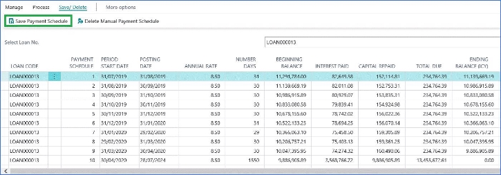

# Loans - Manual Payment Schedule

1. Loan Card

Process > Import Manual Payment Schedule

2. Several options are available:

- Start with a blank Payment Schedule and fill in your own

➔ Click on Process “Export Excel Template”. 
This will generate an Excel template for you to use.
  - Start from the existing Payment Schedule (system generated) and modify it directly in the system

➔ Click on “Copy Current Payment Schedule”. 
This will populate the page with the current payment schedule of the loan.

➔ Manually modify the schedule.

3. Continuing from point 2.a, after saving the Excel template on your PC, you can insert the payment schedule in Excel.

Example:

4. We import it back in Business Central using the function “Import Payment Schedule from Excel”.

The are some built-in checks already when importing the schedule, but mainly you need to make sure that:

- Period Start Date of the 1st entry is = to the Value Date of the Loan
- Posting Date of the last entry is = to the Maturity Date of the Loan
- Period Start Date = Posting Date of previous line
- Total Due = Interest Repaid + Capital Repaid
- Ending Balance = Beginning Balance -Capital Repaid
- Beginning Balance = Ending Balance of previous line
- First entry should have Beginning Balance = Loan Amount
- Last Entry should have Ending Balance = 0
5. Once you import the Payment Schedule in the system, you need to click on Save > Save Payment Schedule

6. That’s all. Now you will see on the Loan Card this comment to warn the user the original schedule has been overwritten:

And from the Loan Card > Payment Schedule, the system generated schedule has been replaced with the imported one.