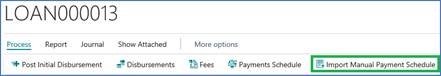
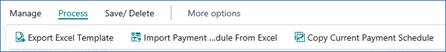
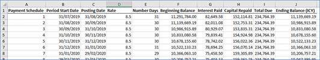

# Loans - Manual Payment Schedule

This document describes the process of manually import a payment
schedule using the Elysys Loans Module.

## **Access the Manual Payment Schedule menu**

1.  Open a loan card and navigate to *Process Import Manual Payment
    Schedule*

    

2.  Several options are available:

    

    a.  Start with a blank Payment Schedule and fill in your own
    
        Click on Process *"Export Excel Template"*. This will generate an Excel template for you to use.

    b.  Start from the existing Payment Schedule (system generated) and
        modify it directly in the system

        Click on "Copy Current Payment Schedule". This will populate the
        page with the current payment schedule of the loan.

    c.  Manually modify the schedule.

3.  Continuing from the previous point, after saving the Excel template
    on your PC, you can insert the payment schedule in Excel. Example:

    

## **Import the excel file with the new payment schedule**

1.  We import it back in Business Central using the function "Import
    Payment Schedule from Excel".

2.  The are some built-in checks already when importing the schedule,
    but mainly you need to make sure that:

    a.  Period Start Date of the 1st entry is = to the Value Date of the
        Loan

    b.  Posting Date of the last entry is = to the Maturity Date of the
        Loan

    c.  Period Start Date = Posting Date of previous line

    d.  Total Due = Interest Repaid + Capital Repaid

    e.  Ending Balance = Beginning Balance - Capital Repaid

    f.  Beginning Balance = Ending Balance of previous line

    g.  First entry should have Beginning Balance = Loan Amount

    h.  Last Entry should have Ending Balance = 0

3.  Once you import the Payment Schedule in the system, you need to
    click on Save \> Save Payment Schedule.

4.  That's all. Now you will see on the Loan Card this comment to warn
    the user the original schedule has been overwritten:
       
    And from the Loan Card \> Payment Schedule, the system generated
    schedule has been replaced with the imported one.
