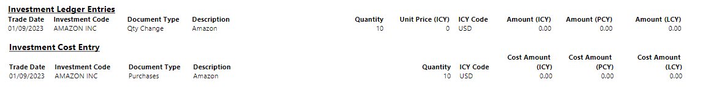

 

This document is accompanying the **Elysys Wealth** module, and it has
been created for the purpose of providing users with brief guidance on
how to process contracts for the dividend split, stock split and reverse
stock split.

The system is enhanced by adding Dividend Split, Stock Split and Reverse
Stock Split shares calculation.

 
The feature works with Equities, Funds, Alternative Investments and
Cryptocurrency and it allows stock increase and decrease to the
outstanding number of shares.

A new field **Qty Change Type** was added to the contract level. In
combination with **Type** = **Qty Change**, the user can select from the
three options below.

 

  

-   **Dividend Stock** - distribution of additional shares.

-   **Stock Split** - increases the number of outstanding shares. Stock
    Split allows only positive adjustment and is calculated by dividing
    existing shares into multiple shares.

-   **Reverse Stock Split** - decreases the number of outstanding shares
    and only negative adjustment is allowed.

**(1) Dividend Stock Qty Change**

Equities - Back Office

**Report**

Investment Ledger Entries

Investment Cost Entry

**(2) Stock Split Qty Change**

-   Automatic allocation to outstanding lot at trade date based on the
    following formula:

-   Quantity Lot 1/ ((Sum of all Purchases)/(Sum of all Purchases+ Qty
    Stock Split Change))

-   Stock Split allows positive adjustments only.

Equities - Back Office

 

**Report**

Initial lots are written off and Purchase lines are reopened with new
Quantity.

Purchase = 298.01 USD is calculated as follows:

100/ ((1010)/(1010+2000)) = 298.01, where

100 = Qty (lot 1)

1000 = SUM (Qty (lot1): Qty (lot 6))

 

 

**(3) Reverse Stock Split**

Decreases the number of initial shares hence it needs to be booked in
negative quantity.

**Report**

Initial lots are written off and Purchase lines are reopened with new
Quantity.

 

