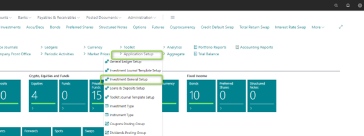
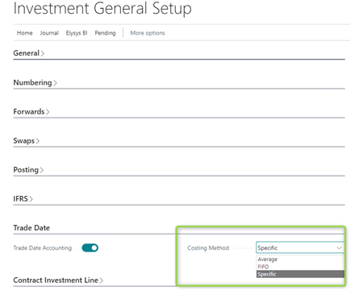
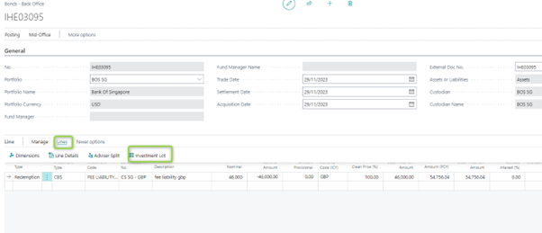
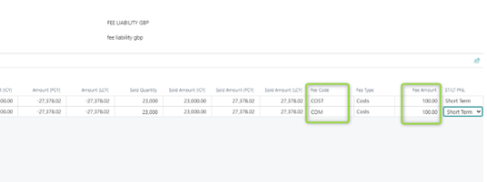
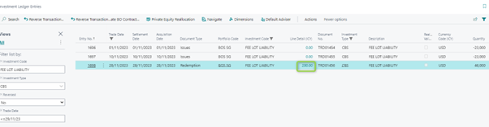
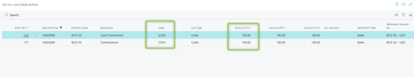
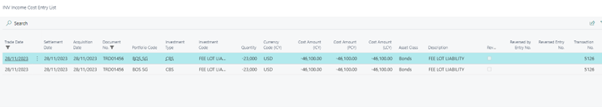
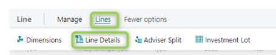
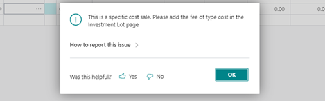

This document is accompanying the **Elysys Wealth** module, and it has
been created for the purpose of providing users with brief guidance on
how to capitalize fees when using the specific costing method.

**Introduction**

>  

-   **Purpose of the Function**

> Our Elysys module offers support for several costing methods. The
> primary costing methods include:

-   Average,

-   FIFO,

-   Specific.

>  

This functionality is available for the following asset classes:

-   Equities (long positions),

-   Funds,

-   Alternative Investments,

-   Bonds,

-   Structured Notes,

-   Preferred Shares.

>  

-   **Understanding Fees Capitalization in Elysys**

> Fees capitalization is a financial accounting process that involves
> recognizing and incorporating various fees associated with an asset or
> project into its overall cost.
>
>  
>
> Our Elysys module offers support for the capitalization of fees
> associated with investments for all the costing methods mentioned
> above.
>
>  

This user guide describes the fees capitalization using the **Specific
costing method**.

>  

**Getting Started**

>  

-   **Logging In**

> First things first, log in to your Elysys/ Business Central account.
> Once you\'re on the dashboard, locate the \'*Application Setup\' \--\>
> \'Investment General Setup\' page*. Click on it to access the
> *Investment General Setup* functionality. This page can also be
> accessed via the search functionality from the top right screen.
>
>  
>
>
>
>  

-   **Investment General Setup**

> Within the *\'Investment General Setup\'* page, look for the option
> that says \'*Costing Method.\'* This is your setup point for defining
> the costing method you want at the company level.
>
>  
>
>

**Function Overview**

>  

Once you finished the setup, create an investment contract.

 

In the below example we pick an outstanding position where we have
issued debt.

Once you\'ve created the *sale (or redemption) contrac*t, you\'ll be
prompted to fill in some details. Start by entering the header and line
information --- type, code, quantity (or nominal), unit price (or clean
price), etc. Then, add the fees to be capitalized via the *\'Investment
Lot\'* page.

>

>  

Then, add the fee codes and the associated amount for the targeted
investment lot.

>

>  
>
>  

After posting, the fee amounts can be found in the *\'Investment ledger
entry\'* (the average cost amount), while the split per lot is found in
the *\'investment line detail*\' page (amount per lot).

>  

>

>  

>

>  

The capitalized fees are booked in the General Ledger accounts and in
the Income Cost Entry.

>  

>

>  

**Notes (expensed fees scenario)**

>  

You have the possibility to add fees that are expensed (the amount will
be booked in a General Ledger account specified by you). This step is
done by clicking on the *\'Line\' \--\> \'Line Details\'.* Note that a
fee that is expensed is set up with the type = fees.

>

>  

If you try to add in this page a fee that will be capitalized (type =
cost), there will be a warning message. This step helps in avoiding
errors and ensures that you\'re fulfilling exactly the fee capitalizing
per each lot.

>  
>
>
>
>  
>
>  
