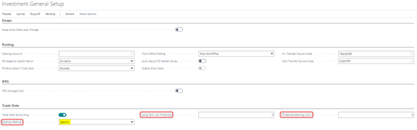
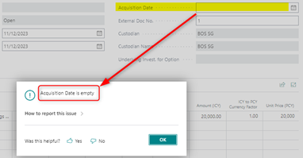
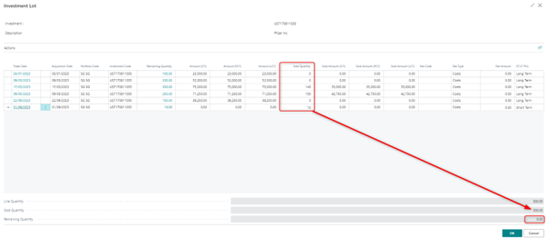
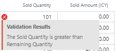
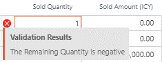
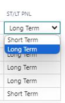
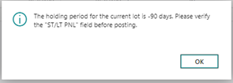
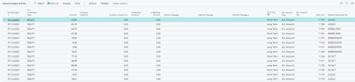
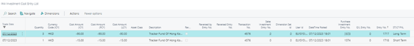
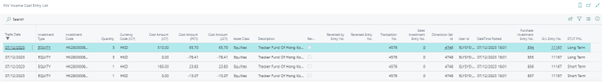

This document is accompanying the **Elysys Wealth** module, and it has
been created for the purpose of providing users with brief guidance on
how to process contracts that are automatically allocated as Short Term
or Long Term when using the specific costing method.

<u>**Purpose:**</u>

There are 3 \"Costing Methods\" available in Elysys Wealth:

-   Average Cost

-   FIFO

-   Specific

For \"Average Cost\" and \"FIFO\" costing methods, when processing a
sales contract, the user cannot select the shares he would like to sell.
This is predetermined automatically.

For the "Specific\" costing method, the user is allowed to select the
shares (lots) he would like to sell, if there had been several purchases
done before.

Investments Scope:

-   Equities, Funds, Alternative Investments, Cryptocurrency

-   Bonds, Preferred Shares, Structured Notes

<u>**Setup:**</u>

Open Application Setup \> Investment General Setup \> Trade Date \>
Costing Method

-   Select \"**Specific**\" for Specific costing method,

-   Specify the **\"Long Term Lot Threshold**\" (this is the limit
    between \"Short Term\" and \"Long Term\" detention),

-   Specify the \"**Threshold Warning Limit**\" (which triggers a
    warning message when reached).

<u>**Purchases:**</u>

When activating this \"Specific\" costing method, a new editable field
is displayed in the FO Journal, MO and BO Contracts: \"**Acquisition
Date**\".

This field is automatically filled-in (defaulted as \"Trade Date\") but
is not mandatory at FO/MO levels.

To post from BO to the ledgers, **this field must be filled in.**

Note:

This field is visible but not editable (greyed-out) for \"Average\" and
\"FIFO\" costing methods.

**<u>Sales:</u>**

In the FO Journal, the users specify the total quantity to be sold and
the unit price, as usual.

**Note:**

**Posting option (Investment General Setup) Front Office Posting =
\"Post to Mid-Office\" and \"Skip Mid-Office\" can be both allowed**

**(However Front Office Posting = \"Skip Mid & Back Office\" must not be
used)**

In MO Contract, the users specify the total quantity to be sold and the
unit price, as usual. The Contract is sent to BO.

On BO level, the users specify the total quantity to be sold and the
unit price as well, then a new window (**\"Investment Lot\"**) will be
disclosed when trying to run a test report or to post the contract:

In the Column \"Sold Quantity\", the user splits the total quantity into
the selected lots (all purchases are disclosed with the dates, remaining
quantities and amounts)

-   The Sold Quantity of a specific line must be smaller than or equal
    to the Remaining Quantity of the same line,

-   The total of Sold Quantities (lines) must be equal to the Sold
    Quantity disclosed at the bottom, so that the remaining quantity is
    0.

Otherwise, error messages will appear:

A new field has been added in this table: \"**ST/LT PNL**\" (only shown
if Costing Method = Specific Lot or FIFO)

Values are populated according to the following rule:

-   IF (Sale Date -- Acquisition Date) SMALLER or EQUAL TO \"Threshold
    Period\" =\> \"**Short Term\"**

-   ELSE (if Greater than \"Threshold Period\") =\> \"**Long Term\"**

This field is editable and user can modify the value if necessary
(**\"Short Term\"** or \"**Long Term\"**)

An additional warning message has been added when validating the
Quantity:

-   IF ABS ((Sale Date -- Acquisition Date) -- Threshold Period) SMALLER
    OR EQUAL TO Threshold Warning Limit

-   THEN Warning Message: \"**The holding period for the current lot is
    XXX days. Please verify the \"ST/LT PNL\" field before posting**.\"

-   Where XXX = (Sale Date -- Acquisition Date)
 

<u>**ST/LT PNL Field:**</u>

The values will be reported to the following ledgers/sub-ledgers:

-   G/L Entry

-   Investment Cost Entry

-   Income Cost Entry

 
