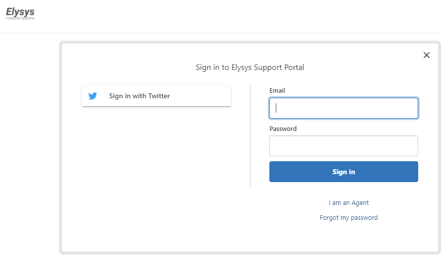
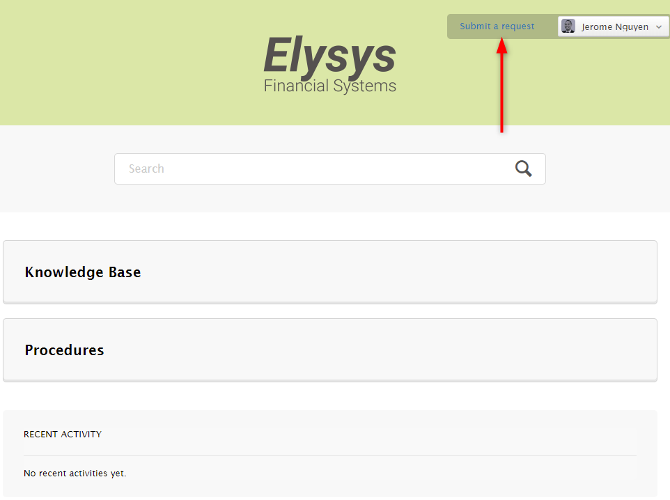
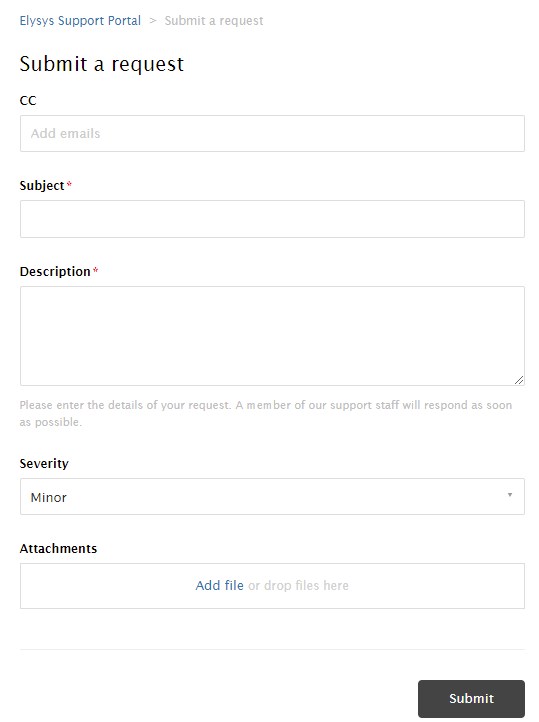

# Elysys Support

The procedure to access Elysys Support Portal.

In case of a production issue please log in here: 

**[https://support.elysys.com/](https://support.elysys.com/)**

And you will see a screen simialr to the one below. 

*(f you do not remember your password, feel free to contact us and we will reset it for you.)*

Then select “Submit a request” 

and describe the problem encountered (it is possible and highly recommended to attach files, screenshots…)

We will have a look at your mail below and will get back to you asap.

**Thank you.**