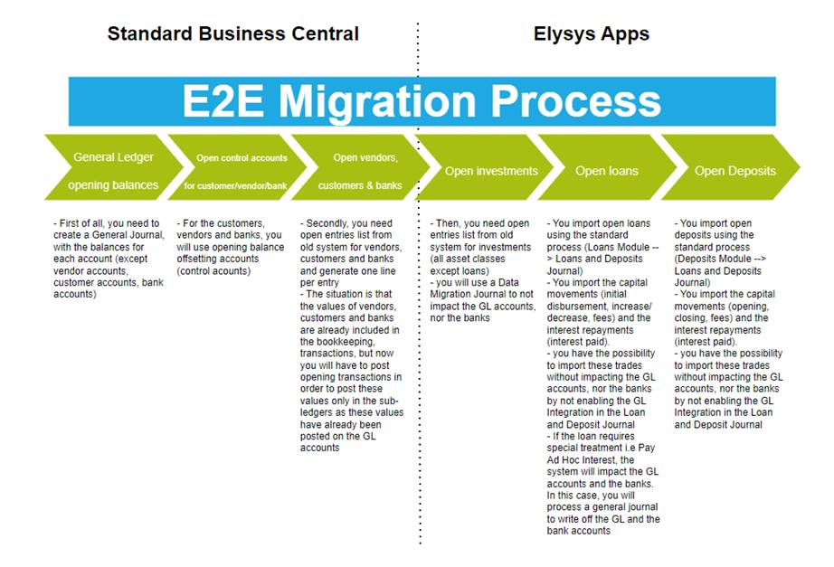
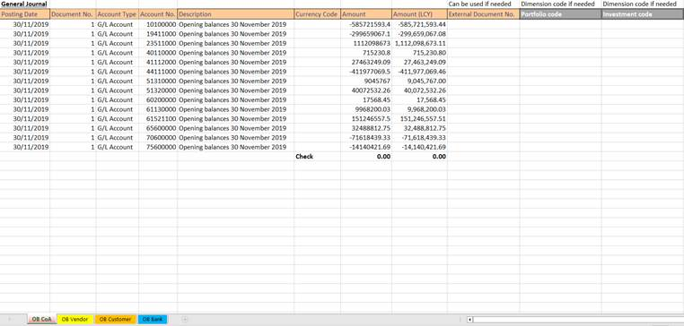
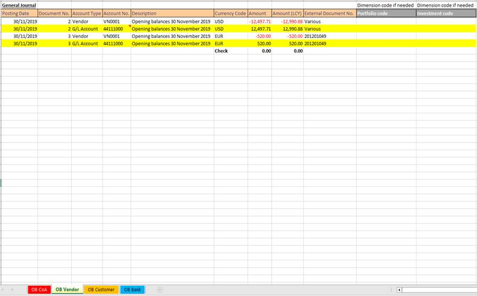
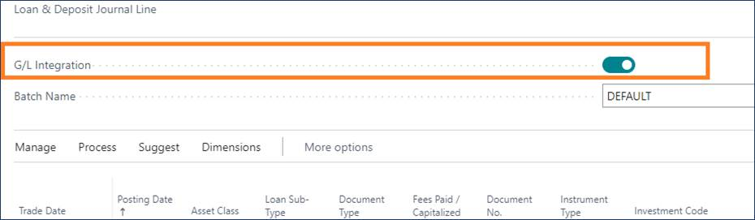
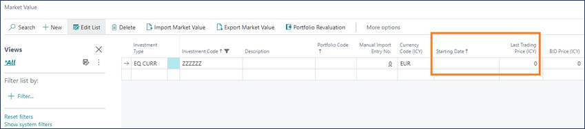

# Elysys Data Migration Manual

This document describes the approach for data migration in Elysys Apps
and for Microsoft Dynamics Business Central. Three types of transactions
can be managed within the system:

-   *Standard Business Central transactions:*

    -   General Ledger opening balances,

    -   Open control accounts for vendors, customers, bank accounts,

    -   Open vendors, customers, bank accounts,

-   *Elysys Apps transactions:*

    -   Open investments,

    -   Open loans,

    -   Open deposits.

    The data migration process (transactions/ opening balances) is done at
    the company level !

## **Opening balances for GL accounts, vendors, customers and banks** 

We recommend that you migrate opening balances in steps, in the
following order.

-   Migrate general ledger opening balances without using the general
    ledger account subledgers. Use specific opening balance offsetting
    accounts (control accounts), one set up for each subledger. Set up
    the offsetting accounts (control accounts) to enable direct
    postings.

-   Migrate open customer ledger entries, vendor ledger entries and bank
    entries.

    First, you need to create a General Journal, with the balances for each account (except vendor accounts, customer accounts, bank accounts).

  

      

        
    

 

    For the customers, vendors, and banks, you will use opening balance offsetting accounts (control accounts).

  

      

        
    

 

  
Then post your balance forward with a date at your convenience
**(30/11/2019).**

Secondly, you need open entries list from your old system for vendors,
customers and banks and generate one line per entry in the General
Journal in case you need to keep the historic.

The situation is that the values of your customers, banks and vendors
are already included in your bookkeeping transactions, but that now you
will have to post opening transactions in order to post these values
only in the sub-ledgers as these values already have been posted on G/L
accounts.

Two options can be done:

-   One line per vendor per invoice. You will use as a balance account,
    the same vendor posting group to write-off this G/L account.

-   Or the balance of the vendor.

## **Opening balances for investments**

At this stage, the open entries list from old system for investments
(all asset classes except loans) is required.

You will use a Data Migration Journal to process the opening balances
(or historical transactions) to not impact the GL accounts, nor the
banks. This is because the GL accounts and the banks should have been
migrated in the previous step.

## **Opening balances for loans**

We recommend following the following steps to manage the loan historical
transactions:

-   You import the capital movements (initial disbursement, increase/
    decrease, fees) and the interest repayments (interest paid). You
    import open loans using the standard process (Loans Module Loans and
    Deposits Journal).

-   You have the possibility to import these trades without impacting
    the GL accounts, nor the banks by switching off the GL Integration
    in the Loan and Deposit Journal,

-   If the loan requires special treatment i.e *Pay Ad Hoc Interest*,
    the system will impact the GL accounts and the banks. In this case,
    you will process a general journal to write off the GL and the bank
    accounts.

## **Opening balances for deposits**

We recommend following the following steps to manage the deposit
historical transactions:

-   You import the capital movements (opening, closing, fees) and the
    interest repayments (interest paid). You import open deposits using
    the standard process (Deposits Module Loans and Deposits Journal)

-   You have the possibility to import these trades without impacting
    the GL accounts, nor the banks by not enabling the GL Integration in
    the Loan and Deposit Journal.

## **Journals & Posting procedures**

### **Data Migration Journal**

Go to: *Home ➔ Toolkit ➔ Journal➔ Button: Data Migration Journal (while
using the Elysys Back Office Profile)*

An excel template will be provided to fill in the following information,
related to each investment:

-   Insert Opening Balances as of **30/11/2019**

    -   Add the Amount ICY/PCY/LCY.

-   For the Opening Balance, please use the Document Type *"Purchases"*
    for all investments which have a Long position and "Sales" for all
    investments which have a Short position @ **30/11/2019**.

    -   The "Rules" sheet defines the Asset Classes & Document Types
        which are allowed.

-   The Portfolio Code, Investment Code, Bank Account must match with
    existing Codes set up

## **Investments Revaluation**

### **Import the Market Price for each investment to be revalued**

*Go to: Home ➔ Periodic Activities ➔ Button: Portfolio Revaluation*

The Portfolio Revaluation journal will be used to revalue the
investments and this process will impact the GL and the bank accounts.

As a prerequisite, you must insert the Market Price (in the investment
currency) and the last trading date in the Market Value table before
running the revaluation.

