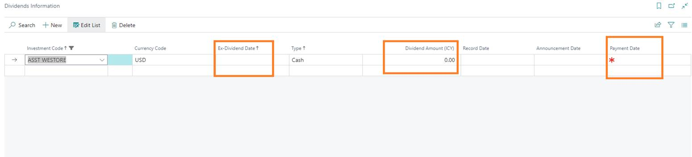
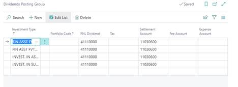
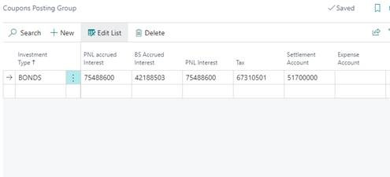

 

# Dividends and Coupons
## **Dividends Journal**

The Dividend Journal will be used to migrate/ process dividend
information.

**First step** is to enter the details in the **Dividend Information**
page. This is available on each investment card such as Equity Card,
Fund, Private Equity Fund.

*Go to: Investment card (i.e Equity) ➔ Dividend ➔ Button: Dividends
Information*

    

  <b>Ex-Dividend Date:</b> Date at which the dividend is received in the account     
  <b>Type:</b> Cash means it is received as cash     
  <b>Dividend Amount (ICY):</b> amount of dividend received per share    
  <b>Announcement date:</b> for information only (not mandatory)     
  <b>Payment Date:</b> the date at which the payment is received (mandatory)     

  

      

        
    

 

  

  **Second setup** is to setup the account rules for the dividend
postings.   
For each Investment Type, you may setup one GL account for:

    

-   <b>PNL Dividend:</b> dividend realised account  
-   <b>Tax, Fees, Expense Account:</b> dividend tax, fee, expense account  
-   <b>Settlement Account:</b> dividend accrual/ transit account before the amount is received to the bank  

  

      

        
    

 

Next step is to **book the dividend amount in the income statement.**

*Go to: Home ➔ Actions: Periodic Activities ➔ Button: Dividend Journal.*

From this page, run the \"Suggest Dividend\" function and enter the date
at which you need to process all your dividends in the \"Last payment
Date\" field.

The suggest function will provide the list of all the outstanding
dividends at the date. You may now post those dividends using the "Post"
function in the ribbon. The dividend entries have now been posted to an
income statement dividend account and a receivables account.

Last step is to **settle the cash** received in the bank.

Once the cash from dividends has been received in the bank, the entries
need to be settled.

*Go to: Home ➔ Actions: Periodic Activities ➔ Button: Settlement
Journal.*

Then run the \"Suggest Settlement\" function and enter the date at which
you need to process all your settlement entries in the \"Settlement
Date\" field.

## **Coupons Journal**

The Coupon Journal will be used to process coupon/ interest information.

   **First** is to setup the account rules for the coupon postings.
For each Investment Type, you may setup one GL account for:

    

-  <b>PNL accrued interest:</b> accrued interest  
-  <b>BS Accrued Interest:</b> BS accrued interest  
-  <b>PNL Interest:</b> PNL interest  
-  <b>Tax, Expense Account:</b> coupon tax, expense account  
-  <b>Settlement Account:</b> transit account before the amount is received to the bank (used only if Trade Date accounting is required)  

  

      

        
    

 

Next step is to book the coupon amount.

*Go to: Home ➔ Actions: Periodic Activities ➔ Button: Coupon Journal.*

Then run the \"Suggest Coupons\" function and enter the date at which
you need to process all your settlement entries in the \"Last Payment
Date\" field.

