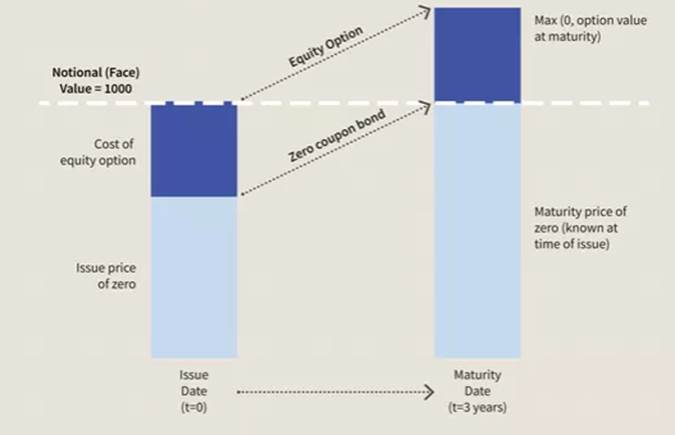
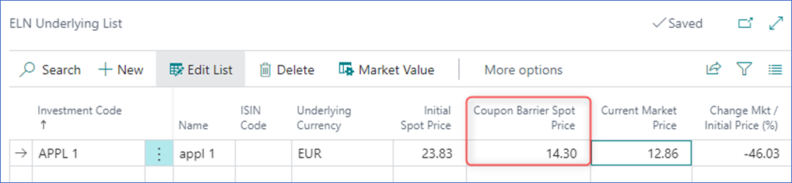

 

# Introduction

Equity Linked Notes fall into the Structured Notes product category for
which coupon payments are based on the performance of the underlying
equity(ies).

The product has a pre-defined schedule according to which the coupons
are paid on Payment Date provided that each underlying equity is equal
to or greater than the Coupon Barrier status on the Observation Date.

# ELN Card

The ELN is created in the Structured Notes Card, and it is activated by
enabling the ELN flag.

-   Coupon Barrier (%): specifies the percentage of the Initial Spot
    Price, on any Observation Date, above which the ELN coupon is paid.

-   Coupon Barrier Spot Price: automatically calculated in the system
    and located in the ELN underlying page, CBSP = Initial Spot Price x
    Coupon Barrier (%)

-   Memory Coupon: specifies a coupon that is carried over to the next
    Coupon Observation Date if the product at a given Observation Date
    is Below Barrier as defined in the ELN Schedule. However, if payment
    requirements are met at a certain Observation Date, either the most
    recent coupon or all coupons that have not previously been paid,
    will fall due for payment.

-   Coupon Guarantee: a guarantee period in which the coupon is paid
    even if the barrier is passed.

-   Coupon Guarantee End Date: the date after which coupon will not be
    paid.

# ELN Underlying

Path: Structured Notes Card -\> ELN -\> ELN Underlying\
\

One or more underlying can be set up for each ELN investment.

Initial Spot Price -- specifies the Market Price of the underlying
equity at the **Date of Issue** of the ELN

Coupon Barrier Spot Price = Spot Price x Coupon Barrier %

ISIN Code, Underlying Currency, Current Market Price - Informative
fields that are auto-populated.

# ELN Payments/Coupon Schedule

ELN Schedule is partially completed by the user, and it determines if
the coupon will be paid based on the Barrier Status.

-   Coupon Observation Date specifies the date on which the Barrier
    Status is calculated.

-   Coupon Payment Date specifies the date on which the coupon is
    settled. Coupons are only payable if the Barrier Status is equal to
    or Above Barrier.

-   Barrier Status: specifies if underlying products are above or below
    barrier on the Coupon Observation Date.

-   Coupon Posted flag specifies if the coupon is posted. It is unticked
    if the coupon is reversed.

-   Posted Coupon Ledger Entry field specifies the entry number of the
    posted coupon.

The **Update Barrier Status** function recalculates the Barrier Status
in accordance with the barrier percentage defined on the card and its
underlying market value on the Coupon Observation Date.

## Workflow

ELN is purchased via the Structured Notes Journal. It can be bought and
sold via the Front, Mid and Back Office.

Nominal: specifies the amount invested in the ELN

Clean Price (%): 100%

# Structured Notes Coupon Journal

ELN Coupons are suggested and posted via the Structured Notes Coupon
Journal

-   First Above Barrier coupon payment is suggested at the first Coupon
    Observation Date on 04/06/2021

Coupon Calculation = Annual Coupon / Number of coupons paid during the
year

Annual Coupon = 200,000.00 = 1,000,000.00 \*20% /100

Coupon Frequency = Quarterly

Coupons = 200,000.00 / 4 = **50,000.00**

-   When the coupon is executed, the **Coupon Posted** and **Posted
    Coupon Ledger Entry** fields in the ELN Schedule are updated.

-   In our example, remaining coupons are suggested up until the last
    Coupon Observation Date on 06/03/2023

The Structure Notes Coupon Journal suggested four lines based on the ELN
schedule where the Barrier Status shows Above Barrier entries only until
06/06/2022 with the remaining lines until the Maturity Date being Below
Barrier.

# Maturity

At the maturity of the ELN, the cash income needs to be executed
manually via the Structured Coupon Journal screen, by booking a Sales
transaction.
