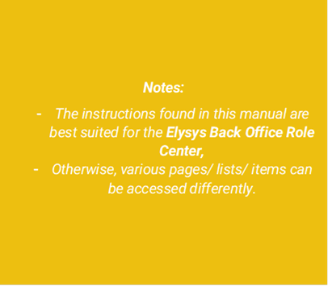

 

# ***Elysys Wealth -- Equity like module***

This document describes the standard functionalities of the Equity like
module within Elysys Wealth, as well as the required setup. Three are
multiple asset classes managed within the module:

-   Equities,

-   Funds,

-   Alternative Investments.

 

## Investment General Setup

The user must make sure the following settings had been set up:

*Home Page ➔ Application Setup ➔ Investment General Setup ➔ Button: New
or Edit*

This page contains the investment module setup. This setup needs to be
done at the early stage and before any entries can be made by the
module.

-   *Portfolio Dimension code:* Specifies the code to identify the
    Portfolio throughout the system.

-   *Investment Dimension code:* Specifies the code used to identify the
    Investment throughout the system.

-   *Investment Contracts Header Nos:* Specifies the number series to
    number Investment contract headers.

-   *Swift Management Header:* Specifies the number series used by the
    Switch Contract function.

-   *Transfer Management Header:* Specifies the number series used by
    the Transfer Contract function.

-   *Clearing No.:* Specifies the clearing account is used by the Switch
    function. The balance of the investment closed by the function is
    booked to this account and the value of the investment being opened
    is also booked from this account.

-   *Trade Date Accounting:* Specifies if the user needs to run the
    settlement process to transfer the cash from the settlement account
    to the bank.

## Investment Type

Now, we need to define all Investment types that will be used throughout
the investment module with their accounting rules. Investment types need
to be defined according to how investments need to be grouped and
accounted together, it is the equivalent of the product posting group of
Business Central. Investment types are required for every Investment
product ranging from Equities to Options and Forex products plus Private
Equity.

-   *Code:* Specifies the code to identify the Investment Type.

-   *Name:* Specifies the name for the Investment type.

-   *Asset Class:* Specifies the asset class relating to the investment
    type being created. The Asset Class defines how the investments are
    managed / handled by Elysys Wealth as each asset class uses its own
    logic.

## Investment Posting Group and Dividends Posting Group

Once all investment types are created, the accounting rules must be
specified using Investment posting group.

Accounting rules allows Elysys Wealth to know which account to use in
the process of creating all accounting entries when booking investment
trades. The Investment posting group page is one of the setup page used
by the module along with the coupons posting group, the forex posting
group, the options posting group, the dividends posting groups and so
on.

For each of the Investment type belonging to those assets class a
nominal account is required for the following account:

-   *BS at Cost Account:* Specifies the General Account used to book
    cost related entries such as purchase and sales type entries

-   *BS UR Forex Gain/Loss Reval:* Specifies the Balance Sheet General
    account used to book unrealised forex gain and loss calculated by
    the revaluation.

-   *BS UR Market Gain/Loss Reval:* Specifies the balance Sheet General
    account used to book unrealised Market gain and loss calculated by
    the revaluation.

-   *PnL UR Market Reval:* Specifies the Profit and Loss General account
    used to book unrealised Market gain and loss calculated by the
    revaluation.

-   *PnL UR Forex G/L Reval:* Specifies the Profit and Loss General
    account used to book unrealised forex gain and loss calculated by
    the revaluation.

## Investment Card 

Before any entry can be made with any investment the user is required to
create the relevant Investment card in Elysys Wealth. The user needs to
select in the list of asset classes the one which applies to the
investment.

In "Equities, Funds, Alt. Investments" select "New" or "Edit" from the
ribbon. The following interface comes up:

The following fields need to be filled in:

-   *Code:* Specifies the unique identifier of the investment, used
    throughout the system (mandatory),

-   *Investment type:* Specifies the accounting behaviour of the
    investment (mandatory),

-   *Currency:* Specifies the currency code for the investment
    (mandatory),

-   *Description:* Specifies the name of the investment,

-   *Other fields are optional.*

## Journals & Posting procedures 

### 1. Front/ Mid/ Back-office journals 

Transactions can be booked via the back-office journals (use can access them by clicking on the green tiles from the home page), or by accessing the Front Office or Middle Office journals.

At the contract level, the following fields are required:

General Section:

-   Portfolio Code: specifies the contained/ bucket that will store the
    transaction,

-   Trade Date and Settlement Date: specifies the posting date and the
    settlement date (they can be the same),

-   External Doc. No.: specifies any unique identifier from the
    statement file (it can be any text).

Line section:

-   Type: specifies the contract type,

-   Investment type: specifies the investment type, it acts as a filter
    for the investment list,

-   Nominal: specifies the nominal amount,

-   Unit Price (ICY) specifies the unit price,

-   Amount ICY: specifies the cost or the net proceed amount (the system
    will automatically calculate the price if user will only add the
    Quantity and the Amount)

Line Details section:

Fees can be added to each contract line. They can be expensed or capitalised (factored into the cost). As a prerequisite, the fee card must exist prior to adding it to the contract.

### 2. Portfolio Revaluation 

**Go to: Home ➔ Bonds ➔ Valuation ➔ Button: Portfolio Revaluation (or
Home Periodic Activities Button: Portfolio Revaluation)**

As a prerequisite, user must add the valuation/ price to the Market
Value table. The required fields are:

-   Starting Date,

-   Last Trading Price (ICY).

Once the price is added, user can open the Portfolio Revaluation
Journal and run the Suggest function, specifying the Revaluation Date
(other fields are not required). This is a batch process, so the
system will suggest the revaluation for all the open positions, unless
user will add specific filters before running the Suggest function.
The process is done at the company level.
>

### 3. Dividends Journal

The dividends Journal will be used to process dividend information.
First step is to enter the details in the **Dividend Information**
page. This is available on each investment card such as Equity Card,
Fund, Private Equity Fund.

*Go to: Investment card (i.e Equity) ➔ Dividend ➔ Button: Dividends
Information*
The required fields to be filled in are:

-   Ex-Dividend Date: specifies the date at which the dividend is
    received in the account,

-   Type: specifies if it is received as cash,

-   Dividend Amount (ICY): specifies the amount of dividend received per
    share,

-   Announcement date: for information only (not mandatory),

-   Payment Date: the date at which the payment is received (mandatory).

-   This is a batch process, so the system will suggest the coupons for
    all the open positions, unless user will add specific filters before
    running the Suggest function. The process is done at the company
    level.

Next step is to *Go to: **Home ➔ Actions: Periodic Activities ➔
Button: Dividend Journal.***

From this page, run the \"Suggest Dividend\" function and enter the
date at which you need to process all your dividends in the \"Last
payment Date\" field (this would be the Ex-Dividend Date from the
Dividends Information).

The suggest function will provide the list of all the outstanding
dividends at the date. You may now post those dividends using the
"Post" function in the ribbon. The dividend entries have now been
posted to an income statement dividend account and a receivables
account. The process is done at the company level.

Last step is to settle the **cash received in the bank.**

Go to ***: Home ➔ Actions: Periodic Activities ➔ Button: Settlement
Journal.***

Then run the \"Suggest Settlement\" function and enter the date
(Payment Date from the Dividends Information table) at which you need
to process all your settlement entries in the \"Settlement Date\"
field.

## 4. Navigate functions

### Investment Ledger Entries

Shows all the ledger entries for the relevant "Investment Code". The
entries result from posting transactions via the Bond front/ mid/
back-office journals. The following types of entries are posted to
this ledger: purchases, sales, issues, redemptions, market (gain/ loss
triggered by the revaluation process).

### Income Ledger Entries

Realised entries created when closing the position for an investment or
the dividend amount.

### Dimensions

Link Dimensions to the investment card. These Dimensions will be linked
to all ledger entries.
