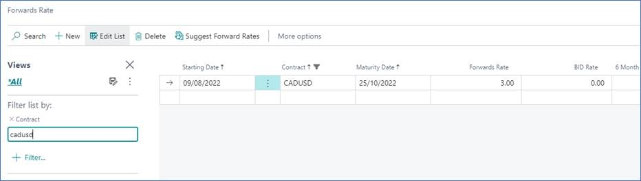

# ***Elysys Wealth -- Forwards***

This document describes the standard functionalities of the Forwards
module within Elysys Wealth, as well as the required setup.

## Investment General Setup

The user must make sure the following settings had been set up:

*Home Page ➔ Application Setup ➔ Investment General Setup ➔ Button: New
or Edit*

This page contains the investment module setup. This setup needs to be
done at the early stage and before any entries can be made by the
module.

-   *Portfolio Dimension code:* Specifies the code to identify the
    Portfolio throughout the system.

-   *Investment Dimension code:* Specifies the code used to identify the
    Investment throughout the system.

-   *Investment Contracts Header Nos:* Specifies the number series to
    number Investment contract headers.

-   *Swift Management Header:* Specifies the number series used by the
    Switch Contract function.

-   *Transfer Management Header:* Specifies the number series used by
    the Transfer Contract function.

-   *Clearing No.:* Specifies the clearing account is used by the Switch
    function. The balance of the investment closed by the function is
    booked to this account and the value of the investment being opened
    is also booked from this account.

-   *Trade Date Accounting:* Specifies if the user needs to run the
    settlement process to transfer the cash from the settlement account
    to the bank.

-   *Forwards No.*: Specifies the number series used in the Forward
    Contract.

-   *User Forward Rate:* specifies if the user allows the revaluation of
    Forward's unrealized market gain/loss;

-   *Use Spot Rate:* specifies if the user allows the revaluation of
    Forward's unrealized Forex Bought and Sold gain/loss.

## Investment Type

Now, we need to define all Investment types that will be used throughout
the investment module with their accounting rules. Investment types need
to be defined according to how investments need to be grouped and
accounted together, it is the equivalent of the product posting group of
Business Central. Investment types are required for every Investment
product ranging from Equities to Options and Forex products plus Private
Equity.

-   *Code:* Specifies the code to identify the Investment Type.

-   *Name:* Specifies the name for the Investment type.

-   *Asset Class:* Specifies the asset class relating to the investment
    type being created. The Asset Class defines how the investments are
    managed / handled by Elysys Wealth as each asset class uses its own
    logic.

## Forex Posting Group

Once all investment types are created, the accounting rules must be
specified using Investment posting group.

Accounting rules allows Elysys Wealth to know which account to use in
the process of creating all accounting entries when booking investment
trades. The Investment posting group page is one of the setup page used
by the module along with the coupons posting group, the forex posting
group, the options posting group, the dividends posting groups and so
on.

For each of the Investment type belonging to those assets class a
nominal account is required for the following account:

-   *BS at Cost Account:* Specifies the General Account used to book
    cost related entries such as purchase and sales type entries

-   *BS UR Forex Gain/Loss Reval:* Specifies the Balance Sheet General
    account used to book unrealised forex gain and loss calculated by
    the revaluation.

-   *BS UR Market Gain/Loss Reval:* Specifies the balance Sheet General
    account used to book unrealised Market gain and loss calculated by
    the revaluation.

-   *PnL UR Market Reval:* Specifies the Profit and Loss General account
    used to book unrealised Market gain and loss calculated by the
    revaluation.

-   *PnL UR Forex G/L Reval:* Specifies the Profit and Loss General
    account used to book unrealised forex gain and loss calculated by
    the revaluation.

## Investment Card 

No investment card is needed.

# Journals & Posting procedures 

### 1. Subscription 

Create a new Forward Subscription Contract.

 

 \- After selecting a Portfolio and the Posting Date, choose
 "Subscription" as the Document Type then fill in all the remaining
 information on the contract line.

 \- Before definitely posting the contract in the system, make sure you
 preview the to-be-posted entries by using the "Test Report" function
 from the ribbon. The use the "Post" function to validate it.

 \- Subscription contracts will not have any impact on the bank
 balances.

 

 Test Preview to check the accounting impact that will be generated
 after posting. The contract will be posted in the Forex Ledger.

 

### 2. Portfolio Revaluation 

 **Go to: Home Periodic Activities Button: Forwards Revaluation**

 First, fill in the forward rate with the rate + maturity date +
 relation/ couple.

 

 The **Forwards revaluation job** will generate 3 lines, for the
 revaluation of the forward contract rate (Market), the currency sold
 (Forex Sold) and the currency bought (Forex Bought).

 

 

 Test Report to see the accounting impact before posting.

 

### 3. Maturity 

 **Go to: Home ➔ Actions: Periodic Activities ➔ Button: Coupon Journal
 or Structured Notes Coupon Journal**

 To create a Forward Maturity contract, select a Portfolio and the
 Posting Date. The Posting Date must match the Maturity Date of the
 Forward you want to mature.

 Fill in the contract line by selecting "Maturity" as a Document Type,
 the corresponding Investment Type, then double-click the "No." field
 and select the Forward No. you want to mature (or use the function
 \"Close Forward\").

 

 Contract generated by Close Forward function (to change the status to
 Completed).

 

 Created contract.

 

#### Preview of the maturity with NDF unticked

 

#### Preview of the maturity with NDF ticked

 

# Navigate functions 

### Detailed View (Open Position)

 

 

### Forex Ledger Entries

 Shows all the ledger entries for the relevant "Investment Code".

 Down below is the Subscription contract posted in the ledger and the
 maturity contract.

 

### Dimensions

Link Dimensions to the investment card. These Dimensions will be linked
to all ledger entries.
