# ***Elysys Wealth – Futures***

This document describes the standard functionalities of the Futures module within Elysys Wealth, as well the required setup.

Futures contracts are standardized agreements to buy or sell an asset at a future date at a price specified today.

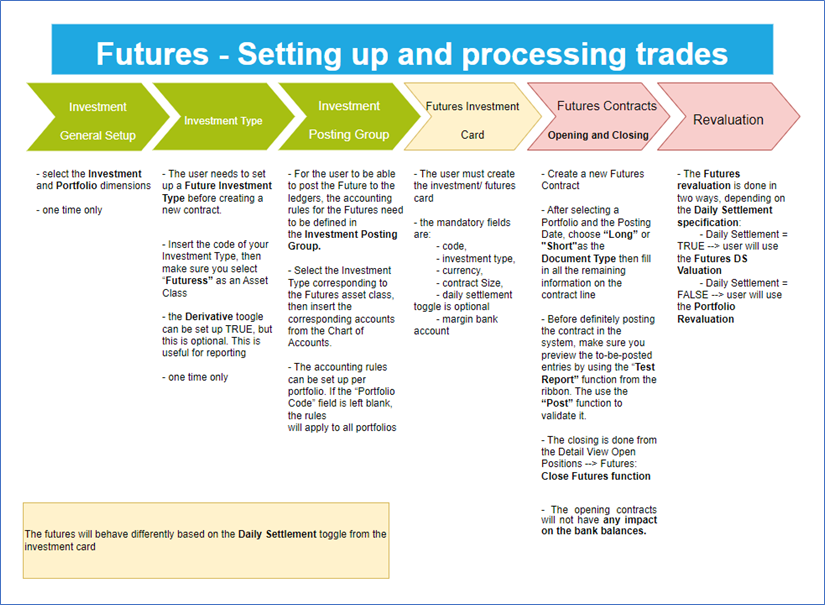

| | |
| ---        |           --- |
| Notes:The instructions found in this manual are best suited for the Elysys Back Office Role Center,Otherwise, various pages/ lists/ items can be accessed differently. | 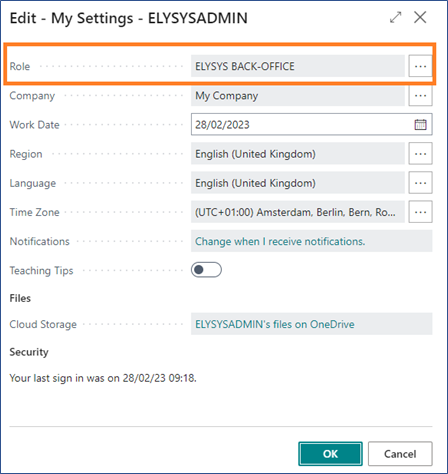 |

## Investment General Setup

The user must make sure the following settings have been set up:

_Home Page ➔ Application Setup ➔ Investment General Setup ➔ Button: New or Edit_

This page contains the investment module setup. This setup needs to be done at an early stage and before any entries can be made by the module.

*   _Portfolio Dimension code:_ Specifies the code to identify the Portfolio throughout the system.
*   _Investment Dimension code:_ Specifies the code used to identify the Investment throughout the system.

## Investment Type

Now, we need to define all Investment types that will be used throughout the investment module with their accounting rules. Investment types need to be defined according to how investments need to be grouped and accounted for together; it is the equivalent of the product posting group of Business Central. Investment types are required for every Investment product ranging from Equities to Options and Forex products plus Private Equity.

*   _Code:_ Specifies the code to identify the Investment Type.
*   _Name:_ Specifies the name for the Investment type.
*   _Asset Class:_ Specifies the asset class relating to the investment type being created. The Asset Class defines how the investments are managed / handled by Elysys Wealth as each asset class uses its own logic. This must be **Futures**
*   _Derivative:_ this toggle has a reporting purpose only.
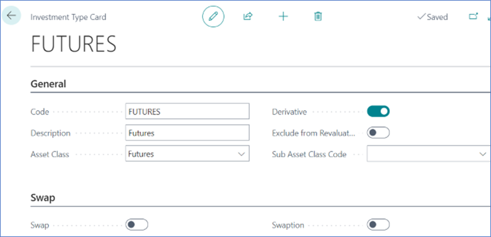

## Investment Posting Group

Once all investment types are created, the accounting rules must be specified using Investment posting group.

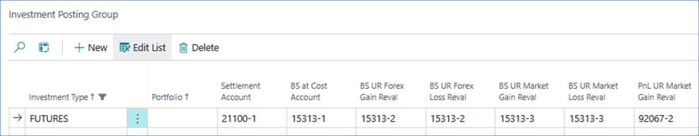

Accounting rules allows Elysys Wealth to know which account to use in the process of creating all accounting entries when booking investment trades. The Investment posting group page is one of the setup pages used by the module along with the coupons posting group, the forex posting group, the options posting group, the dividends posting groups and so on.

For each of the Investment type belonging to those assets class a nominal account is required for the following account:

*   _BS at Cost Account:_ Specifies the General Account used to book cost related entries such as purchase and sales type entries
*   _BS UR Forex Gain/Loss Reval:_ Specifies the Balance Sheet General account used to book unrealised forex gain and loss calculated by the revaluation.
*   _BS UR Market Gain/Loss Reval:_ Specifies the balance Sheet General account used to book unrealised Market gain and loss calculated by the revaluation.
*   _PnL UR Market Reval:_ Specifies the Profit and Loss General account used to book unrealised Market gain and loss calculated by the revaluation.
*   _PnL UR Forex G/L Reval:_ Specifies the Profit and Loss General account used to book unrealised forex gain and loss calculated by the revaluation.

If the Trade Date accounting option is enabled, the user must setup the settlement posting group too by filling the **PnL Realised Forex Gain** and **PnL Realised Forex Loss** accounts.

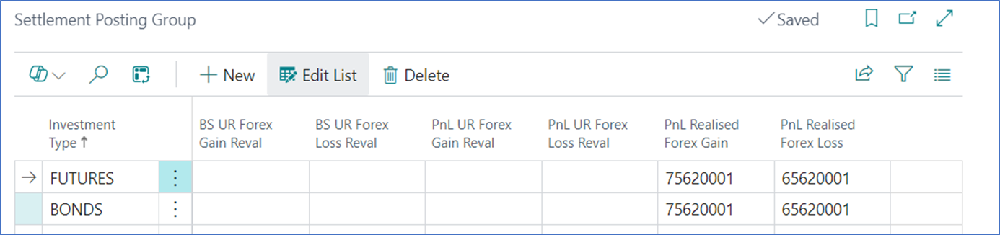

## Futures Investment Card

Each investment (future) must have an investment card. There are two types of futures behaviour that can be achieved by the system:

**\- Futures with Daily Settlement (Mark-to-Market),**

**\- Futures without Daily Settlement (Final Settlement).**

The primary difference between futures with daily settlement and those without (although typically, futures contracts inherently involve daily settlement) lies in how the gains and losses are managed during the life of the contract.

Mandatory fields to be filled on the investment card:

*   Code,
*   Investment Type
*   Daily Settlement,
*   Currency,
*   Description,
*   Futures Contract Size,
*   Margin Account.

### Futures with Daily Settlement
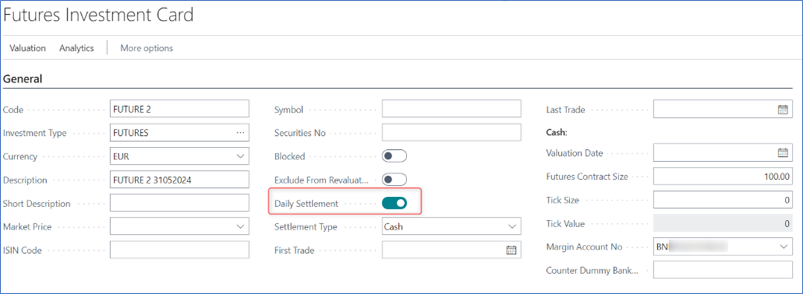

### Futures without Daily Settlement
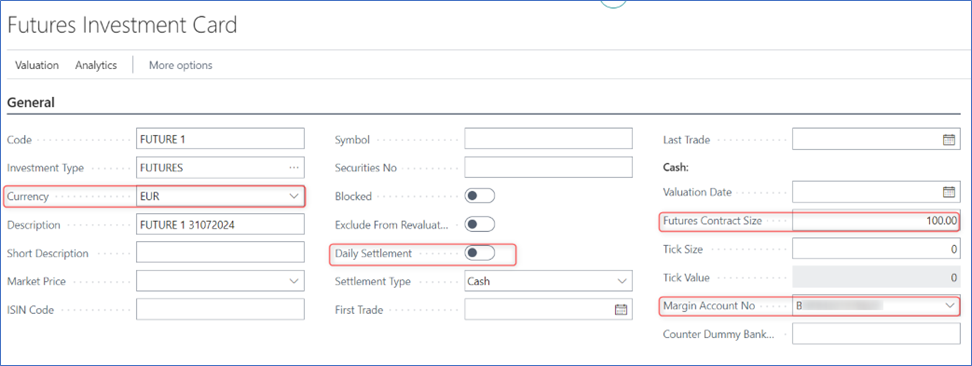

## 5\. Journals & Posting procedures

### 1\. Long or Short Contracts

Create a new Futures Contract by selecting the Futures green tile from the home page.
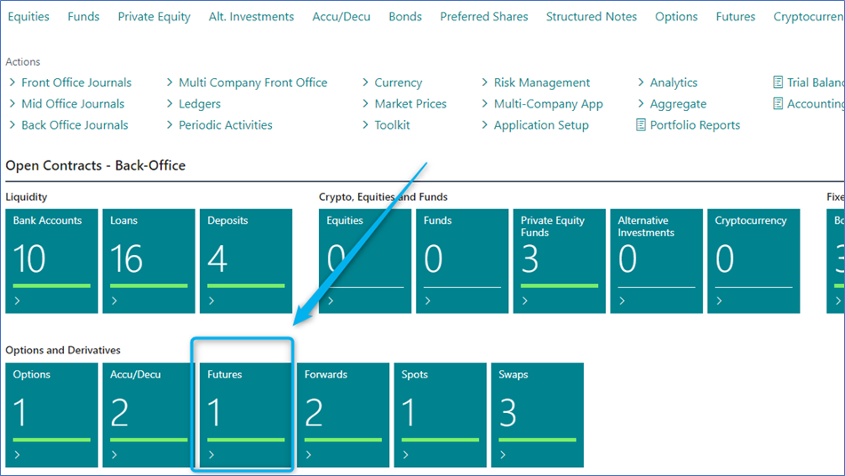

\- After selecting a Portfolio and the Posting Date, choose “Long” or “Short” as the Document Type then fill in all the remaining information on the contract line.

\- Before definitely posting the contract in the system, make sure you preview the to-be-posted entries by using the “Test Report” function from the ribbon. Then use the “Post” function to validate it.

\- The opening contracts will not have any impact on the bank balances.
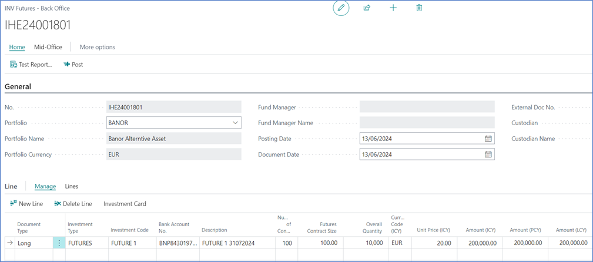

Test Preview to check the accounting impact that will be generated after posting. The contract will be posted in the Investment Ledger.
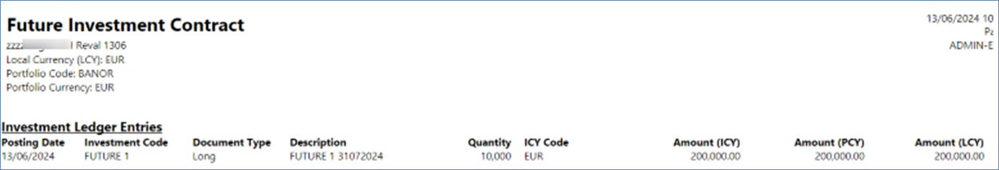

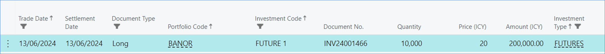

This is how the closing contract looks like, after a revaluation was ran. The closure is done by accessing the **Home: Open positions 🡪 Futures: Function 🡪 Close Future.**

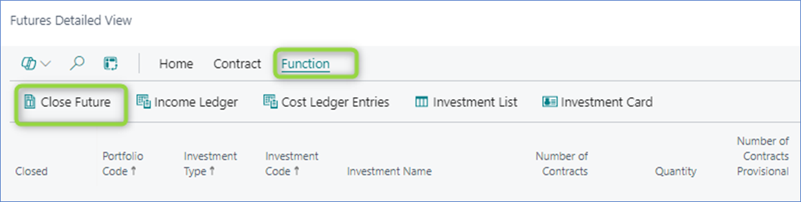

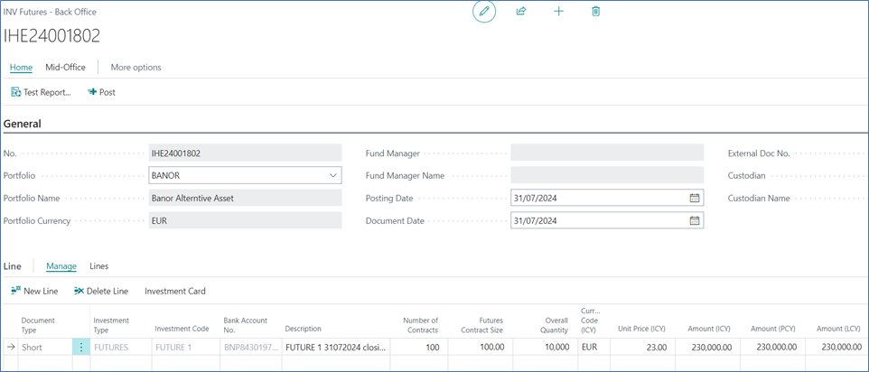

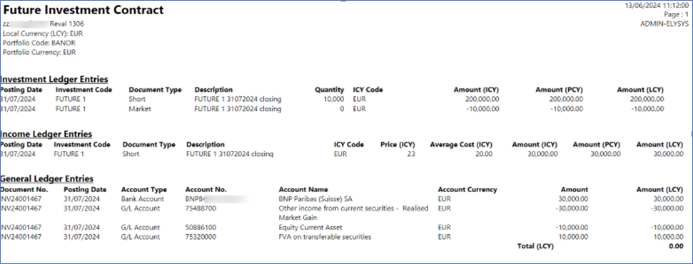

### 2\. Portfolio Revaluation

Depending on the type of the futures, there are two ways to revalue the investment:

*   Daily Settlement 🡪 _Futures DS Valuation Journal,_
*   Without Daily Settlement 🡪 _Portfolio Revaluation Journal._

**Both journals are found at: Home 🡪 Periodic Activities**

First, fill in the market price and the date from the Market Value page. If using a Bank Financial Gateway interface, the market prices may be automatically populated in the system directly from the custodian bank.

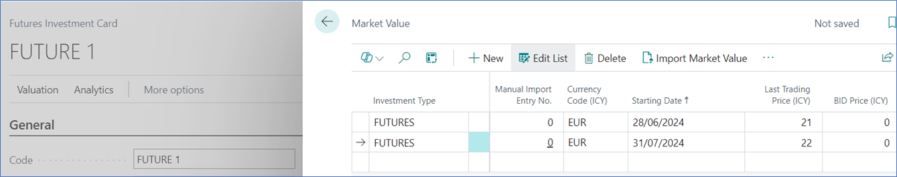

The **Portfolio revaluation job** can generate up to 2 entries, for the revaluation of the futures contract Market gain loss and the currency gain loss if the investment is denominated in a foreign currency (Forex).

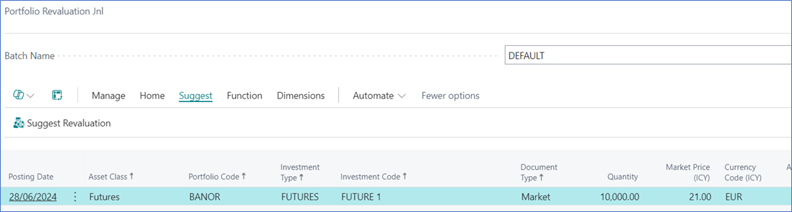

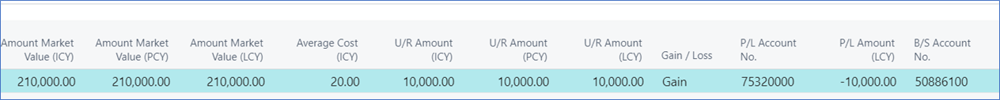

The Futures **DS Valuation Journal** job will get you a similar result.

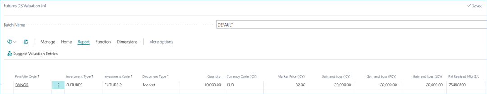

## 6\. Navigate functions

### Detailed View (Open Position)

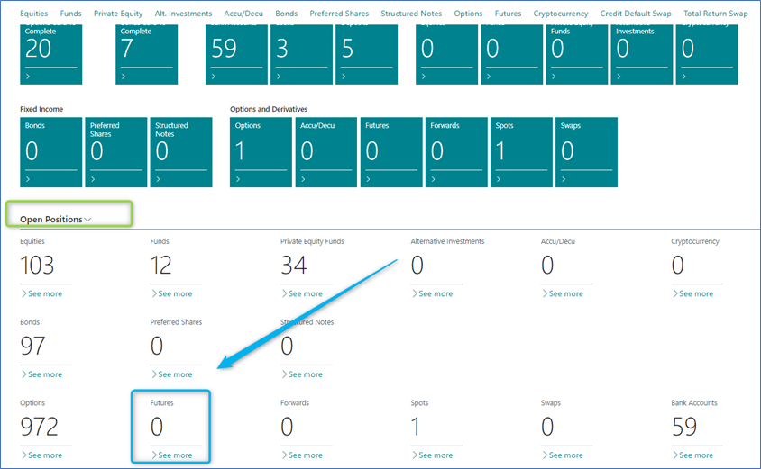

### Investment Ledger Entries

Shows all the ledger entries for the relevant “Investment Code”.

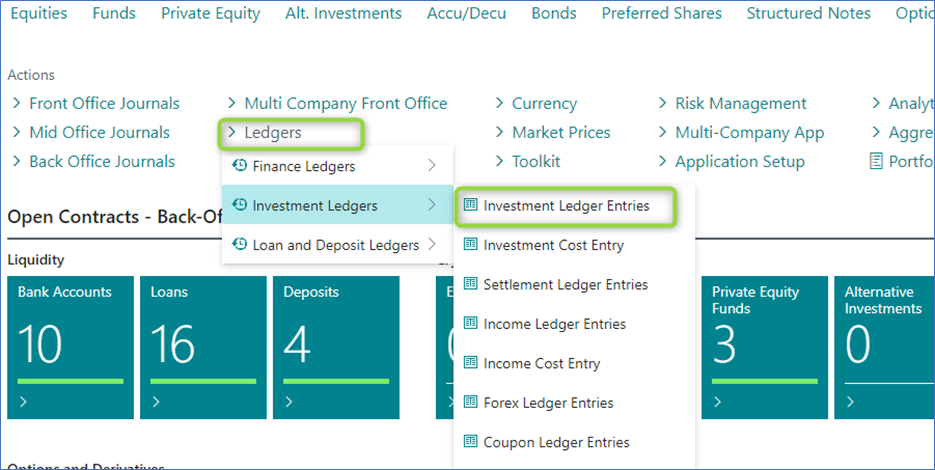

### Dimensions

Link Dimensions to the investment card. These Dimensions will be linked to all ledger entries.