 

# Introduction

The **IFRS Year End Closing** process moves all unrealized market and
forex balances, for each investment and instrument, to its corresponding
balance sheet cost accounts, as pre-defined in the **Posting Groups**.

The IFRS unrealized allocation happens on the first day of the new
fiscal year and once the revaluation is posted.

**Notes:**

-   Investment Ledger Entry's ICY, PCY, and LCY Amounts specify the
    historical costs since inception.

-   Investment Ledger Entry's IFRS ICY and IFRS LCY Amounts specify the
    IFRS costs.

-   Both historical and IFRS amounts are calculated in the ledgers
    regardless of the **IFRS Average Cost** activation in the
    **Investment Ledger Setup**. Nevertheless, the IFRS YE unrealized
    accounts write-off only occurs upon the IFRS YE closing validation.

-   The Boolean field "IFRS Close Line" in the Investment Ledger Entry
    can be used to easily isolate the transactions generated by the IFRS
    Year-End Closing Journal.

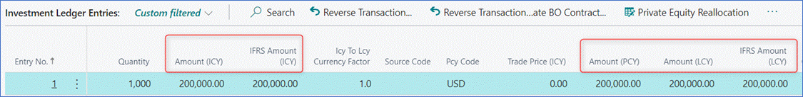

### Year-End Accounting Entries

-   **IFRS YE closing** writes off the balance sheet unrealized market
    and forex accounts to the corresponding balance sheet cost accounts.

-   **Standard BC YE closing** writes off the income statement accounts
    to the balance sheet's Retained Earnings account.

#### Elysys IFRS Year End Closing

#### Loan & Deposit IFRS Year End Closing

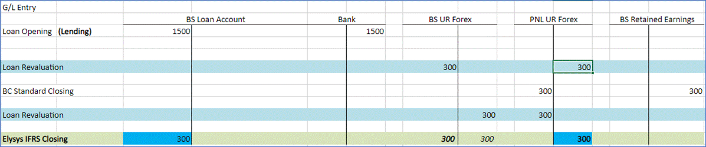

**Note:**

Upon running IFRS YE closing a new purchase line is created in the
Investment Ledger and Loan and Deposit Ledger Entries. The line is the
sum of all balance sheet cost accounts and unrealized accounts.

# Setup

#### 1.  Investment General Setup

Path: Application Setup -\> Investment General Setup

IFRS Average Cost needs to be enabled.

When the IFRS Average Cost option is **Enabled**, the IFRS Amount (LCY)
value is posted to the General Ledger.

When the IFRS Average Cost option is **Disabled,** the value from Amount
(LCY) is posted to the General Ledger.

#### 2.  Accounting Periods

Accounting Periods and New Fiscal Year are defined in the **Accounting
Periods** screen.

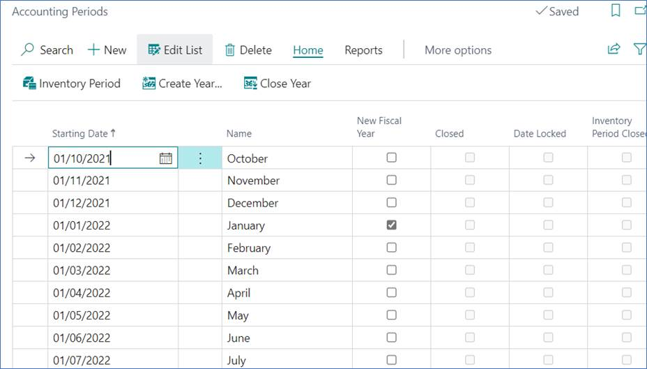

# Investments

## Pre Year-End Revaluation Transactions 

Before **Portfolio Revaluation** is posted, only historical costs are
reflected in the CoA for the transactions processed throughout the
fiscal year.

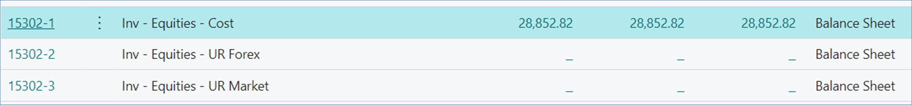

## Portfolio Revaluation

Before running the IFRS Year-End closing process, all investments must
be revalued at their fair value.

Make sure that all trades are booked, and the latest market prices and
exchange rates are imported.

Once ready, proceed to the **Portfolio Revaluation** journal and suggest
the revaluation entries for the last day of the fiscal year as defined
in the **Accounting Periods** screen.

Path: Elysys Wealth -\> Periodic Activities -\> Portfolio Revaluation
-\> Process -\> Suggest Revaluation

The portfolio revaluation journal generates unrealized market and forex
lines for each investment's open position which requires an adjustment.

## Post-Revaluation CoA

Posting revaluation entries calculates unrealized market and forex
values for each investment and is posted to the corresponding G/L
Accounts as per the account definitions in the **Investment Posting
Group**.

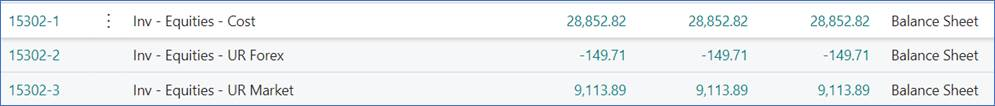

## IFRS Year-End Closing

Path: Periodic Activities -\> IFRS Year End Closing -\> Report -\>
Suggest IFRS Closing Entries

The **Opening Balance Sheet** **Date** is selected from the dropdown
list, and it is the first day of the new fiscal year.

For each investment, the following lines are suggested:

-   Closing entry (Type = Close) - writes off the cost and unrealized
    market and forex values.

-   Opening line (Type = Open) - which is the sum of all historical
    costs and unrealized market and forex values, corresponding to the
    fair value of the investment. The entry will be posted as a purchase
    on the first day of the new fiscal year.

## Outcome

After the IFRS entries are posted, all unrealized market and forex
balances are transferred to the cost accounts and are written off.

# Loans & Deposits 

## Pre Year-End Revaluation Transactions

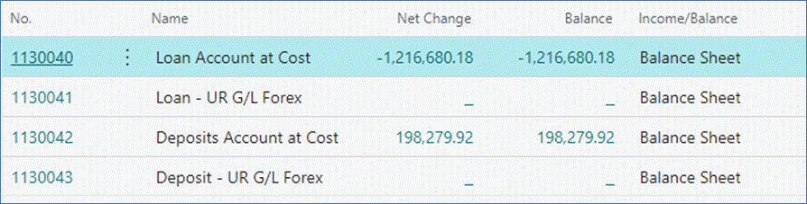

## Loan & Deposit Revaluation Journal

Before running the IFRS Year-End closing process, all loans and deposits
must be revalued. Make sure that all trades are booked, and the latest
exchange rates are imported.

Revaluation lines for Loans & Deposits are suggested for the last day of
the fiscal year via the L**oan & Deposit Revaluation Journal.**

Path: Elysys Wealth -\> Periodic Activities -\> Loan & Deposit
Revaluation Journal -\> Process -\> Suggest Revaluation

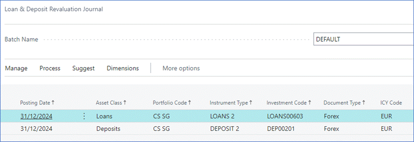

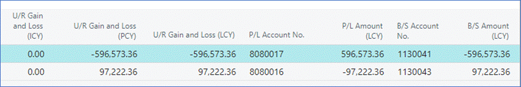

## Post-Revaluation Loan and Deposit Ledger Entries

**Loan and Deposit Revaluation** calculates unrealized forex amounts for
each instrument and gets reversed and reposted to the next day to G/L
Accounts as per definition in the **Loan and Deposit Posting Group**.

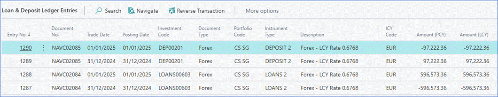

## Loan and Deposit IFRS Year-End Closing

Path: Periodic Activities -\> Loan and Deposit IFRS Year End Closing -\>
Report -\> Suggest IFRS Closing Entries

The **Opening Balance Sheet** **Date** is the first day of the new
fiscal year.

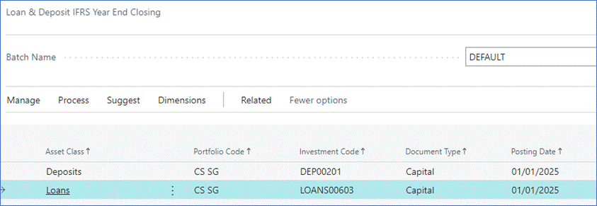

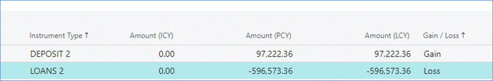

Posted IFRS lines are reflected in the Loan & Deposit Ledger Entries

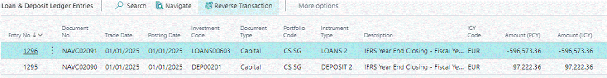

All unrealized forex balances are transferred to the cost accounts and
written off.

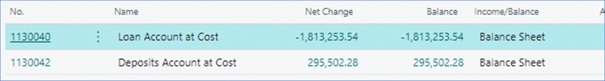
