# Master Catalog Setup

This document describes the process of creating a new company and how to
use the **Master Catalog Setup module** in Elysys Wealth.

## **Process Diagram**

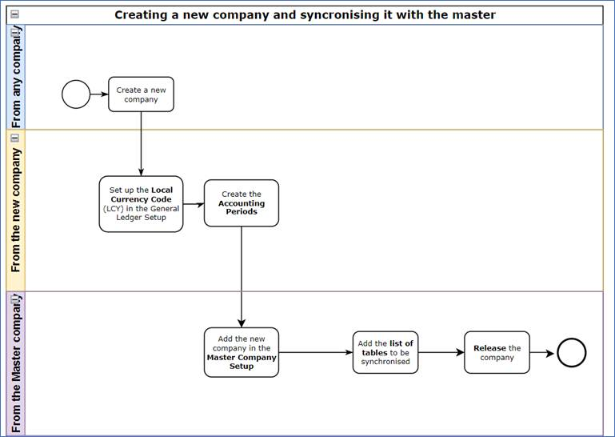

## **Create a new company**

1.  Access the *Companies* list

2.  Find the Search function from top-right section and look for
    \"Companies\" list

    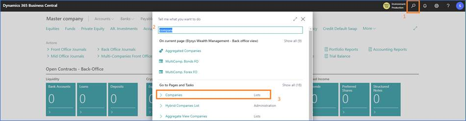

3.  Select *New Create a New Company* (say Yes/ Okay for the first
    window)

    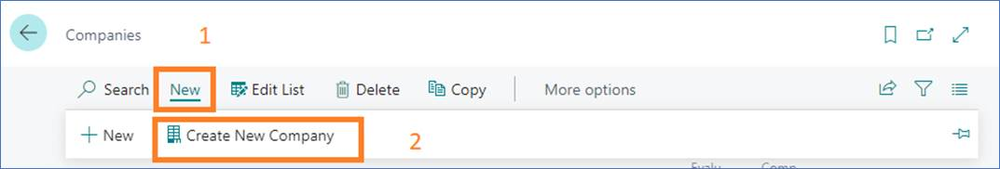

4.  Enter the name of the company,

    a.  For test purpose, we recommend starting with *z-Company Name*

    b.  For a final version (or official company), we recommend using
        the real name (*Company Name*)

5.  Select - *Create New - No Data* and validate the next steps by
    choosing the default option (*Next \--\ Next \--\ Finish*).

    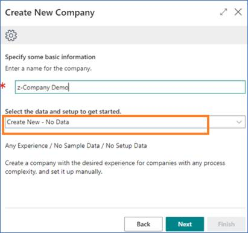

6.  Next, switch to the new company using the *My Settings* section.

    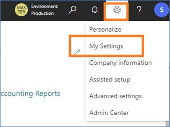

### **Setup the Local Currency for the new company**

1.  Access the *General Ledger Setup* (using the Search function)

2.  Fill in the *LCY Code* (i.e USD) and close the page

        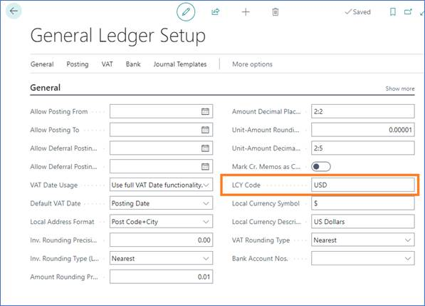

### **Create the Accounting Periods in the new company**

1.  Access the *Accounting Periods* using the search function

    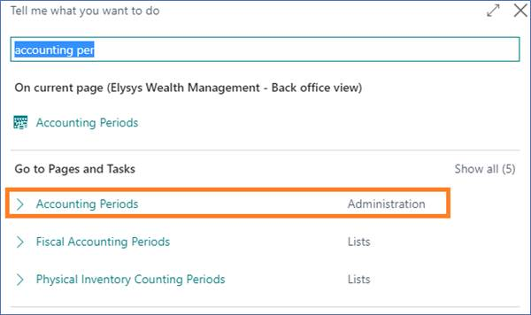

2.  Fill in the *Starting Date* and use the function *Create Year...*,
    edit the fields if necessary than say OK.

    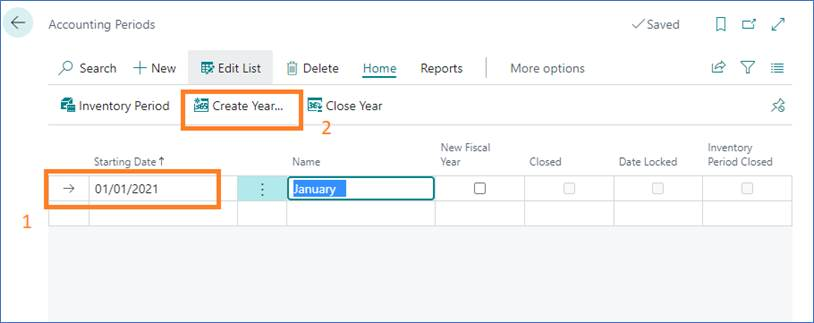

3.  Close the page once finished.

### **Add the company in the Master Catalog**

1.  Access the Master *Company Setup* to check which is the master
    company. You do that by searching for *Master Catalog Setup* while
    logged into any company.

    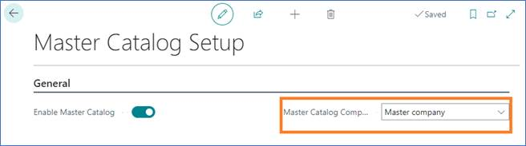

2.  Next you switch to the *Master company* (from Settings \--\ My
    Settings)

    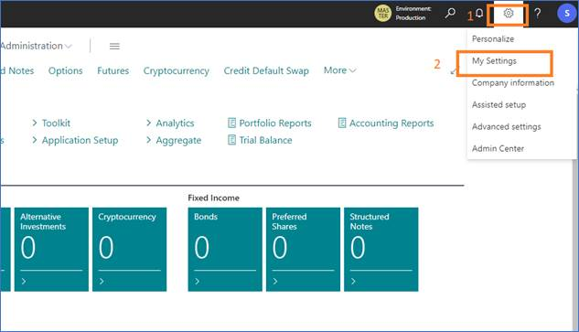

3.  Select the *Master company* and validate (OK)

    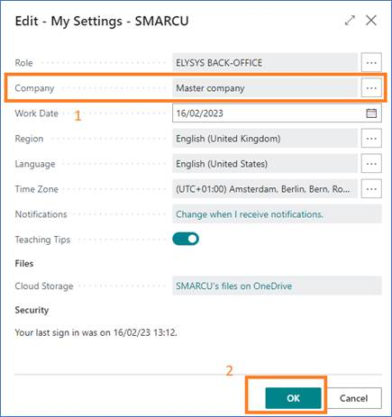

4.  Add the company in the list using the *New* function 

5.  Select the tables you want to synchronise with the master.

    a.  First, you can select a Released company and navigate to the
        *Table List*. The *Copy Table List* function can be used to skip
        this process.
    
       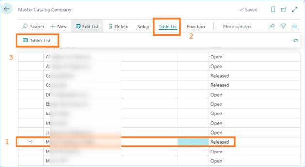
    
    b.  To select all the tables, you can click anywhere in the table and
        press Ctrl + A (like in Excel). You navigate back to the master
        company setup, select the line with the target company, access the
        Table List and paste the lines (like in excel).

       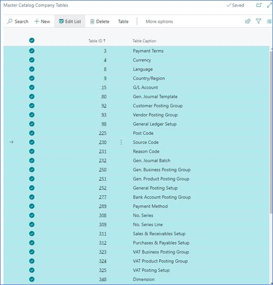

6.  Then you select the line with the new company, navigate to *Function
    \--\ Release.*

    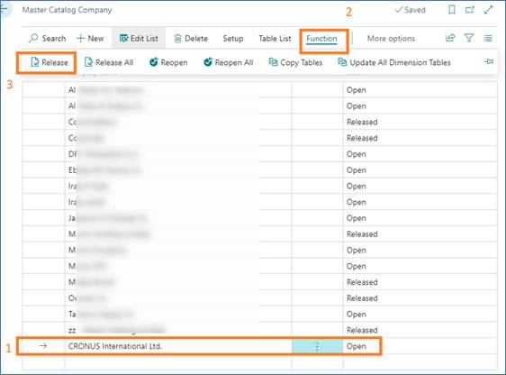

7.  The process is finished.
