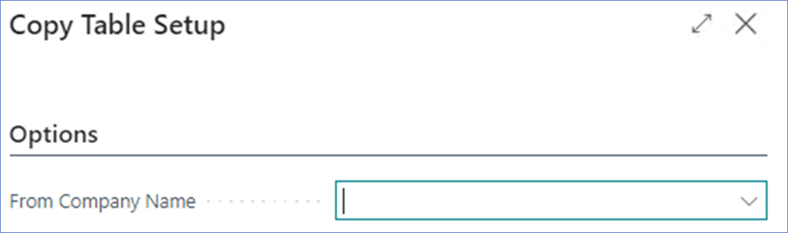
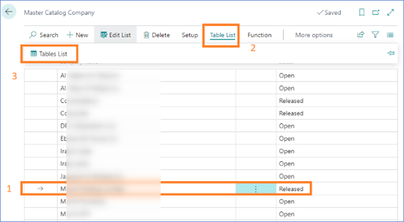

# Master Catalog Setup

This document describes the process of creating a new company and how to
use the **Master Catalog Setup module** in Elysys Wealth.

## **Process Diagram**

## **Create a new company**

1.  Access the *Companies* list

2.  Find the Search function from top-right section and look for
    \"Companies\" list

    

3.  Select *New Create a New Company* (say Yes/ Okay for the first
    window)

    

4.  Enter the name of the company,

    a.  For test purpose, we recommend starting with *z-Company Name*

    b.  For a final version (or official company), we recommend using
        the real name (*Company Name*)

5.  Select - *Create New - No Data* and validate the next steps by
    choosing the default option (*Next \--\ Next \--\ Finish*).

    

6.  Next, switch to the new company using the *My Settings* section.

    

### **Setup the Local Currency for the new company**

1.  Access the *General Ledger Setup* (using the Search function)

2.  Fill in the *LCY Code* (i.e USD) and close the page

    

### **Create the Accounting Periods in the new company**

1.  Access the *Accounting Periods* using the search function

    

2.  Fill in the *Starting Date* and use the function *Create Year...*,
    edit the fields if necessary than say OK.

    

3.  Close the page once finished.

### **Add the company in the Master Catalog**

1.  Access the Master *Company Setup* to check which is the master
    company. You do that by searching for *Master Catalog Setup* while
    logged into any company.

    

2.  Next you switch to the *Master company* (from Settings \--\ My
    Settings)

    

3.  Select the *Master company* and validate (OK)

    

4.  Add the company in the list using the *New* function 

5.  Select the tables you want to synchronise with the master.

    a. If **at least one company has already been setup**, select the new record created in the previous step, then use the Copy Tables function to duplicate the synchronised tables setup from an existing company.  All tables & table exceptions will be copied across to the new company.
    
    b.  b.	If it’s the **first company to be set up** as part of the synchronisation process, navigate to the Table List.  All tables requiring synchronisation with the Master Company will need to be listed in this page. For each table, field exceptions (fields values which should not synch for a specific table) can be set up as well.
    We recommend take advise from an Elysys consultant to proceed to the first company setup.

6.  Then you select the line with the new company, navigate to *Function
    \--\ Release.*

    

7. The process is finished and the new company is being synchronized. An error message shall pop up when trying to add records from the synchronized companies for the synchronized tables. New data should be entered from the Master Company only.
