# Month and Year End Closing

 

## ***Elysys Wealth -- Year End Closing***

To evaluate profit and loss, a fiscal year closing report is provided at
the end of each fiscal year. The month end activities are also included
in the end.

## **Summary**

Fiscal year closing involves the following steps:

-   Closing the fiscal year using the Accounting Period option.

-   Generating a year-end closing entry using the Close Income Statement
    option.

-   Posting the year-end closing entry.

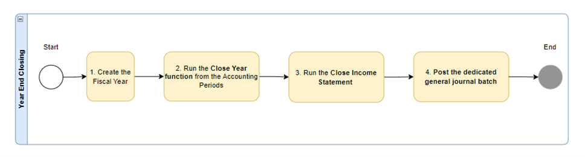

## **Closing the fiscal year using the Accounting Period option**

| | |
| ---        |           --- |
| Search for the **Accounting Periods** | 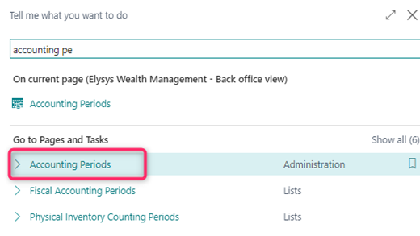 |
| Create a new year and accounting period | 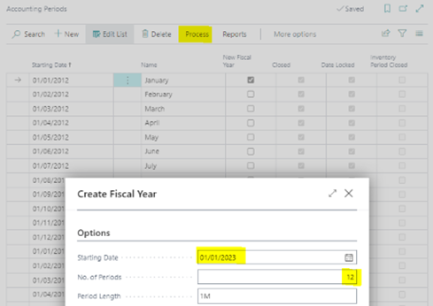 |
| Close an accounting period by selecting the accounting period, and then choose the **Close Year** action.   The field **Closed** will be ticked and the year locked.   **Note**: even if the year is closed, the user still can process transactions. | 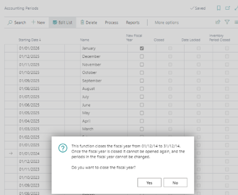 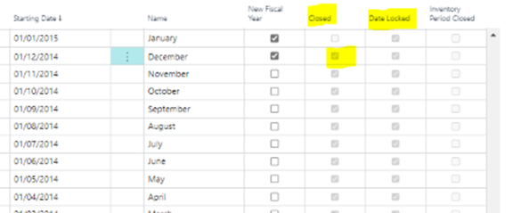 |

**Generating a year-end closing entry using the Close Income Statement
option.**

| | |
| ---        |           --- |
| Search for the **Close Income Statement** | 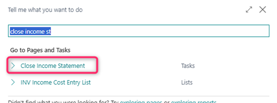 |
| On the **Options tab**, fill in the fields as described in the following table.   We can run the Close Income Statement batch twice:    - First with the Post Retained Earnings Acc = Balance. Result: **different lines** with each different    - Secondly, with the  Post Retained Earnings Acc = Details:     Result: **one line with a lamp sum** | 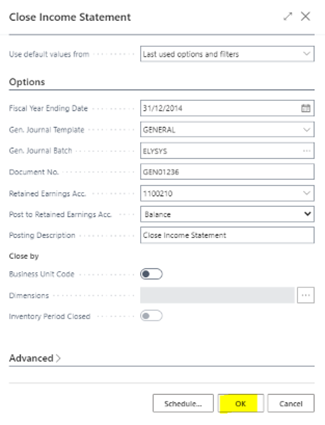 |
| The system suggests all GL entries to be posted for the year that was closed.   Navigate to the general journal batch and choose the **Post** action. | 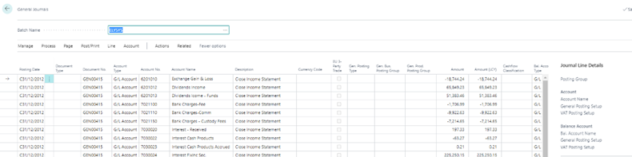 |
| The entries will be processed in the General Ledger. | 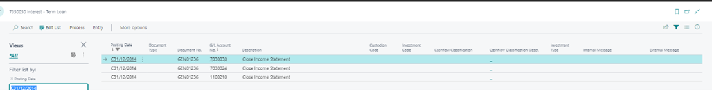 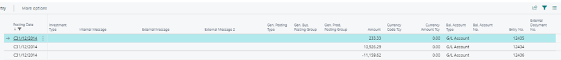 |

-   The batch job processes all general accounts of the income statement
    type and creates entries that cancel out their respective balances.

-   That is, each entry is the sum of all the general ledger entries on
    the account in the fiscal year.

-   These new entries are placed in a journal in which you must specify
    a balancing account and retained earnings account in the balance
    sheet before you post.

-   When you post the journal, an entry is posted to each income
    statement account so that its balance becomes zero and at the same
    time the year\'s result is transferred to the balance sheet.

-   You must post the journal yourself. The batch job does not post the
    entries automatically, except when an additional reporting currency
    is being used. When an additional reporting currency is being used,
    the batch job posts entries directly to the general ledger.

-   The date on the lines that the batch job inserts in the journal is
    always a closing date for the fiscal year. The closing date is a
    fictitious date between the last day of the old fiscal year and the
    first day of the new year. The advantage of posting on a closing
    date is that you maintain the correct balances for the ordinary
    dates of the fiscal year.

-   The Close Income Statement batch job can be used several times. You
    can post in a previous fiscal year, even after the income statement
    accounts have been closed, if you run the batch job again.

Microsoft documentation :
*https://learn.microsoft.com/en-us/dynamics365/business-central/localfunctionality/italy/how-to-close-a-fiscal-year*

## **Month End Processes**

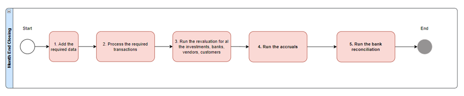

| | |
| ---        |           --- |
| **Data required at month-end** | Currency Exchange Rates   Market Prices |
| **Transactions required at month-end** | General Journals / Payment Journal / Cash Receipt Journal…   All trades & journals posted on Investments & Loans   -	Investment Contracts FO/MO/BO   -	Private Equity journal FO/MO/BO   -	Cash/Investment Transfers   -	Coupon Journal   -	Dividend Journal   -	Loan & Deposit Journal   All the above must be settled using the Settlement Journal   Apply entries for   -	Customers (Cash receipts and invoices)   -	Vendor (Payments and invoices) |
| **Revaluation** | Portfolio Revaluation (IFRS mark to market)   LUX GAAP Revaluation (lower of cost or market valuation)   Forward Revaluation   Future DS Valuation   Settlement Revaluation   Loan & Deposit Revaluation   Business Central Adjust Exchange Rate   - Banks,   - Customers,   - Vendors   - G/L Accounts for Additional Reporting Currency |
| **Accruals** | Coupon Accrued Journal   Loan & Deposit Accrued Interest Journal |
| **Bank reconciliations** | Reconcile BC entries against Bank statements - once reconciled, the process cannot be reversed; the transactions must be corrected with a manual journal or manual contract. |
