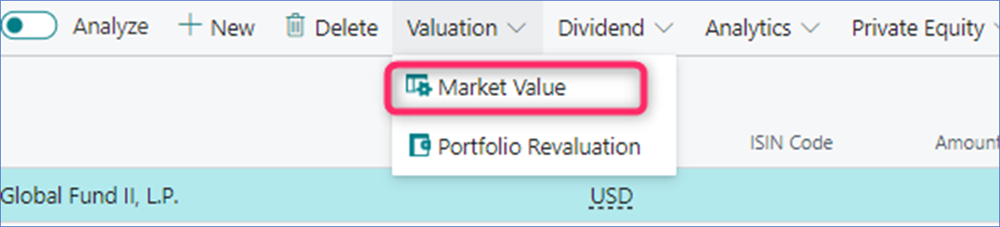

 

# ***Elysys Wealth -- Private Equity Funds module***

This document describes the standard functionalities of the Private
Equity Funds module within Elysys Wealth, as well as the required setup.
Three are multiple asset classes managed within the module:

-   Private Equity Funds.

| | |
| ---        |           --- |
| **Notes:**   -	The instructions found in this manual are best suited for the ***Elysys Back Office Role Center***,   -	*Otherwise, various pages/ lists/ items can be accessed differently.* |  |

: 

## Investment General Setup

The user must make sure the following settings had been set up:

*Home Page ➔ Application Setup ➔ Investment General Setup ➔ Button: New
or Edit*

This page contains the investment module setup. This setup needs to be
done at the early stage and before any entries can be made by the
module.

-   *Portfolio Dimension code:* Specifies the code to identify the
    Portfolio throughout the system.

-   *Investment Dimension code:* Specifies the code used to identify the
    Investment throughout the system.

-   *Investment Contracts Header Nos:* Specifies the number series to
    number Investment contract headers.

-   *Swift Management Header:* Specifies the number series used by the
    Switch Contract function.

-   *Transfer Management Header:* Specifies the number series used by
    the Transfer Contract function.

-   *Clearing No.:* Specifies the clearing account is used by the Switch
    function. The balance of the investment closed by the function is
    booked to this account and the value of the investment being opened
    is also booked from this account.

-   *Trade Date Accounting:* Specifies if the user needs to run the
    settlement process to transfer the cash from the settlement account
    to the bank.

-   *PE Negative Capital Return:* if the return is bigger than the call,
    the system will book the difference in a PnL dividend account, the
    cost account or not allowing this to happen.

-   *PE Revaluation if Cost Zero:* decide if no revaluation, if the PnL
    unrealized account is used or the PnL realized account is used.

-   *PE Cashflow classification control:* to decide if the system will
    let the user to post a capital return against a vendor.

-   *Auto-Adjust PE Market Values:* the system will automatically
    increment/ decrement the market value at the same time when a call/
    capital return is posted

## Investment Type

Now, we need to define all Investment types that will be used throughout
the investment module with their accounting rules. Investment types need
to be defined according to how investments need to be grouped and
accounted together, it is the equivalent of the product posting group of
Business Central. Investment types are required for every Investment
product ranging from Equities to Options and Forex products plus Private
Equity.

-   *Code:* Specifies the code to identify the Investment Type.

-   *Name:* Specifies the name for the Investment type.

-   *Asset Class:* Specifies the asset class relating to the investment
    type being created. The Asset Class defines how the investments are
    managed / handled by Elysys Wealth as each asset class uses its own
    logic.

## Private Equity Posting Group

Once all investment types are created, the accounting rules must be
specified using Investment posting group.

Accounting rules allows Elysys Wealth to know which account to use in
the process of creating all accounting entries when booking investment
trades. The Investment posting group page is one of the setup page used
by the module along with the coupons posting group, the forex posting
group, the options posting group, the dividends posting groups and so
on.

For each of the Investment type belonging to those assets class a
nominal account is required for the following account:

-   *BS at Cost Account:* Specifies the General Account used to book
    cost related entries such as purchase and sales type entries

-   *BS UR Forex Gain/Loss Reval:* Specifies the Balance Sheet General
    account used to book unrealised forex gain and loss calculated by
    the revaluation.

-   *BS UR Market Gain/Loss Reval:* Specifies the balance Sheet General
    account used to book unrealised Market gain and loss calculated by
    the revaluation.

-   *PnL UR Market Reval:* Specifies the Profit and Loss General account
    used to book unrealised Market gain and loss calculated by the
    revaluation.

-   *PnL UR Forex G/L Reval:* Specifies the Profit and Loss General
    account used to book unrealised forex gain and loss calculated by
    the revaluation.

## Investment Card 

Before any entry can be made with any investment the user is required to
create the relevant Investment card in Elysys Wealth. The user needs to
select in the list of asset classes the one which applies to the
investment.

In "Private Equity" select "New" or "Edit" from the ribbon. The
following interface comes up:

The following fields need to be filled in:

-   *Code:* Specifies the unique identifier of the investment, used
    throughout the system (mandatory),

-   *Investment type:* Specifies the accounting behaviour of the
    investment (mandatory),

-   *Currency:* Specifies the currency code for the investment
    (mandatory),

-   *Description:* Specifies the name of the investment,

-   *Other fields are optional.*

## Journals & Posting procedures

### 1. Front/ Mid/ Back-office Private Equity journals

> Transactions can be booked via the back-office journals (use can
> access them by clicking on the green tiles from the home page), or by
> accessing the Front Office or Middle Office journals.
>
> At the journal level, the following fields are required:
>
> 

-   Trade Date and Settlement Date: specifies the trade and settlement
    date (they can be the same),

-   Cash Flow Type: specifies the transaction type:

    -   Commitment: no impact in the general ledger, only in the
        investment sub ledger and it's used for reporting purposes,

    -   Call: the capital call (purchase),

    -   Capital Return: the sales,

    -   PnL items:

        -   Dividend/ Tax/ Fees/ Expenses/ Interest/ Realised Gain:
            added as a positive amount in the journal,

        -   Realised Loss: added as a negative amount in the journal,

    -   Distribution: specifies the amount booked against a BS Account
        (transit account) as we don't know how to allocate i.e
        dividend, capital return, fees, interest

        -   The amount will be allocated afterwards using the Private
            Equity Reallocation journal,

-   Portfolio Code: specifies the contained/ bucket that will store the
    transaction,

-   Account Type: specify the 3rd party. It can be a bank account/
    vendor or a customer,

-   Cash Flow Concept: specify another level of detail, it has impact in
    the Statistics calculation.

-   In/ Out: specifies if the capital call is in or out of commitment,
    it has impact in the Statistics calculation,

-   Recallable: specifies if the capital return is recallable or not, it
    has impact in the Statistics calculation,

-   Amount ICY: specifies the cost (or the PnL) associated to the
    contract.

### 2. Portfolio Revaluation

> **Go to: Home ➔ Private Equity ➔ Valuation ➔ Button: Portfolio
> Revaluation (or Home 🡪 Periodic Activities 🡪 Button: Portfolio
> Revaluation)**
>
> 
>
> As a prerequisite, user must add the valuation/ price to the Market
> Value table. The required fields are:

-   Starting Date,

-   Last Trading Price (ICY).

> 
>
> Once the price is added, user can open the Portfolio Revaluation
> Journal and run the Suggest function, specifying the Revaluation Date
> (other fields are not required). This is a batch process, so the
> system will suggest the revaluation for all the open positions, unless
> user will add specific filters before running the Suggest function.
> The process is done at the company level.
>
> 
>
> *!!If the costing method is Specific Cost or FIFO 🡪 the portfolio
> revaluation is written off the next day (Posting Date + 1). When
> booking a capital return, there is no write off of the unrealized
> amount.*

### 3. Private Equity Reallocation Journal

> This journal is used to reallocate in/out commitment. As a
> prerequisite, user must post a call having the ***Cash Flow Type =
> Call and Cash Flow Concept = Generic Call***.
>
> 
>
> **Go to: Home ➔ Open Position ➔ Private Equity Funds ➔ Button: Home 🡪
> Private Equity Reallocation**
>
> 

## Navigate functions

### Investment Ledger Entries

> Shows all the ledger entries for the relevant "Investment Code". The
> entries result from posting transactions via the Bond front/ mid/
> back-office journals. The following types of entries are posted to
> this ledger: purchases, sales, issues, redemptions, market (gain/ loss
> triggered by the revaluation process).

### Income Ledger Entries

Realised entries created when closing the position for an investment or
the dividend amount.

### Statistics

> When posting transactions using various Cash Flow Concept items, In/
> Out of commitment, the impact will be tracked in the Statistics page,
> which can be accessed from the investment card. This has only an
> analytical/ reporting purpose.
>
> 
>
> 

### Underlying investments

> User can track information related to the underlying investment via
> the Underlyings table. This can be accessed from the investment card.
>
> 
>
> In this table, user can add as many lines as needed and all these
> fields will be available in Elysys Analytics (i.e Power BI) to report
> on it. This table is used only for reporting purposes.
>
> 

### Dimensions

Link Dimensions to the investment card. These Dimensions will be linked
to all ledger entries.

## **Private Equity Funds - Automatically Adjusting the Market Value**

The **Auto-Adjust PE Market Value** functionality allows users to automatically update the market price of the private equity funds at the same time when posting transactions.

### **Summary**
-	When processing a **capital call** or **distribution** ➔ the market value increases at the date of the transaction by the amount added in the contract,
-	When processing a **capital return** ➔ the market value decreases at the date of the transaction by the amount added in the contract,
-	When processing a reallocation ➔ the market value is updated accordingly,
-	When processing an **impairment** ➔ the market value increases at the date of the transaction by the amount added in the contract.
-	When a **PnL** transaction or a **commitment** is recorded ➔ the market value doesn't change.

### **How to enable it**
Access the Investment General Setup and toggle on the **Auto-Adjust PE Market Value** field

### **How it works – use case**

| | |
| ---        |           --- |
| Start fresh with a new fund with its market value being zero |  |
| Process the commitment | |
| Processing the commitment won’t affect the valuation | |
| Process a **capital call** | |
| User is prompted with the following message |  |
| By choosing **Yes**, the valuation will be incremented |  |
| Process a second **capital call** |  |
| The same prompt is shown |  |
| By choosing **Yes**, the valuation will be incremented |  |
| Process a distribution |  |
| The same prompt is shown |  |
| *By choosing **Yes**, the valuation will be incremented |  |
| Process a PnL transaction **(Dividend)**
**No prompt message is shown, and the valuation is not impacted** |  |
| Process a **capital return** |  |
| By choosing **Yes**, the valuation will be incremented |  |

*After processing a distribution, the reallocation is done via the reallocation journal. Once this is done, the valuation will be changed accordingly i.e capital return ➔ the valuation is decreased.

### Deal Flow

> Another functionality used to track private equity funds information
> is the deal flow function. It can be accessed by typing the key word
> "deal" in the search menu.
>
> 
>
> 
