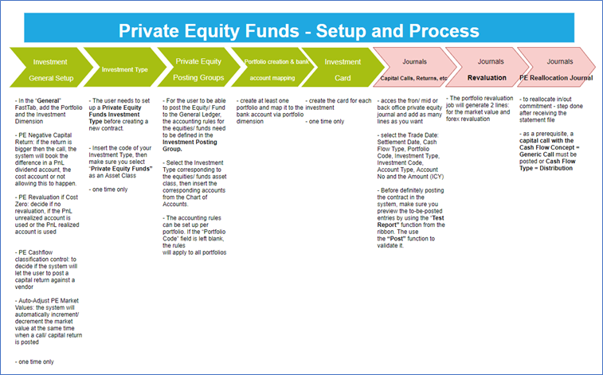
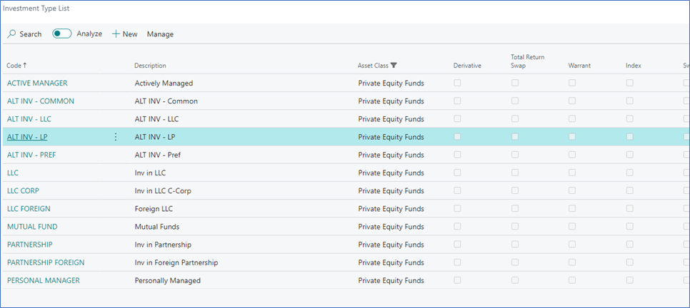
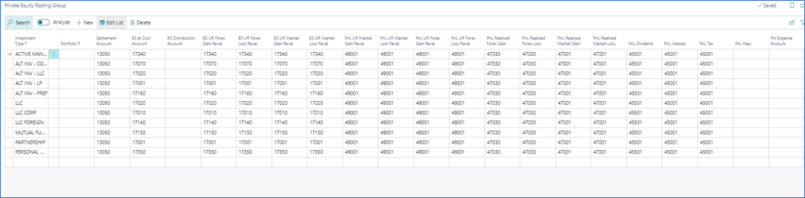
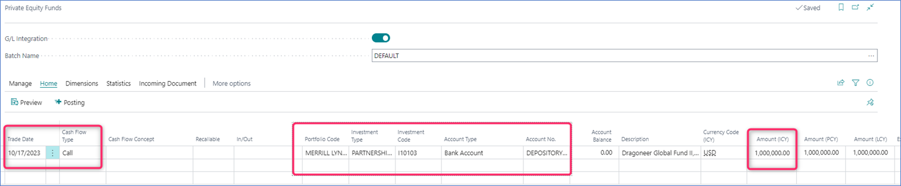
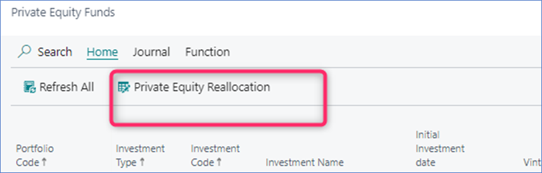
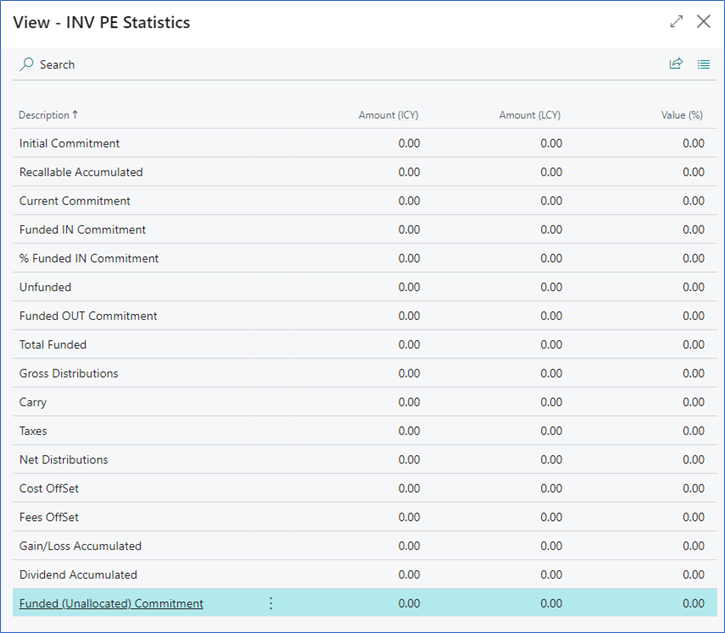

 

# ***Elysys Wealth – Private Equity Funds***

The **Auto-Adjust PE Market Value** functionality allows users to automatically update the market price of the private equity funds at the same time when posting transactions.

## **Summary**
-	When processing a **capital call** or **distribution** ➔ the market value increases at the date of the transaction by the amount added in the contract,
-	When processing a **capital return** ➔ the market value decreases at the date of the transaction by the amount added in the contract,
-	When processing a reallocation ➔ the market value is updated accordingly,
-	When processing an **impairment** ➔ the market value increases at the date of the transaction by the amount added in the contract.
-	When a **PnL** transaction or a **commitment** is recorded ➔ the market value doesn't change.

## **How to enable it**
Access the Investment General Setup and toggle on the **Auto-Adjust PE Market Value** field

## **How it works – use case**

| | |
| ---        |           --- |
| Start fresh with a new fund with its market value being zero |  |
| Process the commitment | |
| Processing the commitment won’t affect the valuation | |
| Process a **capital call** | |
| User is prompted with the following message |  |
| By choosing **Yes**, the valuation will be incremented |  |
| Process a second **capital call** |  |
| The same prompt is shown |  |
| By choosing **Yes**, the valuation will be incremented |  |
| Process a distribution |  |
| The same prompt is shown |  |
| *By choosing **Yes**, the valuation will be incremented |  |
| Process a PnL transaction **(Dividend)**
**No prompt message is shown, and the valuation is not impacted** |  |
| Process a **capital return** |  |
| By choosing **Yes**, the valuation will be incremented |  |

*After processing a distribution, the reallocation is done via the reallocation journal. Once this is done, the valuation will be changed accordingly i.e capital return ➔ the valuation is decreased.