# Specific Costing Method

## Specific Cost Dividend Split, Stock Split and Reverse Stock Split

 

This document is accompanying the **Elysys Wealth** module, and it has
been created for the purpose of providing users with brief guidance on
how to process contracts for the dividend split, stock split and reverse
stock split.

The system is enhanced by adding Dividend Split, Stock Split and Reverse
Stock Split shares calculation.

 
The feature works with Equities, Funds, Alternative Investments and
Cryptocurrency and it allows stock increase and decrease to the
outstanding number of shares.

A new field **Qty Change Type** was added to the contract level. In
combination with **Type** = **Qty Change**, the user can select from the
three options below.

 

  

-   **Dividend Stock** - distribution of additional shares.

-   **Stock Split** - increases the number of outstanding shares. Stock
    Split allows only positive adjustment and is calculated by dividing
    existing shares into multiple shares.

-   **Reverse Stock Split** - decreases the number of outstanding shares
    and only negative adjustment is allowed.

**(1) Dividend Stock Qty Change**

Equities - Back Office

**Report**

Investment Ledger Entries

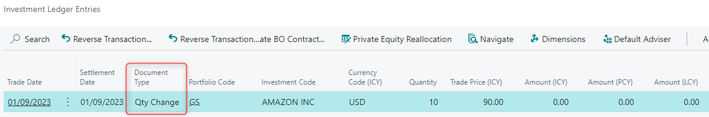

Investment Cost Entry

**(2) Stock Split Qty Change**

-   Automatic allocation to outstanding lot at trade date based on the
    following formula:

-   Quantity Lot 1/ ((Sum of all Purchases)/(Sum of all Purchases+ Qty
    Stock Split Change))

-   Stock Split allows positive adjustments only.

Equities - Back Office

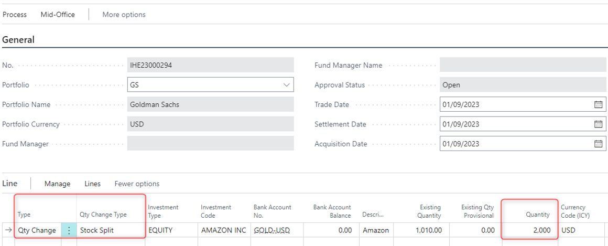
 

**Report**

Initial lots are written off and Purchase lines are reopened with new
Quantity.

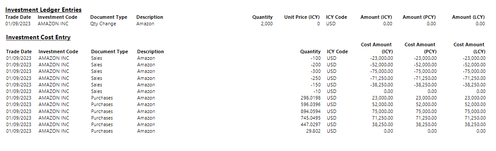

Purchase = 298.01 USD is calculated as follows:

100/ ((1010)/(1010+2000)) = 298.01, where

100 = Qty (lot 1)

1000 = SUM (Qty (lot1): Qty (lot 6))

 

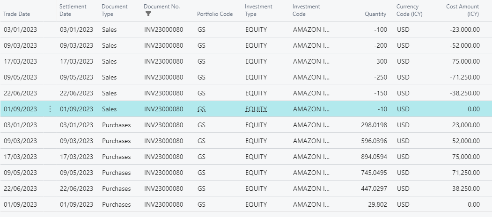

 

**(3) Reverse Stock Split**

Decreases the number of initial shares hence it needs to be booked in
negative quantity.

**Report**

Initial lots are written off and Purchase lines are reopened with new
Quantity.

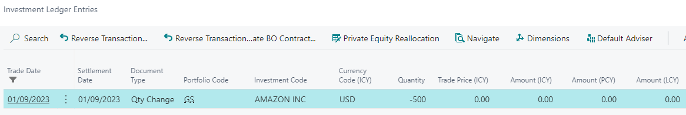

 

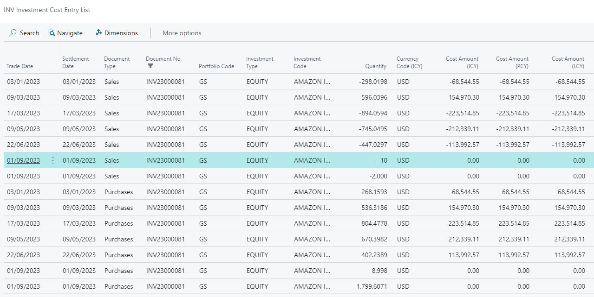

## Specific Cost Fees Capitalization

This document is accompanying the **Elysys Wealth** module, and it has
been created for the purpose of providing users with brief guidance on
how to capitalize fees when using the specific costing method.

**Introduction**
  
-   **Purpose of the Function**

 Our Elysys module offers support for several costing methods. The
 primary costing methods include:

-   Average,

-   FIFO,

-   Specific.

This functionality is available for the following asset classes:

-   Equities (long positions),

-   Funds,

-   Alternative Investments,

-   Bonds,

-   Structured Notes,

-   Preferred Shares.

-   **Understanding Fees Capitalization in Elysys**

 Fees capitalization is a financial accounting process that involves
 recognizing and incorporating various fees associated with an asset or
 project into its overall cost.

 Our Elysys module offers support for the capitalization of fees
 associated with investments for all the costing methods mentioned
 above.

This user guide describes the fees capitalization using the **Specific
costing method**.

**Getting Started**

-   **Logging In**

 First things first, log in to your Elysys/ Business Central account.
 Once you\'re on the dashboard, locate the \'*Application Setup\' \--\
 \'Investment General Setup\' page*. Click on it to access the
 *Investment General Setup* functionality. This page can also be
 accessed via the search functionality from the top right screen.

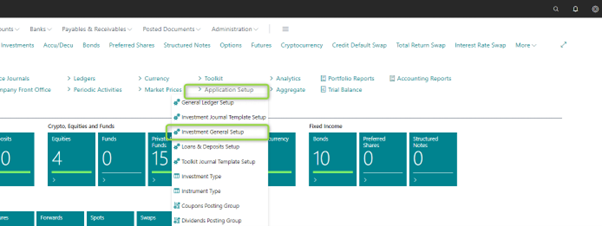

-   **Investment General Setup**

 Within the *\'Investment General Setup\'* page, look for the option
 that says \'*Costing Method.\'* This is your setup point for defining
 the costing method you want at the company level.

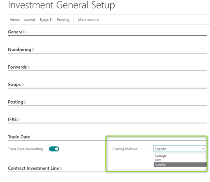

**Function Overview**

Once you finished the setup, create an investment contract.

 

In the below example we pick an outstanding position where we have
issued debt.

Once you\'ve created the *sale (or redemption) contrac*t, you\'ll be
prompted to fill in some details. Start by entering the header and line
information --- type, code, quantity (or nominal), unit price (or clean
price), etc. Then, add the fees to be capitalized via the *\'Investment
Lot\'* page.

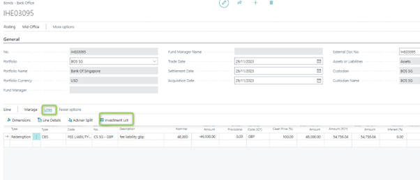

Then, add the fee codes and the associated amount for the targeted
investment lot.

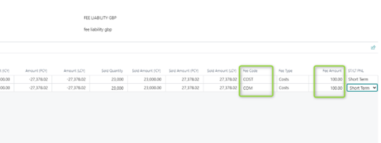

After posting, the fee amounts can be found in the *\'Investment ledger
entry\'* (the average cost amount), while the split per lot is found in
the *\'investment line detail*\' page (amount per lot).

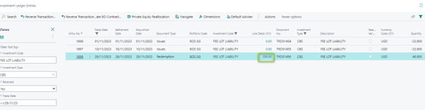

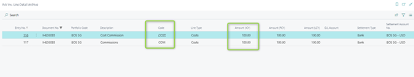

The capitalized fees are booked in the General Ledger accounts and in
the Income Cost Entry.

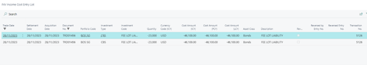

**Notes (expensed fees scenario)**

You have the possibility to add fees that are expensed (the amount will
be booked in a General Ledger account specified by you). This step is
done by clicking on the *\'Line\' \--\ \'Line Details\'.* Note that a
fee that is expensed is set up with the type = fees.

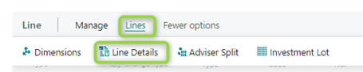

If you try to add in this page a fee that will be capitalized (type =
cost), there will be a warning message. This step helps in avoiding
errors and ensures that you\'re fulfilling exactly the fee capitalizing
per each lot.

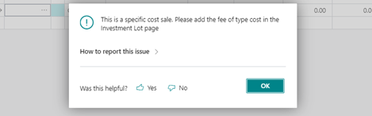

## Specific Cost Long Term Short Term Allocation

This document is accompanying the **Elysys Wealth** module, and it has
been created for the purpose of providing users with brief guidance on
how to process contracts that are automatically allocated as Short Term
or Long Term when using the specific costing method.

**<u>Purpose:</u>**

There are 3 \"Costing Methods\" available in Elysys Wealth:

-   Average Cost

-   FIFO

-   Specific

For \"Average Cost\" and \"FIFO\" costing methods, when processing a
sales contract, the user cannot select the shares he would like to sell.
This is predetermined automatically.

For the "Specific\" costing method, the user is allowed to select the
shares (lots) he would like to sell, if there had been several purchases
done before.

Investments Scope:

-   Equities, Funds, Alternative Investments, Cryptocurrency

-   Bonds, Preferred Shares, Structured Notes

**<u>Setup:</u>**

Open Application Setup \> Investment General Setup \> Trade Date \>
Costing Method

-   Select \"**Specific**\" for Specific costing method,

-   Specify the **\"Long Term Lot Threshold**\" (this is the limit
    between \"Short Term\" and \"Long Term\" detention),

-   Specify the \"**Threshold Warning Limit**\" (which triggers a
    warning message when reached).

**<u>Purchases:</u>**

When activating this \"Specific\" costing method, a new editable field
is displayed in the FO Journal, MO and BO Contracts: \"**Acquisition
Date**\".

This field is automatically filled-in (defaulted as \"Trade Date\") but
is not mandatory at FO/MO levels.

To post from BO to the ledgers, **this field must be filled in.**

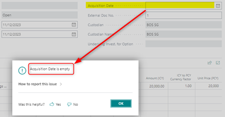

Note:

This field is visible but not editable (greyed-out) for \"Average\" and
\"FIFO\" costing methods.

**<u>Sales:</u>**

In the FO Journal, the users specify the total quantity to be sold and
the unit price, as usual.

**Note:**

**Posting option (Investment General Setup) Front Office Posting =
\"Post to Mid-Office\" and \"Skip Mid-Office\" can be both allowed**

**(However Front Office Posting = \"Skip Mid & Back Office\" must not be
used)**

In MO Contract, the users specify the total quantity to be sold and the
unit price, as usual. The Contract is sent to BO.

On BO level, the users specify the total quantity to be sold and the
unit price as well, then a new window (**\"Investment Lot\"**) will be
disclosed when trying to run a test report or to post the contract:

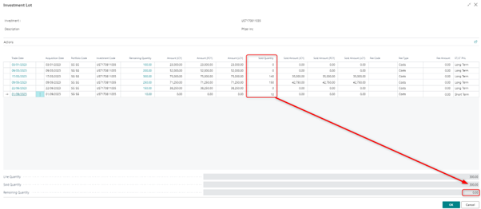

In the Column \"Sold Quantity\", the user splits the total quantity into
the selected lots (all purchases are disclosed with the dates, remaining
quantities and amounts)

-   The Sold Quantity of a specific line must be smaller than or equal
    to the Remaining Quantity of the same line,

-   The total of Sold Quantities (lines) must be equal to the Sold
    Quantity disclosed at the bottom, so that the remaining quantity is
    0.

Otherwise, error messages will appear:

A new field has been added in this table: \"**ST/LT PNL**\" (only shown
if Costing Method = Specific Lot or FIFO)

Values are populated according to the following rule:

-   IF (Sale Date -- Acquisition Date) SMALLER or EQUAL TO \"Threshold
    Period\" =\> \"**Short Term\"**

-   ELSE (if Greater than \"Threshold Period\") =\> \"**Long Term\"**

This field is editable and user can modify the value if necessary
(**\"Short Term\"** or \"**Long Term\"**)

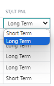

An additional warning message has been added when validating the
Quantity:

-   IF ABS ((Sale Date -- Acquisition Date) -- Threshold Period) SMALLER
    OR EQUAL TO Threshold Warning Limit

-   THEN Warning Message: \"**The holding period for the current lot is
    XXX days. Please verify the \"ST/LT PNL\" field before posting**.\"

-   Where XXX = (Sale Date -- Acquisition Date)
 

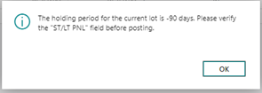

**<u>ST/LT PNL Field:</u>**

The values will be reported to the following ledgers/sub-ledgers:

-   G/L Entry

-   Investment Cost Entry

-   Income Cost Entry

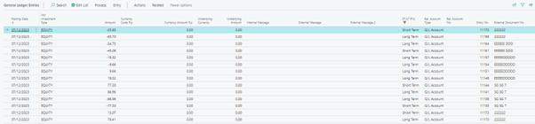

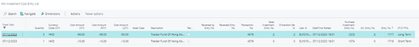

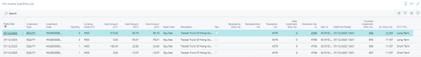