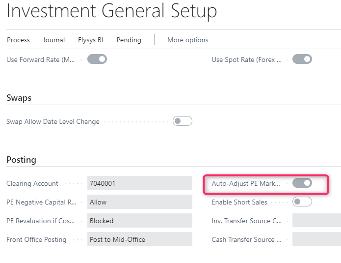
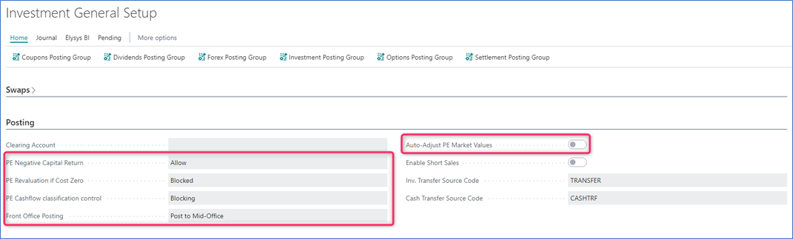

 

# ***Elysys Wealth – Investment Transfer Journal for Specific Cost***

The investment transfer journal allows now users to automatically transfer the position of an investment cross-company and intra-company, when the costing method is **Specific Cost**.

## **How to enable it**
Access the **Investment Transfer Journal**

## **How it works – use case**

| | |
| ---        |           --- |
| Start by adding the transaction details, knowing that the user will process the journal **a lot at a time** |  |
| Once the necessary fields are populated, user will access the **Specific Cost ➔ Investment Lot** function from the application ribbon | |
| The user will add the **Sold Quantity** for any lot to be transferred and says **OK** | |
| The transferred lines will have the **Transfer Type** field populated in the **Investment Ledger Entry**  | |

After the transfer, each transferred lot will keep the same **Acquisition Date** as the initial lots

> To transfer another lot, the user will repeat the steps above. You **can not transfer all lots at once**.
For the **cross-company transfer**, it’s possible to do transfers only if the target company has the same costing method as the source company.
