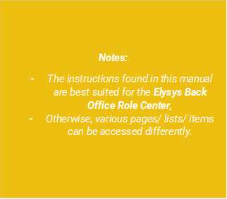
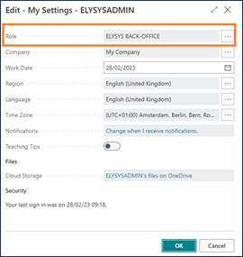

***Elysys Wealth -- Spots***

This document describes the standard functionalities of the Spots module
within Elysys Wealth, as well as the required setup.

 
 

## Investment General Setup

The user must make sure the following settings had been set up:

*Home Page ➔ Application Setup ➔ Investment General Setup ➔ Button: New
or Edit*

This page contains the investment module setup. This setup needs to be
done at the early stage and before any entries can be made by the
module.

-   *Portfolio Dimension code:* Specifies the code to identify the
    Portfolio throughout the system.

-   *Investment Dimension code:* Specifies the code used to identify the
    Investment throughout the system.

-   *Investment Contracts Header Nos:* Specifies the number series to
    number Investment contract headers.

-   *Swift Management Header:* Specifies the number series used by the
    Switch Contract function.

-   *Transfer Management Header:* Specifies the number series used by
    the Transfer Contract function.

-   *Clearing No.:* Specifies the clearing account is used by the Switch
    function. The balance of the investment closed by the function is
    booked to this account and the value of the investment being opened
    is also booked from this account.

-   *Trade Date Accounting:* Specifies if the user needs to run the
    settlement process to transfer the cash from the settlement account
    to the bank.

-   *Spots No.*: Specifies the number series used by the Spot Contracts.

## Investment Type

Now, we need to define all Investment types that will be used throughout
the investment module with their accounting rules. Investment types need
to be defined according to how investments need to be grouped and
accounted together, it is the equivalent of the product posting group of
Business Central. Investment types are required for every Investment
product ranging from Equities to Options and Forex products plus Private
Equity.

-   *Code:* Specifies the code to identify the Investment Type.

-   *Name:* Specifies the name for the Investment type.

-   *Asset Class:* Specifies the asset class relating to the investment
    type being created. The Asset Class defines how the investments are
    managed / handled by Elysys Wealth as each asset class uses its own
    logic.

## Forex Posting Group

Once all investment types are created, the accounting rules must be
specified using Investment posting group.

Accounting rules allows Elysys Wealth to know which account to use in
the process of creating all accounting entries when booking investment
trades. The Investment posting group page is one of the setup page used
by the module along with the coupons posting group, the forex posting
group, the options posting group, the dividends posting groups and so
on.

For each of the Investment type belonging to those assets class a
nominal account is required for the following account:

-   *BS at Cost Account:* Specifies the General Account used to book
    cost related entries such as purchase and sales type entries

-   *BS UR Forex Gain/Loss Reval:* Specifies the Balance Sheet General
    account used to book unrealised forex gain and loss calculated by
    the revaluation.

-   *BS UR Market Gain/Loss Reval:* Specifies the balance Sheet General
    account used to book unrealised Market gain and loss calculated by
    the revaluation.

-   *PnL UR Market Reval:* Specifies the Profit and Loss General account
    used to book unrealised Market gain and loss calculated by the
    revaluation.

-   *PnL UR Forex G/L Reval:* Specifies the Profit and Loss General
    account used to book unrealised forex gain and loss calculated by
    the revaluation.

## Investment Card 

No investment card is needed.

## 5. Journals & Posting procedures 

### 1. Create a Spot contract 

 

 After selecting a Portfolio and the Posting Date, choose the
 Investment Type then fill in all the remaining information on the
 contract line.

 

 Test Preview to check the accounting impact that will be generated
 after posting. The contract will be posted in the Forex Ledger.

 

## 6. Navigate functions 

### Detail View (Open Positions)

Access the spots detailed view. Drill down in the forex ledger.

### Forex Ledger Entries

 Shows all the ledger entries for the relevant "Investment Code".

 Spot contract posted in the ledger.

 

### Dimensions

Link Dimensions to the investment card. These Dimensions will be linked
to all ledger entries.

### Fees

Fees can be added via Line Details page, before posting the contract.

