# **Options Module**

This document describes the standard functionalities of the Options module of Elysys Wealth for 

Microsoft Dynamics Business Central, as well as the required setup.
## **Investment General Setup**
The user must make sure the following settings had been set up:

*Home Page ➔ Application Setup ➔ Investment General Setup ➔ Button: New or Edit*

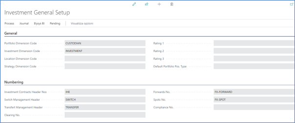

This page contains the investment module setup. This setup needs to be done at the early stage and before any entries can be made by the module.

- *Portfolio Dimension code:* Specifies the code to identify the Portfolio throughout the system.
- *Investment Dimension code:* Specifies the code used to identify the Investment throughout the system.
- *Investment Contracts Header Nos:* Specifies the number series to number Investment contract headers.
- *Swift Management Header:* Specifies the number series used by the Switch Contract function.
- *Transfer Management Header:* Specifies the number series used by the Transfer Contract function.
- *Clearing No.:* Specifies the clearing account is used by the Switch function. The balance of the investment closed by the function is booked to this account and the value of the investment being opened is also booked from this account.
- *Trade Date Accounting:* Specifies if the user needs to run the settlement process to transfer the cash from the settlement account to the bank.
## **Investment Types**
Now, we need to define all Investment types that will be used throughout the investment module with their accounting rules. Investment types need to be defined according to how investments need to be grouped and accounted together, it is the equivalent of the product posting group of Business Central. Investment types are required for every Investment product ranging from Equities to Options and Forex products plus Private Equity.

- *Code:* Specifies the code to identify the Investment Type.
- *Name:* Specifies the name for the Investment type.
- *Asset Class:* Specifies the asset class relating to the investment type being created. The Asset Class defines how the investments are managed / handled by Elysys Wealth as each asset class uses its own logic.

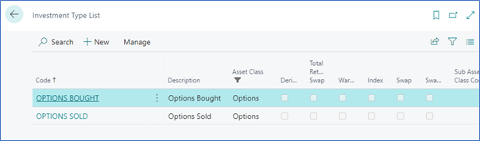

## **Posting Groups: Options and Settlement**
Once all investment types are created, the accounting rules must be specified using Investment posting group.

Accounting rules allows Elysys Wealth to know which account to use in the process of creating all accounting entries when booking investment trades. The Investment posting group page is one of the setup page used by the module along with the coupons posting group, the forex posting group, the options posting group, the dividends posting groups and so on.

For each of the Investment type belonging to those assets class a nominal account is required for the following account:

- *BS at Cost Account:* Specifies the General Account used to book cost related entries such as purchase and sales type entries
- *BS UR Forex Gain/Loss Reval:* Specifies the Balance Sheet General account used to book unrealised forex gain and loss calculated by the revaluation.
- *BS UR Market Gain/Loss Reval:* Specifies the balance Sheet General account used to book unrealised Market gain and loss calculated by the revaluation.
- *PnL UR Market Reval:* Specifies the Profit and Loss General account used to book unrealised Market gain and loss calculated by the revaluation.
- *PnL UR Forex G/L Reval:* Specifies the Profit and Loss General account used to book unrealised forex gain and loss calculated by the revaluation.
- *PnL Realised Forex Gain/Loss:* Specifies the Profit and Loss account used to book realised forex gain and loss.
- *PnL Realised Market G/L:* Specifies the Profit and Loss account used to book realised market gain and loss.

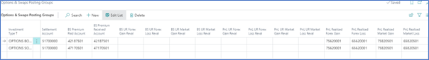

## **Settlement Posting Group**

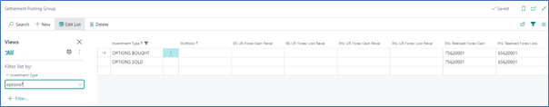

- *PnL Realised Forex Gain/Loss:* Specifies the Profit and Loss account used to book realised forex gain and loss.
## **Option Card**
Before any entry can be made with any investment the user is required to create the relevant Investment card in Elysys Wealth. The user needs to select in the list of asset classes the one which applies to the investment. 

In “Options” select “New” or “Edit” from the ribbon. The following interface comes up:

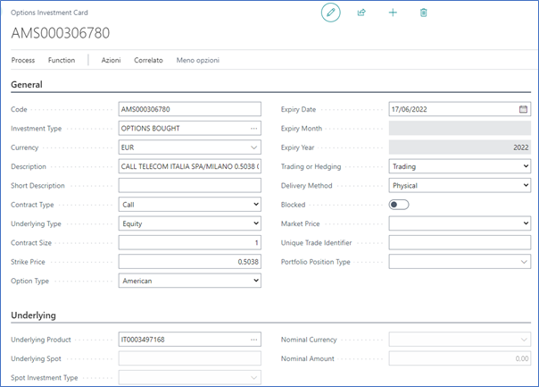

The following fields need to be filled in:

- *Code:* Specifies the unique identifier of the investment, used throughout the system (mandatory),
- *Investment type:* Specifies the accounting behaviour of the investment (mandatory),
- *Currency:* Specifies the currency code for the investment (mandatory),
- *Description:* Specifies the name of the investment,
- *ISIN code:* Specifies the ISIN code of the investment,
- *Contract Type:* Specifies the contract type of the investment (Call vs Put),
- *Underlying Type:* Specifies the type of the underlying product (Equities vs Forex),
- *Contract Size:* Specifies the number of contracts,
- *Strike Price:* Specifies the price at which the option can be exercised,
- Option Type: Specifies the type of the option (American vs European), not mandatory,
- *Expiry Date:* Specifies the expiry date,
- *Trading or Hedging:* Specifies the strategy (Trading vs Hedging), not mandatory,
- *Delivery Method:* Specifies the delivery method (Physical vs Cash), not mandatory.

Underlying Fasttab:

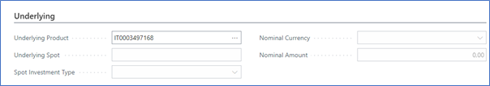

- *Underlying Product:* Specifies the equity product linked to the option,
- *Underlying Spot:* Specifies the convention for the forex contract i.e EURUSD, EURGBP,
- *Spot Investment Type:* Specifies the accounting behaviour of the underlying forex product,
- *Nominal Currency:* Specifies the nominal currency,
- *Nominal Amount:* Specifies the nominal amount.

Options Analytics Fasttab:

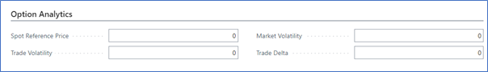

- *Spot Reference Price:* Specifies the spot reference price, this information is available through the Bloomberg interface only, 
- *Trade Volatility:* Specifies the trade volatility, this information is available through the Bloomberg interface only, 
- *Market Volatility:* Specifies the market volatility, this information is available through the Bloomberg interface only, 
- *Trade Delta:* Specifies the trade delta, this information is available through the Bloomberg interface only.

Analytics Fasttab:

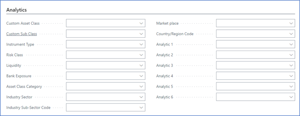

Quotation Method Fasttab:

This is used for Bloomberg integration.

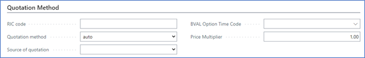

User Details Fasttab:

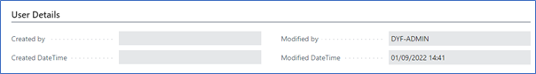

This gives the user audit information related to option card modifications.

## **Market Price**
This is the last piece of setup required to run the Elysys Wealth revaluation. The revaluation batch job allows to mark opened portfolio position as per their latest market values. Before the revaluation can be run the user needs to specify the investment market price.

Typically, this process would be done electronically using the pricing provider. Business Central and Elysys Wealth offer a range of possibilities to work with a variety of sources.

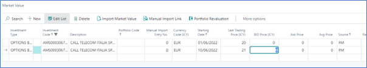

## **Posting procedure**
### **Open the option position. Line Type = Open.**
Create a contract by accessing the options back-office contract tile directly from the role centre (home page).

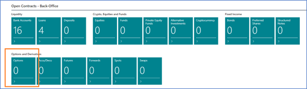

Fill in the contract details, starting with the contract header:

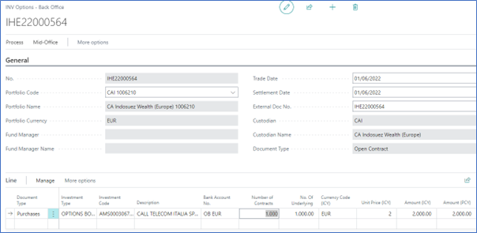

- *Portfolio Code:* Specifies the portfolio use to book the transaction,
- *Trade Date:* Specifies the date of the transaction (posting date),
- *Settlement Date:* Specifies the date when the transaction is settled against the bank, this applies when using the Trade Date Accounting.	

Fill in the contract line details:

- *Document Type:* Specifies the type of the contract,
- *Investment Type:* Specifies the investment type associated with the option,
- *Investment Code:* Specifies the option,
- *Bank Account No.:* Specifies the bank account used to book the transaction,
- *Number of Contracts:* Specifies the number of contracts,
- *Unit Price (ICY):* Specifies the premium amount.

Preview the entries before posting the contract:

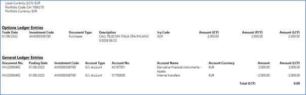

Once posted, the user can navigate to the Open Positions view and inspect the change.

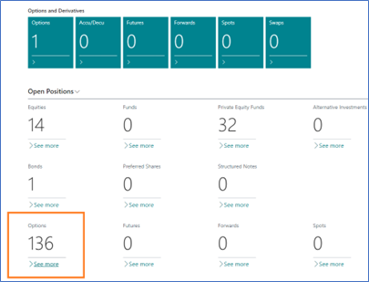

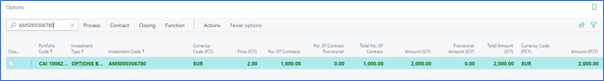

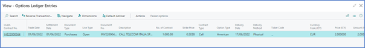

Drill down to see the transaction in the Options Ledger Entries.

### **Possibilities for exercising or closing the option**
Case: AMS000306780

From the Open Position View, use one of the following functions to:

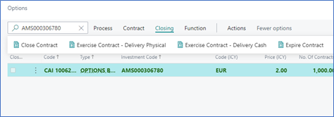

#### ***Close Contract (Line Type = Closure)***

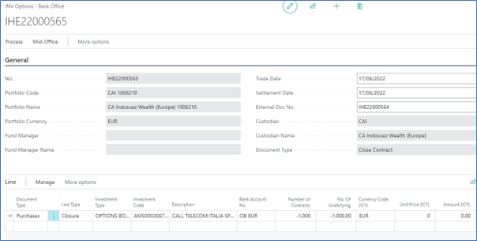

The accounting entries and the impact in the ledgers and subledgers.

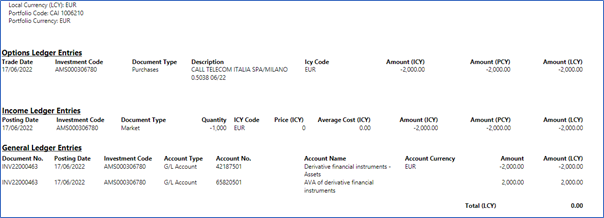

#### ***Exercise Contract – Delivery Physical (Line Type = Delivery Physical)***
In this case, the Underlying Market Price field is mandatory. Partial delivery is also possible.

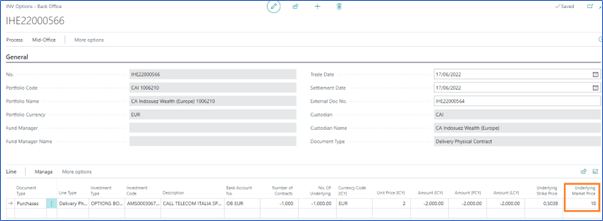

The accounting entries and the impact in the ledgers and subledgers.

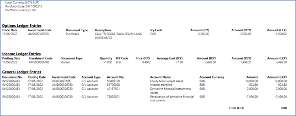

Once the option contract is posted, the system will book the purchase contract associated to the underlying equity.

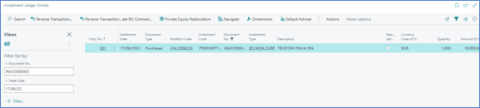

#### ***Exercise Contract – Delivery Cash (Line Type = Delivery Cash)***
In this case, the Underlying Market Price field is mandatory. Partial delivery is also possible.

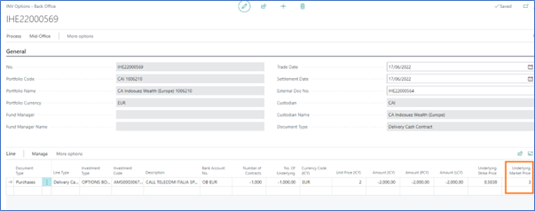

The accounting entries and the impact in the ledgers and subledgers.

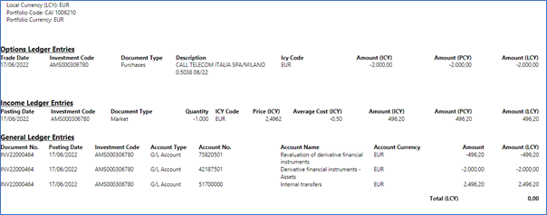

#### ***Expire Contract (Line Type = Expiry)***

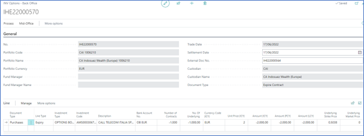

The accounting entries and the impact in the ledgers and subledgers.

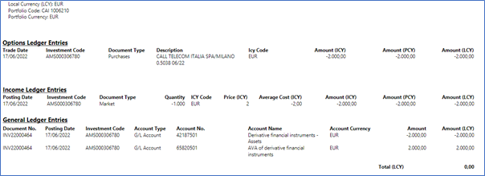
